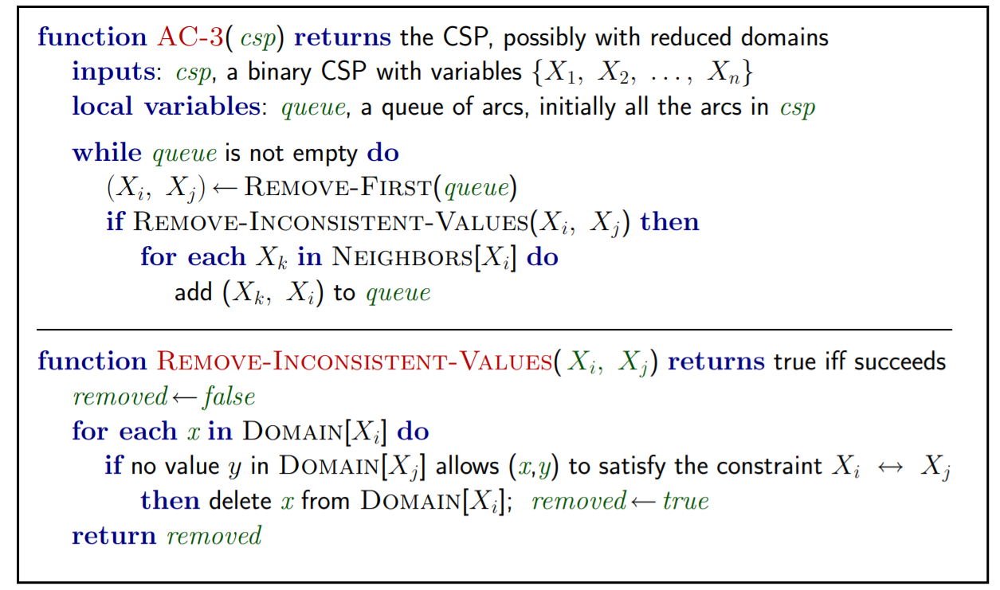
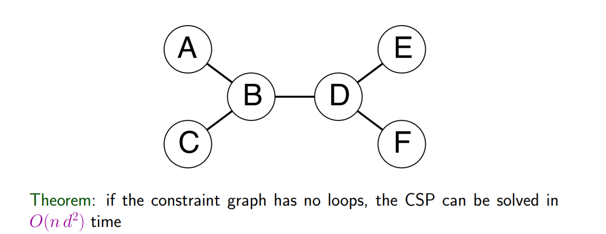

# 搜索方法

## 无启发搜索
+ 深度优先搜索
+ 广度优先搜索
+ 一致代价搜索
+ 深度受限搜索
  + 即，达到一定深度的节点没有后继节点，直接转头搜其他节点即可
+ 迭代加深搜索
  + 不停尝试深度更深的深度受限搜索

## 有启发搜索
+ 贪婪搜索
  + 只有到达解的预估代价h(x)
  + 不一定完备
  + 不一定能找到最优解
+ A star搜索
  + 能找到最优解

## 关于启发式函数的讨论
+ 可采纳的：不会过高估计解决问题所需要的实际代价
+ 一致的：沿着某条路径，f总是上升
+ 在可采纳的前提下，若$h_2>h_1$，则一般使用启发式函数$h_2$的效果要更好

## 博弈搜索
+ minimax树
+ alpha beta剪枝（好好想想！）
  + 更常用的：同cut-off检测替代end-of-game检测
  + 用eval评估函数替代Utility函数

## 连续状态空间下的搜索
+ Hill Climbing
  + 找到最大的后继节点进行移动
+ 梯度下降方法
  + exploitation
  + locally optimal
+ 完全随机搜索（Pure Random search）
  + 不停的随机生成解，如果遇到更好的解就更新
  + exploration
  + globally optimal
+ 模拟退火算法
  + 将时间映射到温度，逐渐降低
  + 每一个时间节点上，随机选择一个后继
  + 如果后继的目标值更优，选这个后继
  + 如果不是，则以$e^{\delta E/T}$的概率接受这个差一点的值
+ 局部束搜索
  + 每次保留k个节点。在选择后继节点时，选择这k个后继节点中最大的k个后继节点

## 约束满足问题
+ 一般只考虑单个变量约束、两个变量之间的相互约束
+ backtracking-Search
  + 先赋一个变量的值，深搜，如果没有相容的就回退
  + 启发式加速：
    + 确定即将赋值的变量后，选择已被选择的最少的值作为新的试探赋值
    + 确定即将赋值的变量后，选择对其他值影响最小的值
    + 选择变量时，可以选择对其他变量有最多约束的变量进行赋值

### 约束图
+ 将有约束的两个变量连接形成一条边
+ AC-3算法
  + 
  + 一步步排除不可能的值，即不相容的值
+ 
  + 可沿着拓扑排序顺序进行CS-3
  + 从后向前一遍，从前向后一遍，如果不存在解，会返回矛盾
+ 对于有环图，可切割出一部分点集使得剩下的图为树。固定他们的取值（for loop），使用AC-3算法
