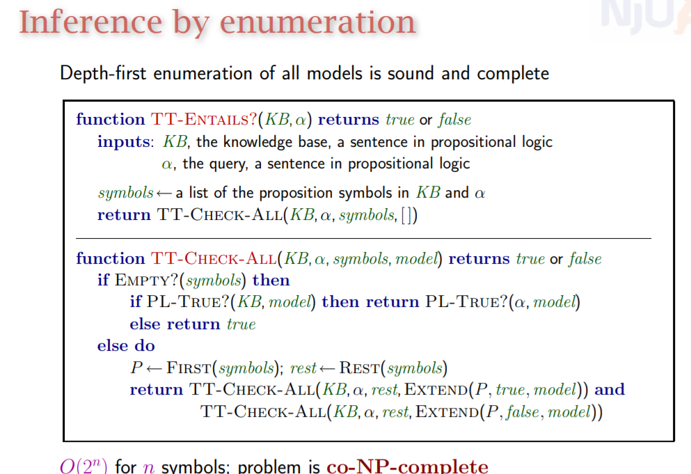
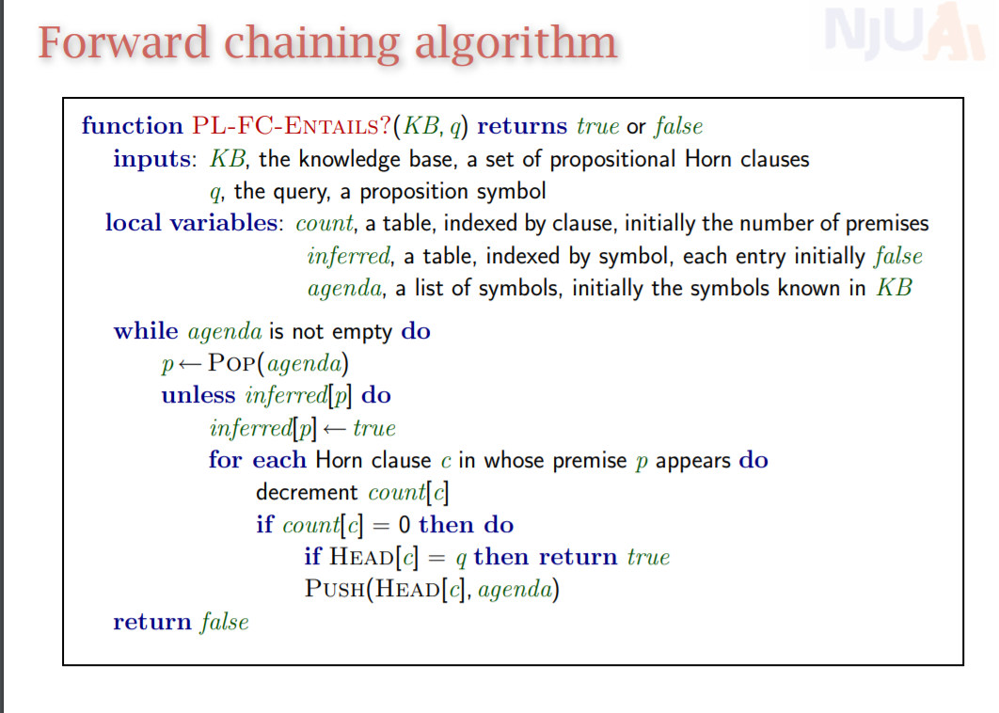

# 知识表示
## 真值表法

+ 枚举每个变量的取值，枚举完的时候检验，要求KB为真时alpha也为真

## Forward Chaining
+ Horn子句
  + 以下式子的合取
    + 单个变量
      + 左边是合取的蕴含式

+ 思想就是，每次从取出一个KB前缀中出现过的变量赋真值，然后将通过当前已赋为真值的变量能推导出为真的变量加入到agenda中，等待逐个提取

## 后向推理
+ 从当前目标出发，通过以下方法证明当前目标被知识库推理得到
  + 要么当前目标已经得知
  + 要么所有能够蕴含当前目标的式子的前件都能被知识库推理得到
  + 所以是个递归的过程

## 消解算法