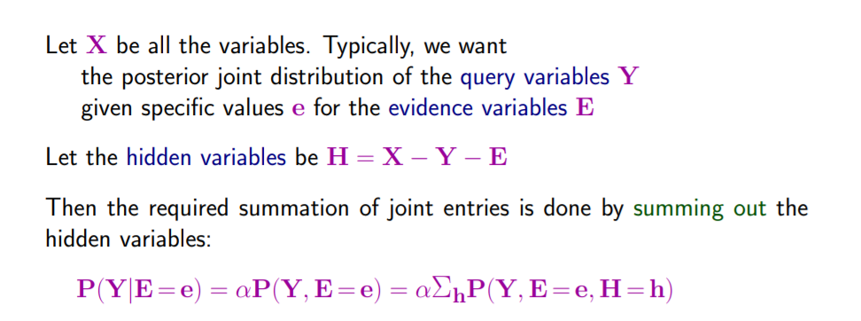
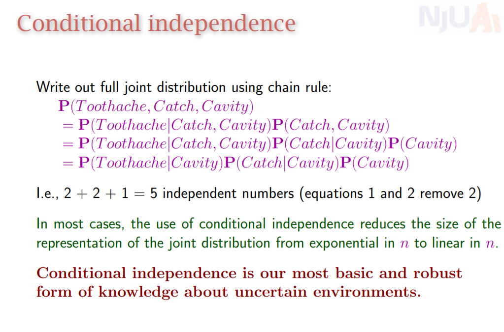
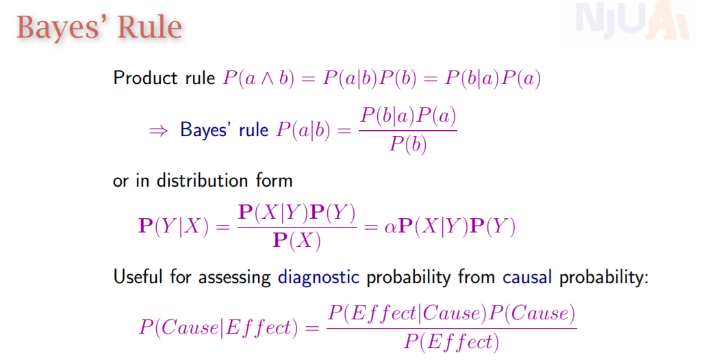
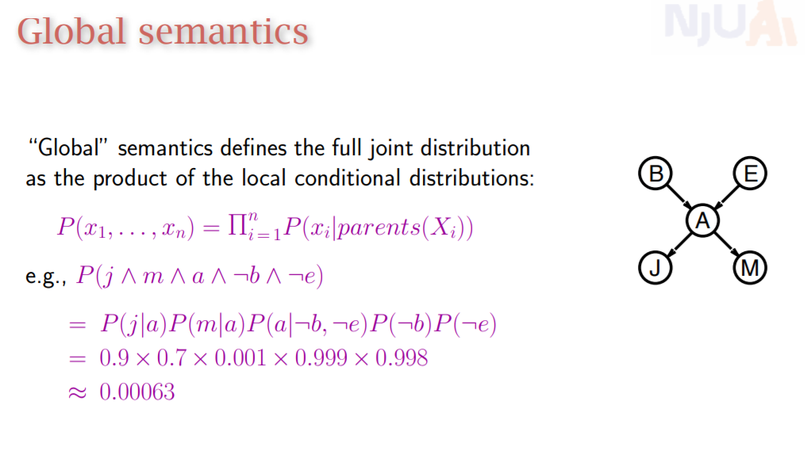
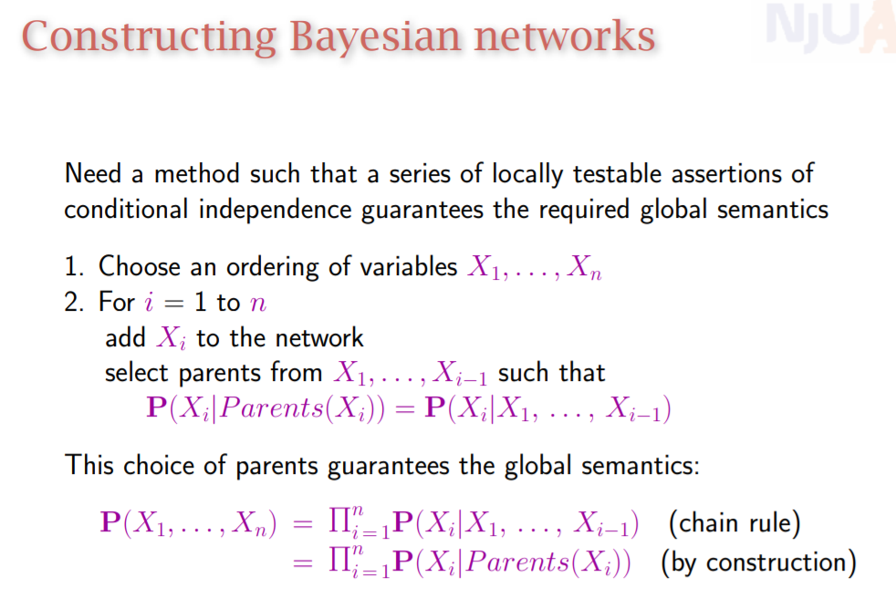
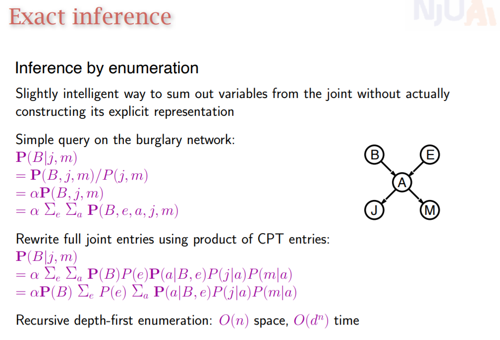
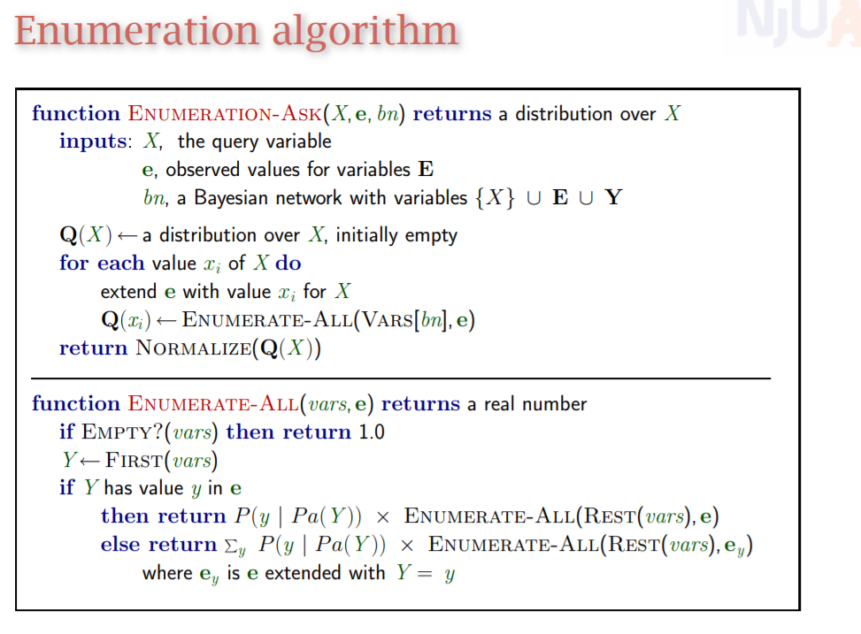
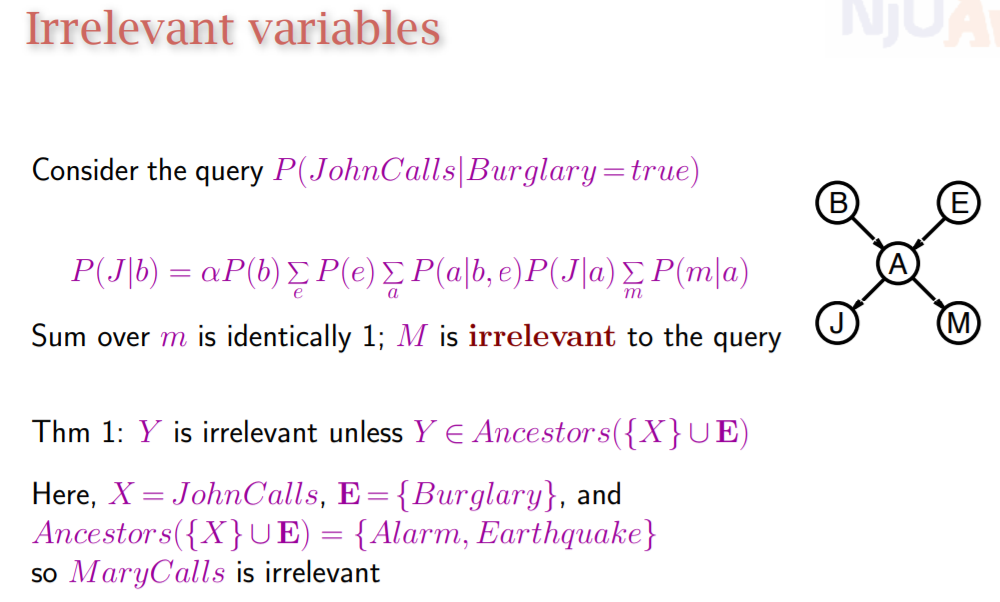

# 概率推理
## 重要公式
+ 

## 条件独立性

有助于减少需要储存的参量
## 贝叶斯公式

贝叶斯公式，分析因果关系

## 全局语义

+ 构建贝叶斯网络

  + 由此可见，相比较原来的贝叶斯网络多了两条边。因此在构建贝叶斯网络时边的顺序非常重要
+ 给定一个贝叶斯网络，每一个节点条件独立与所有除马尔可夫覆盖外的所有其他节点。这个性质在同一问题对应的不同网络版本下是保持不变的

## 贝叶斯网络推理
### 精确推理：所有节点的条件分布已知

+ 首先根据贝叶斯定理展开为全联合概率
+ 然后使用全局语义结合已有的条件概率进行计算
#### 枚举算法

+ 但是枚举算法是低效的
+ 可以从右向左计算提高效率
+ 也可以使用下面的定理，找出无关变量

### 模糊推理：部分节点的条件分布未知
+ LM采样。给定证据变量，越能使得证据变量一致的样本权重应该越大
  + 对查询变量采样，
  + 证据变量固定。但是途径证据变量时，要根据他目前的父节点计算他满足给定值的条件概率，更新w
+ MCMC采样

+ 统计需要查询的变量为真和为假出现的次数。比例正则化后即为给定证据变量情况下需查询变量的条件分布