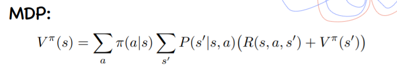
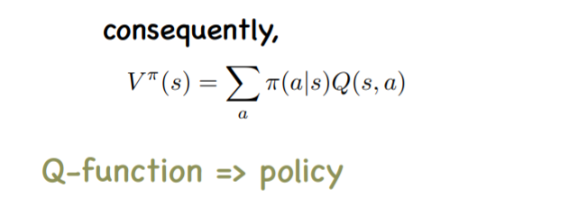
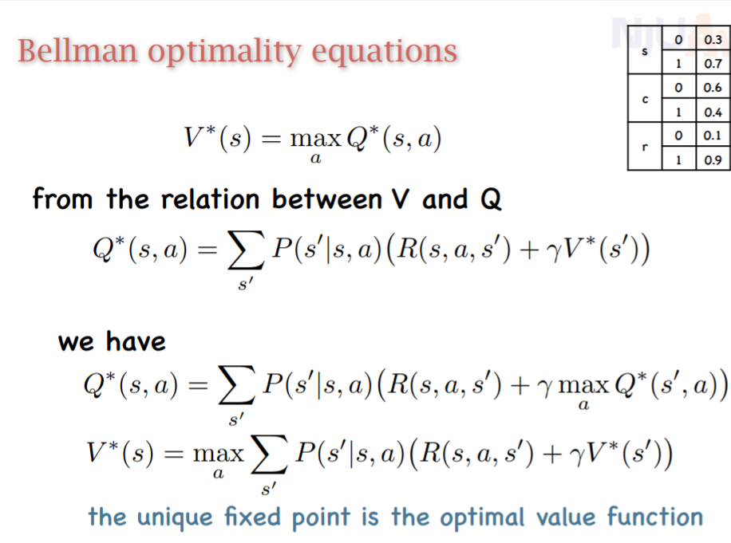
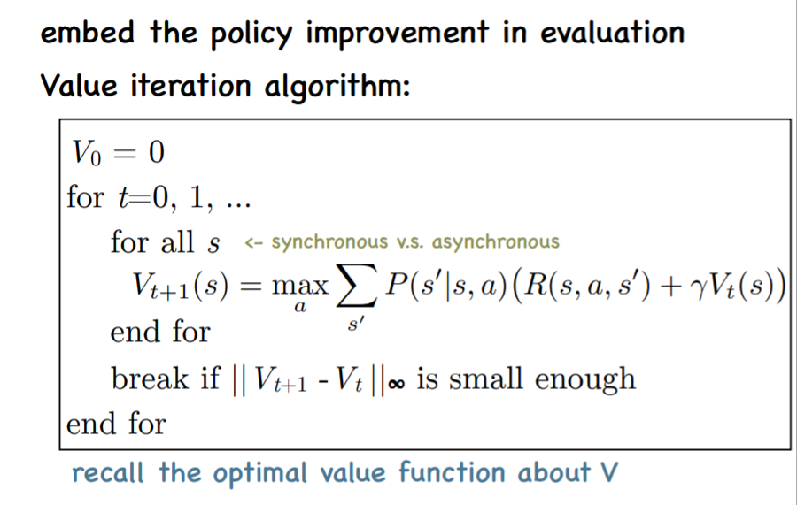
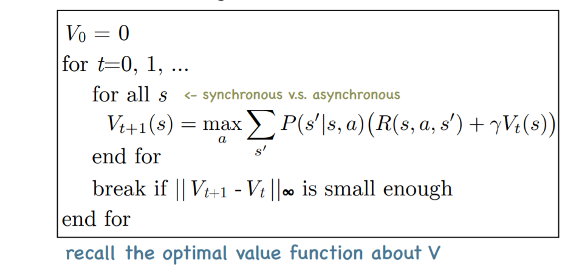
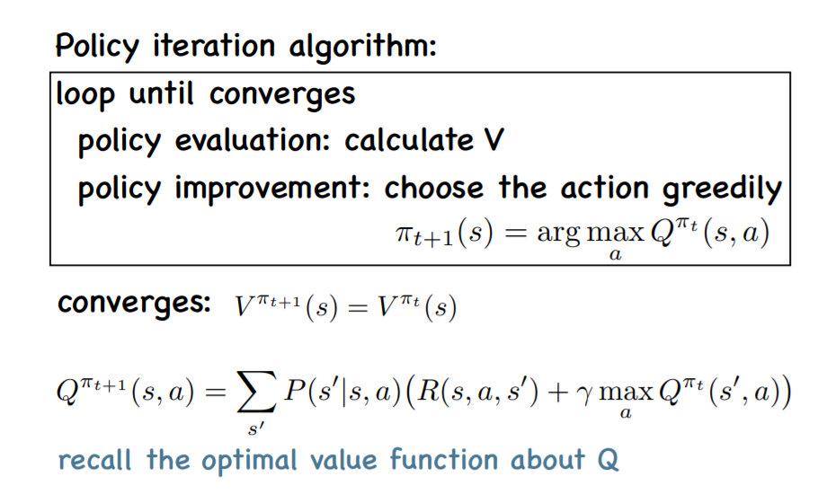
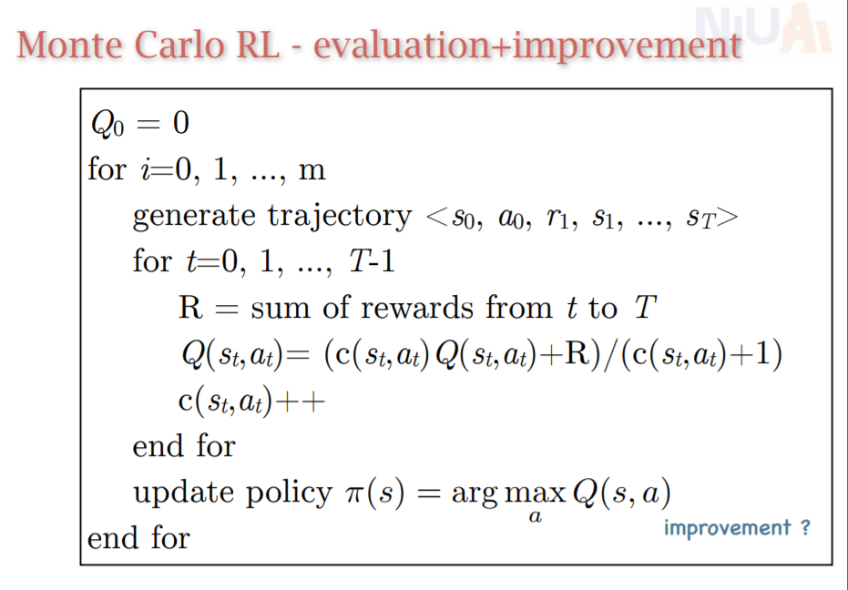
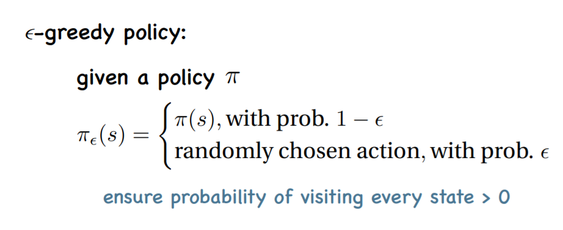
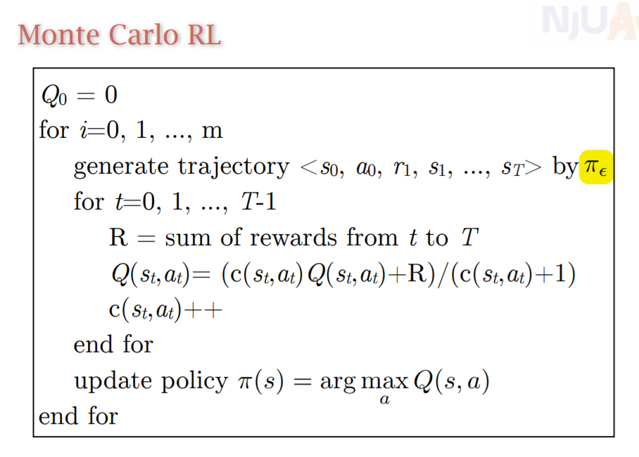
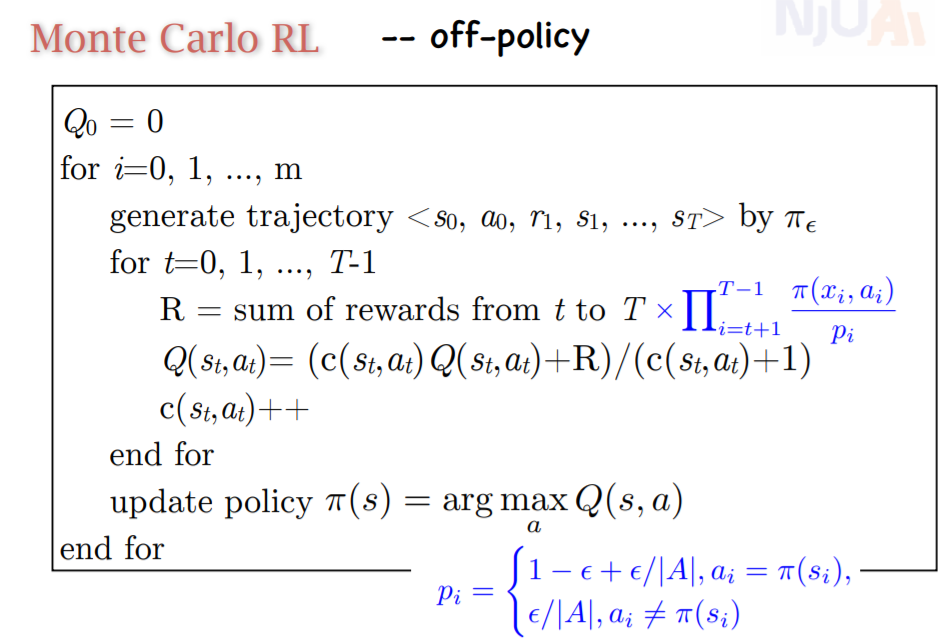

# 强化学习
## 马尔可夫过程
+ 每个节点的当前状态只和上一个状态和状态转移矩阵有关

## 马尔可夫奖励过程
定义效用函数 两种定义
$V(s) = \sum_{s'}P(s'|s)(V(s')+R(s'))$
$V(s) = \sum_{s'}P(s'|s)(R(s')+\gamma V(s'))$
只和下一个状态有关
末状态的V为0，反向传播

## 马尔可夫决策过程
输入为$<S, A, R, P>$
策略$\pi$实际上为给定状态下各个动作的概率
修改效用函数的计算方法，实际上要对两个东西求和：一个是动作，一个是采取动作能够转移到的状态

## 定义Q值函数
实际上就是在当前节点的某个动作a下的效用函数
$Q^\pi(S, a) = \sum_{S'}P(S'|S, a)(V^\pi(S')+R(S, a, S'))$

## 最优解

也就是说，这是一个固定点，可以被不断强化逼近

## 找到马尔可夫决策过程中的最优解
### 策略评估
策略评估就是V和Q的反向更新公式
### 策略改进

#### 价值迭代

#### 策略迭代

## 在未知R和P的情况下学习
### 蒙特卡洛算法

每次更新的是一条蒙特卡洛采样路径上的点和对应动作

