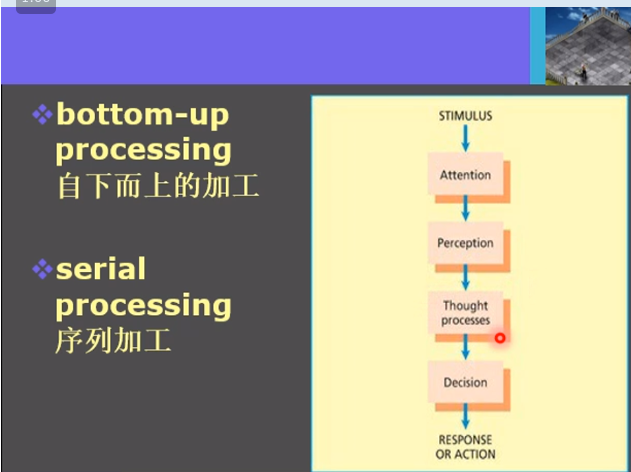
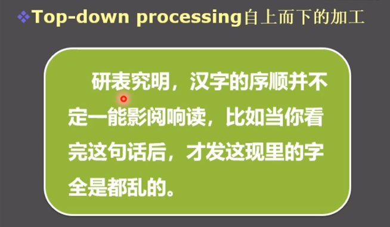
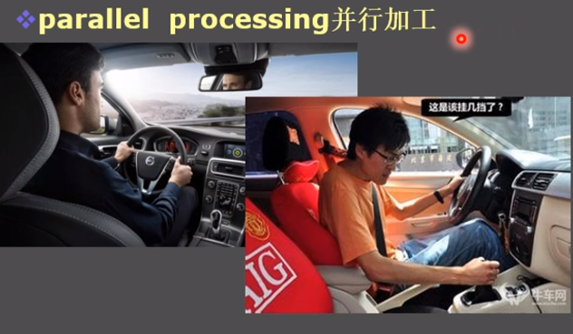

# 认知心理学史及其他
## 信息加工模型
+ 一些事件的时间序列
+ 将认知过程概念化
+ 对信息加工模型的讨论集中于
  + 有哪些阶段？
  + 各个阶段的信息是如何表征的？
### 三大假设
+ 认知过程可以被分为seqeuntial stages
+ 每个阶段都有独特的加工过程
+ 每个阶段都有信息的接收和传递
### 经典的信息加工模型

+ **自下而上的加工**
+ **序列加工**

+ **自上而下的加工**
+ 已有的知识产生了指导

+ **并行加工**

## 认知心理学史
+ 知识从何而来？
  + 经验主义着 Empiricists
  + 先天论者 Nativists

## 认知科学和概念科学
+ 认知模型是概念科学的子集
+ 