# 认知神经科学
+ 认知神经科学 = 认知心理学+神经科学
  + 认知心理学需要为它提出的构想在神经科学中寻找物质证据
  + 神经科学的发现与对脑和认知更全面的理论模型联系起来
  + 将神经功能增加到对心灵理论的模型中
  + 模拟人的认知

## 中枢神经系统
+ 神经元
  + 胞体
  + 突起
    + 树突：接受神经冲动
    + 轴突：传递神经冲动
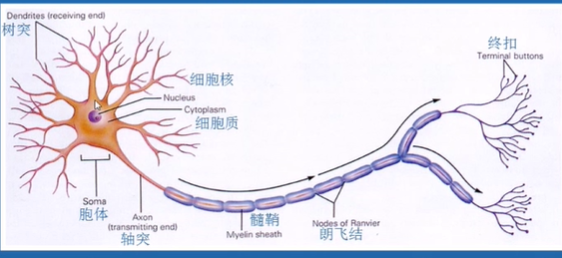
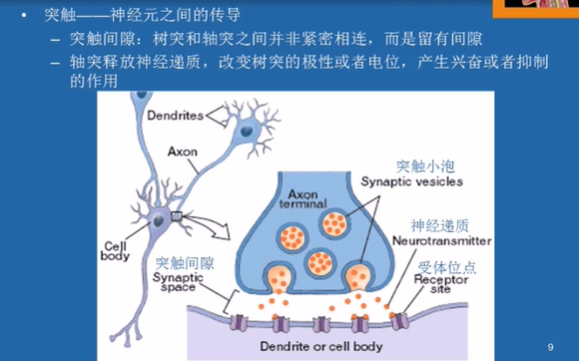
+ 脑的解剖结构
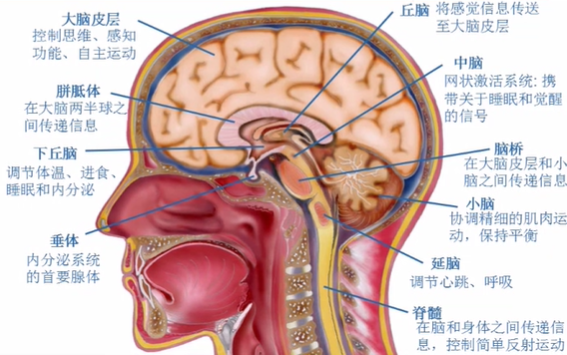

### 术语
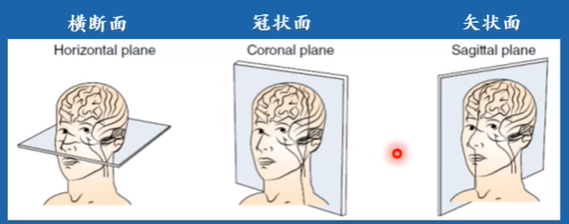
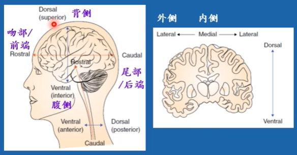
+ brodmann分区：一种对大脑的分区方式
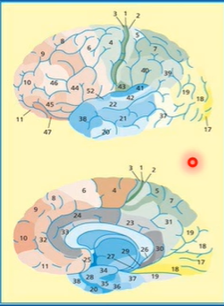

### 髓鞘化
+ 髓鞘化过程从出生开始，在20岁左右完成
+ 髓鞘帮助人类作出理性的决策
+ 青少年的情绪化是边缘系统造成的，而前额叶皮层的控制功能到25岁左右才会完全成熟，中间十年的时间情绪冲动和深思熟虑之间处于失衡状态

### 神经网络的联系
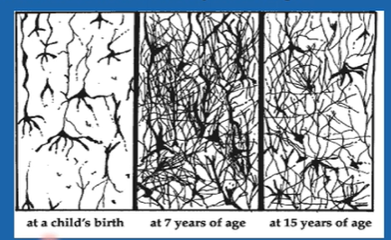
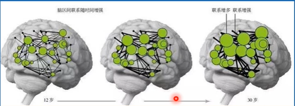
+ 在出生时已拥有大部分的神经元，但神经元之间的突触较少，导致人体反应较慢
+ 在七岁时突触联系非常密集，认知功能开始成熟
+ 十五岁时突出开始减少，为**修剪**过程。剩下的神经元之间的连接更强大且高效
  + 在这一阶段，对语言等学习能力下降
+ 12岁-30岁之间最显著的变化不是脑区成长，二是神经元集群交流增多，帮助大脑成熟并胜任复杂思考和社会交际

## 神经生理学的探测技术
+ 相关性神经成像方法
  + 脑电图（EEG）
    + 时间分辨率很高，空间分辨率很低
    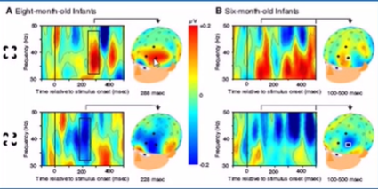
  + 事件相关电位（ERP）
    + 针对某个特定刺激作出反应的平均EEG
  + 脑磁图（MEG）
    + 记录神经电活动所产生的磁场，提供更好的空间分辨率
  + 正电子发射断层扫描（PET）
    + 大脑活跃区域新陈代谢消耗更大
    + 通过探测正电子湮灭释放的成对光子，得到不同区域的新陈代谢情况
    + 空间分辨率高
    + 时间分辨率低
  + 磁共振成像（MRI）
    + 比PET有更佳的空间分辨率，更低的侵入性
    + 时间分辨率低
  + 经颅磁刺激
    + 将装置置于大脑顶部产生电磁脉冲，干扰一部分大脑的功能
  + 功能性近红外光谱技术（fNIRS）
    + 向头皮发射近红外光线
  + 优缺点比较
  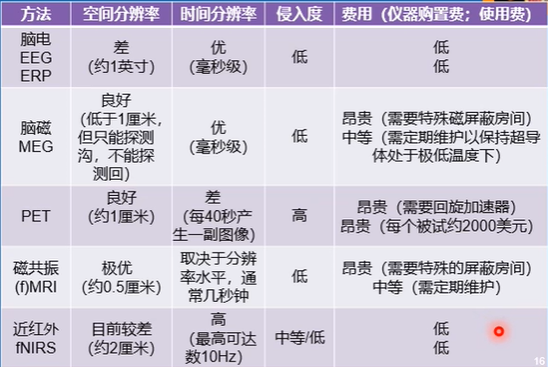
  + 共同缺陷：
    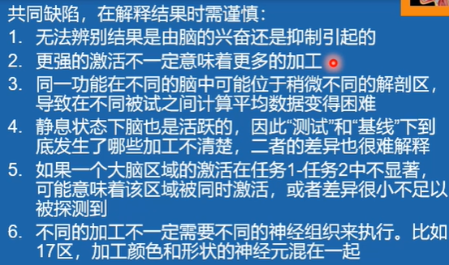