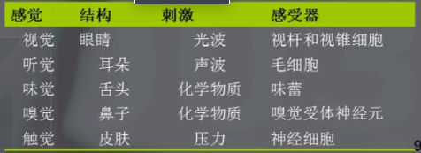
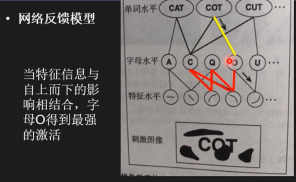
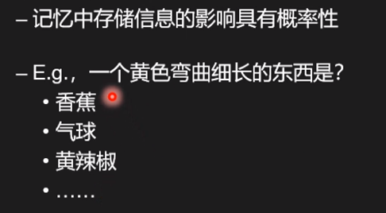
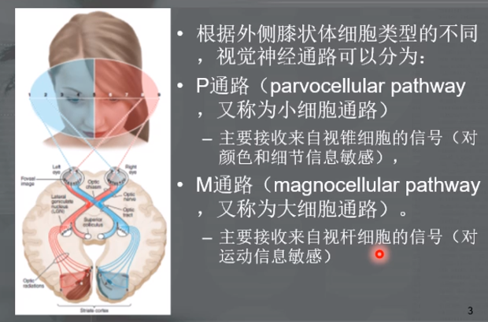

# 知觉与模式识别
## 计算式大脑
+ 心灵对信息的加工分为多个计算阶段
  + 刺激能量 -> 感觉系统 -> 转换 -> 感觉探测、视像声像存储 -> CNS活动和编码 -> 记忆和转换 -> 外显行为 -> 循环
+ 心理物理学：研究外部世界物理属性的改变与相应的心理体验之间的关系的学科
  + $S=K\log R$
    + $S$: 感觉强度
    + $R$: 刺激强度
    + 要想使感觉强度提高，刺激必须指数增长
+ 感觉  
  
+ 知觉：涉及**解释感觉信息**的高级认知过程
  + 关于先前知识和经验
+ 错觉
  + 心智对现实的扭曲
  + 过去经验导致错觉/深深根植于脑中的始终如一的构造

### 感觉
+ 认识论观点
  + 心灵的窗口，即人类的感知系统是随着我们这个星球上的物质变化出现的
+ 对感觉信号的探测和解释取决于
  + 感觉系统和脑所感知到的刺激能量
  + 先前存储在记忆中的知识
+ 感觉存储
  + 视像记忆
    + 视觉印象的持续和一段时间内可供进一步加工
  + 声像记忆
    + 听觉的感觉记忆
    + 250ms～4s
  + **感觉存储的作用：视像存储、声像存储和其他感觉信息的存储，使我们只需抽取有待进一步加工的信息**
+ 短时记忆（STM）
  + 10~30秒
  + 部分受到加工

## 模式识别
+ 根据样本的特征将样本划分到一定的类别中去
+ 包含了**感觉、直觉、短时记忆、长时记忆**与旨在辨别刺激的**认知搜索**之间复杂的相互作用
+ 特点
  + 以较高的准确率迅速识别出熟悉的模式，知觉到以不同角度放置或旋转的物体
  + 评价理解不熟悉的模式
    + 对未见过的物体进行推测
  + 辨别不可见，被遮蔽或处于某种形式的噪音掩蔽中的物体
  + 快速，自动，主观感觉轻松地执行
+ 下面介绍模式识别中的经典理论

### 格式塔理论
+ 所有刺激共同作用而形成一个印象，它超越所有感觉的总和，整体大于部分之和
+ **封闭律**：彼此相属，构成封闭实体的各部分趋于构成整体
+ **接近律**：距离相近的各部分趋于构成整体
+ **相似律**：相似的各部分趋于构成整体

### 典型表象
+ 能对物体做出最佳表征的形象，或回忆一种形状时最先想起的表象
+ 一个实验结果：当给定一张图片要求辨别时，越不典型的图片需要的反应时间越长
  + 该物体能被识别的部分较少
  + 最好的形象是**最经常经验到的形象**
  + 典型表象是对物体最好的、最理想化的形象

### 自下而上和自上而下的加工方式
+ 自下而上
  + 首先识别模式的各个部分，再识别整个模式
+ 自上而下
  + 首先形成关于事物整体的假设，导致整体识别与之后的部分识别
  + 网络反馈模型  
    
  + 贝叶斯方法  
    
+ 在很多时候，对部分和整体的解释在自上而下和自下而上两个方向上是同步发生的
+ 另：世俗知识能够帮助我们在熟悉的情景中辨别物体，在不合适的情景中阻碍我们的辨认

### 模板匹配
+ 模板是一种**内部结构**，当感觉刺激与之匹配后，便产生了对物体的识别
+ 成分识别：在复杂的形状中找出简单形状

### 特征分析
+ 模式识别是一种高级信息加工，在此之前，复杂的输入刺激需要根据其自身的简单特征进行分析
+ 类似从下而上的加工思想和成分识别
+ 同时根据任务的需要的不同，人会去关注不同的特征

### 原型匹配
+ 长时记忆中存储了某种抽象的模式作为原型
+ 原型更是模式的一个典型或“最佳”的表征
+ 寻找相似性而非完全匹配
+ 原型脸实验：
  + 获得模式中有关特征的信息很快
  + 获得特征之间关系的信息很慢
+ 原型理论：有人认为原型表征的是一组样例的平均数，有人认为原型表征的是一组样例的众数

## 补充内容
### 感觉和运动

### 面部识别
+ 面部识别和物体识别最大的差异在于面孔识别是**整体加工**的
  + 不同的人有相同的面部局部信息（瞳孔的颜色，etc）
  + 个体的面部信息可能被改变