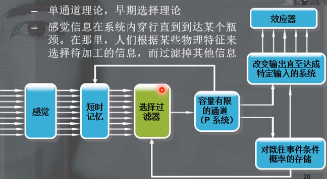
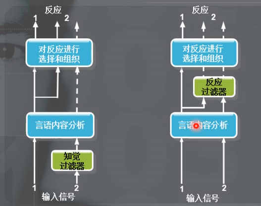
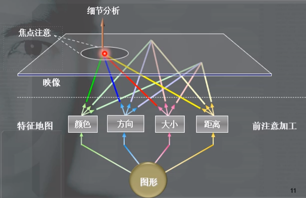

# 注意机制
+ 心理能量在感觉事件或心理事件上的集中
+ 研究主题
  + 处理能力与选择性
  + 控制
  + 自动加工
  + 认知神经科学
  + 意识
+ 分类
  + active vs passive
    + 主动注意（自上而下的注意）
    + 被动注意（自下而上的注意）
  + focus vs divided
    + 单任务注意
    + 多任务注意

## 听觉注意

### 双耳分听任务
+ 追随实验
  + 范式设计
    + 双耳分别同时呈现两个信息
    + 被试复述一只耳的信息
  + 发现
    + 未注意（未追随）的信息中仅有少量的信息得到了加工
    + 被试注意到了非追随耳里自己的名字

### 过滤器模型
+ **感觉信息在系统内穿行直到到达某个瓶颈，在瓶颈处，人们根据某些物理特征来选择待加工的信息，而过滤掉其他信息**

+ 特雷斯曼（Treisman， 1960）
  + 人们往往会追随语义，而不是仅仅注意来自一只耳朵的声音

### 衰减器模型
+ 过滤器模型的问题：人能够从非注意通道中探测到敏感或有趣的信息
+ 衰减器模型
  + 未被注意的信息被**削弱**，而不是完全过滤掉
  + 每个人都有自己的词典，其中某些单词的激活阈限较低，实际上注意就是感觉信号强度足以激活阈限的表现
    + 比如自己的名字，即使被削弱，得益于名字较低的激活阈限，仍能被人注意到

### 后期选择理论
+ 所有信息都未被衰减，而是得到了完全加工
+ 局限性在于反应系统，人能知觉多条信息，却只能跟踪一条信息
+ 因此，人们需要某些依据来进行跟踪选择

### 总结
+ 左图为过滤器和衰减器模型
+ 右图为后期选择模型

## 视觉注意

### 弹出效应
+ 特雷斯曼
  + 当某个视觉元素截然不同时，观察者能在50ms内看出图形边界
  + 特征整合理论
    + 当看到一张图形时，会首先将这张图片从颜色、方向、大小、距离四个不同角度观察（前注意加工）。随后再结合这四个视角，观测我们想要观测的组合特征是否出现在图形的同一位置处（焦点注意、细节分析）。  
    
    + 因此，如果一个物体具有一些其他物体不具备的简单的特征，我们可以在前注意加工阶段就注意到它；如果物体具有复杂的组合特征，需要在焦点注意阶段才能注意到它。
+ 弹出效应
  + 人更倾向于观察到与周围物体截然不同的物体或模式

### 视野忽视
+ 单侧大脑受损会导致被试忽视对侧视野和对侧认知
+ 忽视整体和忽视细节
  + 左侧顶叶
    + 负责将注意引向物体的局部
    + 受损患者能够复制整体框架，却无法复制细节
  + 右侧顶叶
    + 参与多种感觉通道中的空间注意分配
    + 受损患者能够复制具体组成部分，但无法复制空间框架

### 视觉追踪
+ 人们发现意料之外的物体的能力取决于这个物体与人们关注的物体的相似性。
  + 相似性越高越容易被发现

### 外生性和内生性的视觉线索
+ 外生性 outside generating
  + low-level reflexes
  + sudden changes
  + draws attention automatically
+ 内生性 inside generating
  + high-level control
  + **instruction**
  + sends attention to requested location

+ Posner, 1980
  + 注意的两个系统
    + 内源性系统
      + 该系统受到个体的期待、意图的影响，在中央线索和边缘线索大多数情况下有效时，该系统启用
    + 外源性系统
      + 该系统自动转移注意到新异的、明显的、或与其他刺激不同的刺激位置。这个过程是无意识而自动的

## 中枢注意

### 多任务作业
+ 伯恩和安博森
  + 人不能同时执行两个任务
  + 被试同时完成两个任务的时间，比单独完成两个任务的时间之和还要多
    + 需要额外花费时间切换注意

+ 舒马赫
  + 被试可以同时完成两个简单任务
  + 与第一个实验的对比
    + 第二个实验任务更简单
    + 第二个被实验的被试有预先练习

+ 中枢瓶颈
  + 中枢认知必须指挥所有的活动
  + 只有非常简单的任务，占用中枢资源低的任务才能实现“伪并发”

### 注意瞬脱 Attention Blink
+ 当我们观察到某一待观察结果后，在很短暂的时间内可能会产生注意力缺失

### 自动化
+ 当一个人对**一个任务的中枢认知部分**进行了大量练习，以至于执行这个任务时很少甚至不需要思考时，这个任务就已经自动化了
+ 意义
  + 减少任务的中枢认知占用
+ 自动化任务的三个特征
  + 可以在无意识中进行
  + 自动加工在意识范围之外
  + 自动化过程很少或根本不消耗意识资源

### 斯特鲁普效应
+ 字和颜色不匹配的阅读实验
+ 结论
  + **阅读是一个高度自动化的过程**，不仅不会受字体颜色影响，而且被试通常很难阻止自己读这个单词，并因为读这个单词而干扰辨别颜色