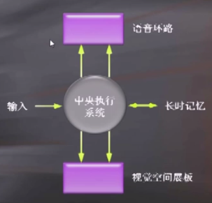
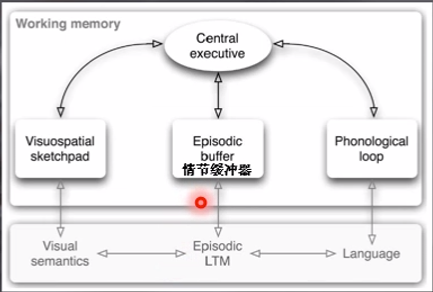

# 记忆
+ 记忆模型
  + 刺激 -> 感觉记忆 -> 长时记忆
## 短时记忆
+ 存储容量有限
+ 如果不进行复述，就会遗忘

### 工作记忆
+ 不能等同于短时记忆
+ 当我们在执行认知任务时，短暂保持和操纵信息的记忆系统
+ 工作记忆可以认为是一种工作平台
+ Baddley的工作记忆模型  
  
  + 语音环路
    + 一种循环复述，用于保持内部言语，以便进行言语理解
  + 视觉空间展板
    + 复述图像使其暂时保存
  + 中央执行系统
    + 协调主注意活动以及控制反应

### 短时记忆容量
+ 短时记忆容量似乎总是在7左右
+ 短时记忆，长时记忆和组块
  + 组块是记忆的单元，本质上是有了**长时记忆的参与**导致记忆一个组块只需要一个单元的记忆量

### 短时记忆的信息编码
+ 听觉编码
  + 短时记忆很大程度上依赖与我们内在的声音
  + 甚至非听觉信息也会用听觉编码
+ 视觉编码
  + 短时记忆也可以通过视觉方式和语义方式进行编码
  + 短时记忆的信息首先是被编码为视觉形式的，后来变成听觉形式
+ 信息一旦被感知，不同系统将同时对其进行编码
  + 短时记忆存储中的信息加工可能是以平行的方式进行的
+ 前摄抑制
  + 先学的内容会使回忆后学内容的能力降低

### 短时记忆的信息提取
+ 关于在短时记忆中的信息搜索
  + 是反应时间会大大小于否反应，因为否反应需要搜索整个短时记忆空间

## 长时记忆
### 长时记忆与认知神经科学
+ PET
  + 大脑额区与信息深层加工有关
+ 有一些脑区对记忆的形成必不可少

+ Danald Hebb
  + 如果信息能够在短时记忆中保持足够长的的时间，就能转换到长时记忆之中
  + 短时记忆中，大脑的神经活动以**反响回路**的方式进行，神经元之间形成自兴奋环路

### 长时记忆的储存和结构
+ 编码
  + 味觉，视觉，语义，触觉
+ 几类保存在长时记忆中的信息
  + 空间信息
  + 知识
  + 信念
  + 价值观与社会目标
  + 知觉能力
  + ...
+ 长时记忆中的信息一定是按一种有序的方式组织的
  + 特定的信息被记录在一个结构良好且实用的网络中
  + 新的信息将被加入到已有的组织结构中

### 超长时程记忆
+ 超过三个月的记忆
+ 对遥远时间的再认记忆受原先编码的影响

### 自传体式的记忆
+ 与个人过去有关的记忆
+ 挑选内容时有很大的选择性

### 记忆的不可靠性
+ 记忆不是简单的重构，而是建构性的
  + 先前经验、事后信息、知觉因素甚至个人更想记住的某些而非其他事情的意图都会影响我们的记忆内容
+ 压抑性记忆

## 工作记忆（补充）
+ Baddeley  
  
+ 语音环路包括两个成分
  + 语音存储
    + 在数秒内以语音形式保持信息
  + 发音复述加工
    + 类似于无声言语。通过默读不断刷新过消退的语音存储表征。防止存储的消退
  + 支持证据
    + 语音相似性效应：想似发音的单词难于同时存储
    + 词长效应
+ 视觉-空间画板
  + 视觉缓存
    + 用来存储视觉形式和颜色
  + 内部抄写器
    + 存储动态信息
+ 中央执行系统
  + 抑制功能
    + 指的是个体可以根据需要有意识地抑制优势的、自动的反应，抵抗分心干扰
  + 转换功能
    + 指的是在多个任务、操作或心理状态之间来回切换
  + 更新功能
    + 指的是对工作记忆内容的更新和监控
+ 情节缓冲器
  + 解释了视觉和听觉可以协同工作的现象
  + 解释了在回忆测试中组块记忆的现象
  + 换言之，情节缓冲器就是组块记忆和视听协作实现的基础