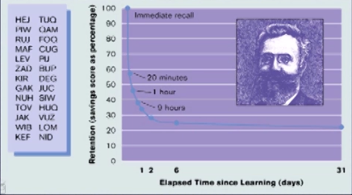
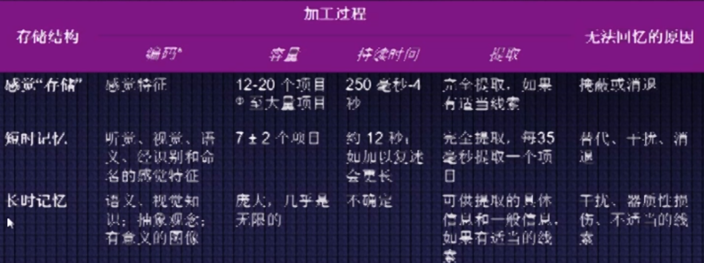
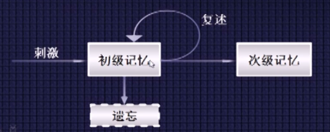
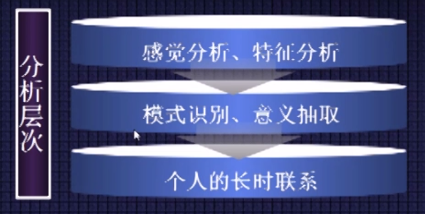

# 记忆模型
## 早期研究
### 艾宾浩斯遗忘曲线
+ 重点：无意义音节：辅音-元音-辅音  
  

### 威廉.詹姆斯
+ 二元记忆
  + 初级记忆——即时记忆——短时记忆
  + 次级记忆——间接记忆——长时记忆

## 记忆的认知神经科学
+ 记忆功能遍布整个大脑
+ 三个区域和记忆直接相关
  + 大脑皮层——思维，问题解决，知识：陈述性记忆
  + 小脑——调节运动功能，动作记忆
  + 海马——加工新信息并传送到大脑皮层的关键区域

### 短时记忆转换为长时记忆
+ 长时程增加：发生在海马结构的突触上
  + 神经细胞在面临重复刺激时，会在很长时间内增加自身反应倾向
  + 长时陈述记忆：大脑皮层向海马发送记忆后会形成长时程增加

## 记忆的存储

## 记忆模型
### Waugh & Norman
+ 和威廉詹姆斯的想法相同，认为记忆是二元的
  + 初级记忆
  + 次级记忆
+ 在威廉的基础上，他们定量描述了初级记忆的属性
  + 存储容量有限，存储其中的信息之所以小时，不仅仅因为时间的流逝，还因为旧的项目会被新项目替代，时间的流逝（即消退）的影响反而不大  
  

### 加工水平
+ 克雷克和洛克哈特
  + 反对记忆的头脑黑箱范式
  + 基于加工水平的记忆概念
  + 一个刺激究竟被传送到浅层还是深层阶段，取决于**刺激性质**和**用于加工处理的时间**  
  
+ 加工水平与信息加工
  + 信息加工模型
    + 强调专司加工功能的结构成分，以及与这些结构成分相联系的操作过程
  + 加工水平
    + 对加工活动提出假设，而后根据这些操作建构一套记忆系统
    + 记忆的持久性取决于加工深度
      + 浅层：很快被遗忘
      + 深入：长久保持
+ 对待“复述”
  + 头脑黑箱理论
    + 将信息转存到更为持久的记忆存储器中
  + 加工水平理论
    + 在某个水平上保持信息，不会产生更好的存储效果
    + 将信息转入更深入的水平

### 自我关联效用（SRE）
+ 自我图式
  + 存储与自我有关的信息
  + 我们能更容易地组织与自身有关的新信息，其他信息则不然