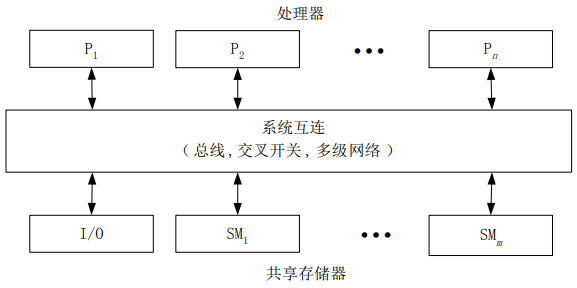
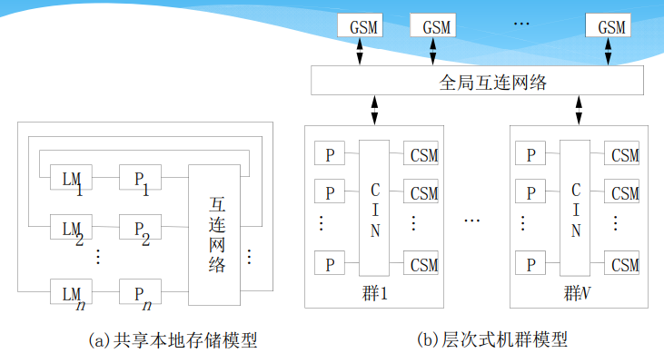
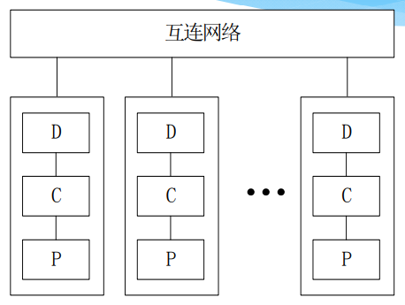
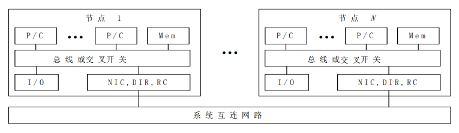
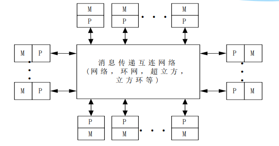
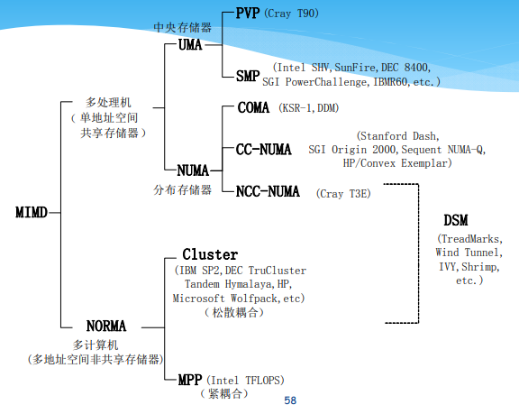

# 并行计算机系统及其结构模型

## 并行计算机的访存模型
#### UMA模型
+ UMA：均匀存储访问模型
  + 物理存储器被所有处理器均匀共享
  + 所有处理器访问任何存储字节需要相同的时间
  + 每台处理器可拥有私有高速缓存
  + 外围设备可以一定形式共享  
  

#### NUMA模型
+ NUMA：非均匀存储访问模型
  + 被共享的存储器在物理上是分布在所有处理器中的，所有处理器的本地存储器的集合就组成了全局地址空间
  + 处理器访问存储器的时间不同，访问本地存储器或群内共享存储器较快，访问外地存储器或全局共享存储器较慢  
  

#### COMA模型
+ COMA：全高速缓存存储访问
  + 各处理器节点中没有存储层次结构，全部高速缓存组成了全局地址空间
  + 利用分布的高速缓存目录D进行远程高速缓存的访问
  + 使用COMA时，数据开始时可任意分配，因为在运行时它最终会被迁移到要用到它们的地方  
  

#### CC-NUMA模型
+ CC-NUMA：高速缓存一致性非均匀存储访问模型
大多数使用基于目录的高速缓存一致性协议；
  + 保留SMP结构易于编程的优点，也改善常规SMP的可扩放性
  + CC-NUMA实际上是一个分布共享存储的DSM多处理机系统
  + 它最显著的优点是程序员无需明确地在节点上分配数据，系统的硬件和软件开始时自动在各节点分配数据，在运行期间，高速缓存一致性硬件会自动地将数据迁移至要用到它的地方。  
  

#### NORMA模型
+ NORMA：非远程存储访问模型
  + 所有存储器是私有的；
  + 绝大数NUMA都不支持远程存储器的访问；
  + 在DSM中，NORMA就消失了  
  

---
