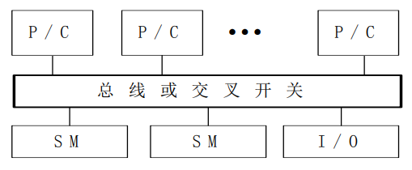
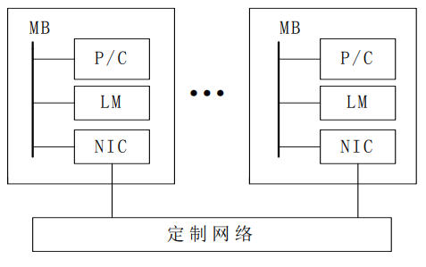
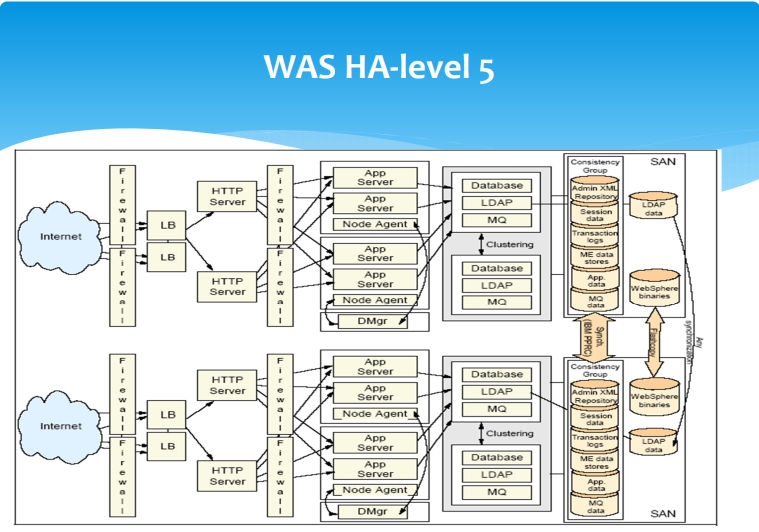
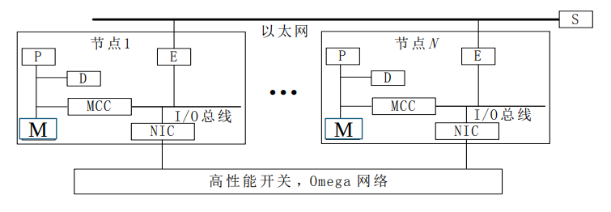
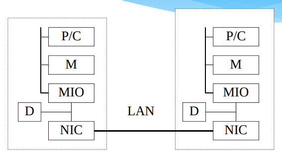
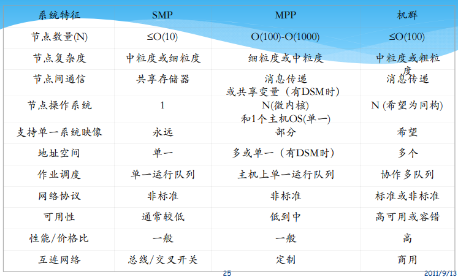

# 当代并行机系统

## 共享存储多处理机系统
### 对称多处理机 SMP

+ SMP：采用商用微处理器，通常有片上和片外Cache，基于总线连接，集中式共享存储，UMA结构
+ 优点
  + 对称性，每个计算单元的地位平等
  + 单地址空间，易编程，动态负载均衡
  + 高速缓存能够很好地维护数据一致性
  + 理论上具有低通信延迟
+ 缺点
  + 欠可靠
  + 在实际应用中因为cpu竞争导致通信延迟较大
  + 带宽增长速度慢
  + 不可扩放性

## 分布式存储多计算机系统
### 大规模并行机 MPP

+ MPP：成百上千个处理器组成的大规模计算机系统，规模是变化的。基于NORMA结构，高带宽低延迟定制互连。

## 集群系统
+ 计算机集群（Cluster）是一种计算机系统，它通过一组松散集成的计算机软件或硬件连接起来高度紧密地协作完成计算工作。
+ 集群分为同构和异构两种，区别在于组成集群系统的计算机之间的体系结构是否相同。集群计算机按照功能和结构可以分成
  + 高性能计算集群 High‐performance (HPC) clusters
    + 高性能计算集群采用将计算任务分配到集群的不同计算节点从而提高计算能力，主要用在科学计算领域。
    + HPC集群特别适合于在计算中各计算节点之间发生大量数据通讯的计算作业。
  + 负载均衡集群 Load balancing clusters
    + 负载均衡集群运行时，一般通过一个或多个前端负载均衡器，将工作负载分发到后端的一组服务器上，从而达到整个系统的高性能和高可用性。
  + 高可用性集群 High‐availability (HA) clusters
    + 一般是指当集群中有某个节点失效的情况下，其上的任务会自动转移到其他正常的节点上。还指可以将集群中的某节点进行离线维护再上线，该过程并不影响整个集群的运行。  
      
  + 网格计算 Grid computing
    + 网格计算或网格集群是一种与集群计算相关的技术。网格与传统计算集群的区别在于，网格是连接一组**相关但是并不信任的计算机**，其运作更像一个计算公共设施而非独立计算机。同时网格计算也支持更多**不同类型的计算机集合**。
    + 网格计算是针对有许多独立作业的工作任务作优化，在计算过程中作业间无需共享数据。

### 大规模并行处理系统MPP机群 SP2
+ 设计策略：
  + 机群体系结构
  + 标准环境
  + 标准编程模型
  + 系统可用性
  + 精选的单一系统映像
+ 系统结构：
  + 高性能开关 HPS 多级Ω网络
  + 宽节点、窄节点和窄节点2

### 工作站集群 COW
+ 分布式存储，MIMD，工作站+商用互连网络，**每个节点是完整的计算机，有自己的磁盘和操作系统，而MPP中只有微内核**
+ 优点：
  + 投资风险小
  + 系统结构灵活
  + 性能/价格比高
  + 能充分利用分散的计算资源
  + 可扩放性好
+ 问题
  + 通信性能
  + 并行编程环境

## SMP、MPP、Cluster比较

