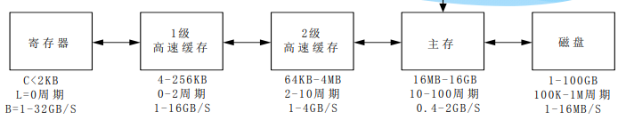
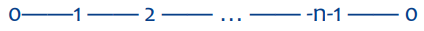
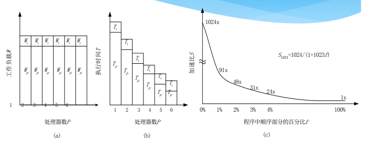
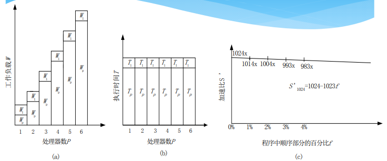
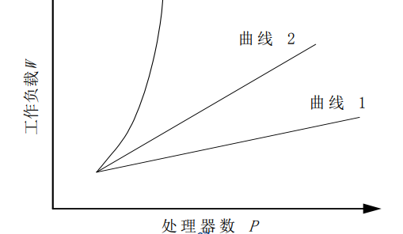
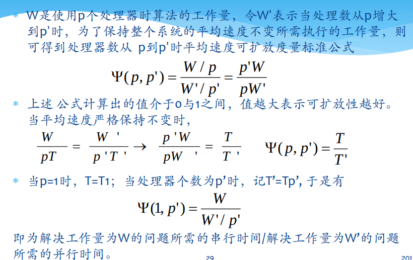
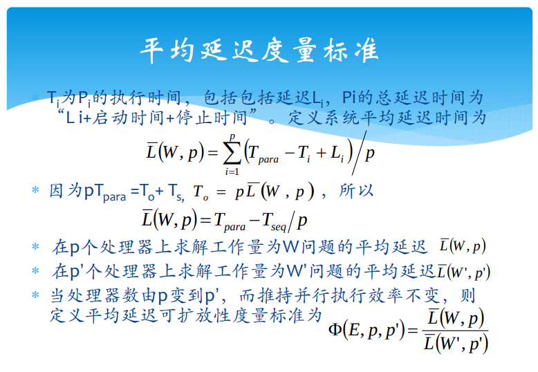

# 并行计算性能评测

## 并行机的一些基本性能指标
### CPU的基本性能指标
+ 工作负载的衡量方式
  + 执行时间
  + 浮点运算数
  + 指令数目
+ 并行执行时间$T_{\text{n}}$
  + 设$T_{\text{compute}}$为计算时间，$T_{\text{paro}}$为并行开销时间，$T_{\text{comm}}$为相互通信时间
  $$T_{\text{n}}=T_{\text{compute}}+T_{\text{paro}}+T_{\text{comm}}$$

### 存储器性能
+ 存储器的层次结构  
  

### 并行与通信开销
+ 通常情况下并行与通信开销远大于计算开销
+ 测量方法
  + Ping-Pong Scheme：节点0发送m个字节给节点1；节点1从节点0接受字节后，立即将消息发回节点0。节点0接受到时间后停止计时，然后总的时间除以2,即可得到点到点的通信时间，也就是执行单一发送或接受操作的时间。
  + Hot Potato Scheme：适用于多个节点的情况。节点0发送给节点1,节点1发送给节点2,直到最后节点接受到消息。  
  
+ 通信方式
  + 整体通信
    + 广播：处理器0发送m个字节给所有的n个处理器，总发送字节为$m$。
    + 散射：处理器0发送m个字节的不同消息给所有n个处理器，总发送字节为$mn$。
    + 收集：处理器0接受所有n个处理器发来的消息，总接收字节为$mn$。
    + 全交换：每个处理器均彼此相互发送$m$个字节的不同消息，总通信量为$mn^2$。
    + 循环移位：处理器$i$发送$m$个字节给处理器$i+1$，处理器$n-1$发送$m$个字节给处理器0,总通信量为$mn$。（类似Hot Potato Scheme）
  + 点到点通信
    + 通信开销$t(m)=t_0+m/r_{\infty}$
    + 其中，$t_0$为通信启动时间，渐进带宽为传递无限长的消息时的通信速率
    + 令$m_{\frac 12}$为达到一半渐进带宽所需要的消息长度，$\pi_0$表示短消息带宽，则有$t_0=m_{\frac 12}/r_{\infty}=\frac 1{\pi_0}$。

### 机器的性价比和利用率
+ 性价比：指用单位代价所能获取的性能
+ 利用率：指可达到的速度与峰值速度之比

---

## 性能评测算法
+ 加速比性能定律
  + 并行系统的加速比是指对于一个给定的应用，并行算法（或并行程序）的执行速度相对串行算法（或串行程序）的执行速度加快了多少倍。

### Amdahl定律
+ 符号定义
  + $P$：处理器数目
  + $W$：问题规模
    + $W_s$是应用程序中的串行分量，$f$是串行分量比例$W_s/W$。
    + $W_p$是应用程序中可并行化的部分
    + $W=W_s+W_p$
  + $S$：加速比
  + $E$：效率
  + 问题假设：固定不变的计算负载
+ 固定负载的加速公式
  $$S=\frac{W_s+W_p}{W_s+W_p/P}=\frac {f+(1-f)}{f+(1-f)/P}=\frac {P}{1+f(P-1)}$$
  + $P\to\infty$时，$S\to 1/f$，即并行系统的加速比上限为$1/f$。
+ 考虑并行开销的加速比公式
  + 设$W_o$为并行开销
  $$S=\frac{W_s+W_p}{W_s+W_p/P+W_o}=\frac{P}{1+f(P-1)+W_oP/W}$$
  + $p\to \infty$时，$S\to \frac 1{f+W_o/W}$

### Gustafson定律
+ 比较的是给定的计算时间下所能完成的工作负载比例。除非是学术研究，在实际应用中没有必要固定工作负载，增多处理器必须相应地增大问题规模才有实际意义。
+ 加速公式
  $$S'=\frac{W_s+PW_p}{W_s+PW_p/P}=\frac{W_s+PW_p}{W_s+W_p}=P-f(P-1)$$
  + 当$p$充分大时，$S'$与$p$几乎成斜率为$1-f$的线性关系，这给出了一个非常乐观的结论。
+ 考虑并行开销的加速比公式
  $$S'=\frac{W_s+PW_p}{W_s+W_p+W_o}=\frac{f+p(1-f)}{1+W_o/W}$$

### Sun和Ni定律
+ 基本思想
  1. 只要空间许可，应尽可能增大问题规模以产生更好的解
  2. 假定在单节点上使用了全部存储容量$M$并在相应于$W$的时间内求解之，此时工作负载为$W=fW+(1-f)W$
  3. 在$P$个节点并行的系统上，由于每加入一个节点，都会带来存储容量的增加，因此能够求解的问题规模会随着节点数量的增加而增加。令因子$G(P)$为反应存储容量增加到$P$倍后*并行工作负载*的增加量，则扩展后的工作负载为$W=fW+(1-f)G(P)W$
+ 加速比公式
  $$S''=\frac{fW+(1-f)G(P)W}{fW+(1-f)G(P)W/P}=\frac{f+(1-f)G(P)}{f+(1-f)G(P)/P}$$
+ 考虑并行开销的加速比公式
  $$S''=\frac{fW+(1-f)G(P)W}{fW+(1-f)G(P)W/P+W_o}=\frac{f+(1-f)G(P)}{f+(1-f)G(P)/P+W_o/W}$$
+ 与其他加速比公式的联系
  + $G(P)=1$就是Amdahl加速比公式
  + $G(P)=P$就是Gustafson加速比公式
  + $G(P)>p$相应于计算机负载比存储增加更快

### 关于加速比的讨论
+ 参考的加速经验公式
  $$P/\log P\leq S\leq P$$
+ 加速比举例
  + 线性加速比：很少通信开销的矩阵相加，内积运算
  + $P/\log P$加速比：分治法应用的问题
  + 超线性加速比：**单目标**搜索问题

---
## 可扩放性（Scalability）评测标准
+ Scalability：在确定的应用背景下，计算机系统所能处理的问题规模随处理器数量的增加而按比例提高的能力。**衡量了该系统能被并行化的余地（能力）**
+ 随着处理器数量的增加，并行计算系统能够处理更大规模的问题。但是这种问题的规模并不是随着处理器数量无线增长的，系统有效利用不断增加的处理器的能力是受限的。**度量这种能力的就是Scalability指标。**
+ 可扩放性研究的主要目的
  + 确定解决某类问题用何种并行算法与何种并行体系结构的组合，可以有效地利用大量的处理器；
  + 估算对于运行于某种体系结构的并行机上的某种算法当移植到大规模处理机上后运行的性能；
  + 对固定的问题规模，确定在某类并行机上最优的处理器数与可获得的最大的加速比；
  + 用于指导改进并行算法和并行机体系结构，以使并行算法尽可能地充分利用可扩充的大量处理器

### 等效率度量标准
+ 在固定**效率**后观察维持该效率时问题规模随处理器数量$P$的变化关系
+ 推导
  + 令$t_{ie}$和$t_{io}$分别是并行系统上第$i$个处理器的有用计算时间个额外开销时间，$T_e=\sum_{i=0}^{P-1}t_{ie}, T_o = \sum_{i=0}^{P-1}t_{io}$
  + 令$T_p$为$P$个处理器系统上并行算法的运行时间，显然$T_p=t_{ie}+t_{io}$且$T_e+T_o=PT_p$
  + 令
  $$S=\frac {T_e}{T_p}=\frac {P}{1+T_o/T_e}=\frac p{1+T_o/W}$$
  $$E=\frac SP=\frac 1{1+T_o/T_e}=\frac 1{1+T_o/W}$$
  其中$E$为**效率**。
  + 可看出，在固定效率时，当处理器数量$P$增大，并行开销$T_o$将增大，为了维持效率恒定，问题的规模$W$也要相应增大。此时$W$随$P$增大的趋势就是用于衡量Scalability的等效率函数。  
  

### 等速度度量标准
+ 推导
  + 定义并行计算的速度$V$为总工作量$W$除以并行执行时间$T$
  $$V=W/T$$
  + $P$个处理器的并行系统的**平均速度**$\bar{V}$定义为并行速度$V$除以处理器个数$P$
  $$\bar{V}=V/P=\frac W{PT}$$  
  

### 平均延迟度量标准

### 可扩放性标准的比较
+ 等效率度量标准
  + 在保持效率$E$不变的前提下，研究问题规模$W$如何随处理器个数$P$而变化
+ 等速度度量标准
  + 在保持平均速度不变的前提下，研究处理器个数$P$增多时应该相应增加多少工作量$W$
+ 平均延迟度量标准
  + 在保持效率$E$不变的前提下，用平均延迟的比值来标志随处理器个数$P$增加需要增加的工作量$W$
+ 三种可扩放性度量的标准是彼此等效的