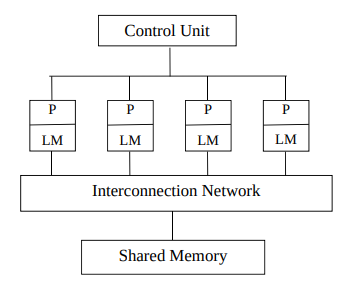
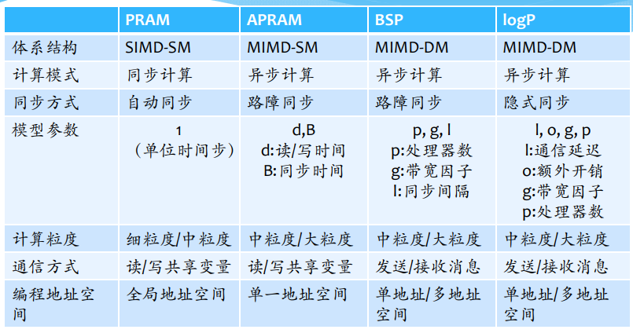

# 并行计算的算法基础
[TOC]
---
## 并行算法基础
### Case Study
#### 计算前缀和
+ 问题定义
  + $n$个元素$\{x_1, x_2, ...,x_n\}$，前缀和是$n$个部分和$S_i=x_1*x_2*...*x_i, 1\leq i\leq n$
  + 串行算法
    + $S_i=S_{i-1}*x_i$，计算时间为$O(n)$
  + 并行计算  
    

### 并行算法的复杂性度量
+ 串行算法的复杂性度量
  + 最坏情况下的复杂度
  + 期望复杂度
+ 并行算法的几个复杂性度量指标
  + 运行时间$t(n)$：包含计算时间和通讯时间，分别用计算时间步和选路时间步做单位，$n$为问题实例的输入规模
  + 处理器数$p(n)$
  + 并行算法成本$c(n)=t(n)p(n)$
    + 如果一个求解问题的并行算法的成本在数量级上等于最坏情况下求解此问题所需的执行步数，则称此并行算法是成本最优的
  + 总运算量$W(n)$：并行算法求解问题时所完成的总的操作步数

+ Brent定理
  + 令$W(n)$是某并行算法A在运行时间$T(n)$内所执行的计算量，那么A使用p台处理器可以在$t(n)=O(W(n)/p+T(n))$时间内执行完毕

### 并行算法的同步
+ 同步：同步是在时间上强使各执行进程在某一点必须互相等待
+ 可用软件、硬件和固件的办法来实现同步操作
+ 同步操作往往伴随着并行算法中的串行部分

### 并行算法的通讯
+ 通讯
  + 共享存储多处理器使用
    + global read(X, Y)和global write(X, Y)
  + 分布式存储多计算机使用
    + send(X, i)和receive(Y, j)

> 通讯示例：计算矩阵乘法结果$AX$，其中$A:n\times n, X:n\times 1$  
> 

---
## 并行计算模型
### Flynn分类法
+ SISD、MIMD、SIMD、MISD
### PRAM模型
#### 基本概念
+ 有一个集中的共享存储器和一个指令控制器，通过SM的R/W交换数据，隐式同步计算  
  
#### 分类
+ PRAM-CRCW 并发读并发写
  + CPRAM-CRCW 仅允许写入相同数据
  + PPRAM-CRCW 仅允许优先级最高的处理器写入
  + APRAM-CRCW 允许任意处理器自由写入
    + 如果能定义一种关于写入优先级的良好偏序关系（比如时间顺序、得分增长等），那么就能够实现处理器的自由写入
+ PRAM-CREW 并发读互斥写
+ PRAM-EREW 互斥读互斥写

#### 计算能力比较

### 异步APRAM模型
+ 每个处理器有局部的存储器、局部的时钟、局部的程序；没有全局的时钟，各处理器异步执行。处理器之间通过SM进行通讯，需要在并行程序中显式地加入同步路障
+ 计算过程
  + 设置同步障，在同步障之前每个处理器可以执行自己各自的任务，在同步障处集中处理在之前时刻其他处理器传输的异步数据
  
+ 分析  
  

### BSP模型
+ 异步MIMD-DM模型，支持消息传递系统
+ **块内异步并行，块间显式同步**

### logp模型
+ 基本概念
  + 是一种分布式存储、点到点通讯的多处理机模型
+ 模型参数
  + $L$：network latency
  + $o$：communication overhead，貌似是读或者写的提前操作时间
  + $g$：gap=1/bandwidth
  + $P$：# of processors

---
### 并行计算模型小结
