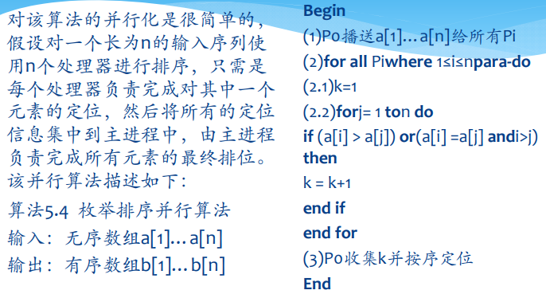
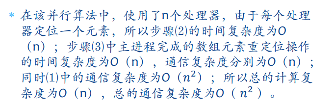
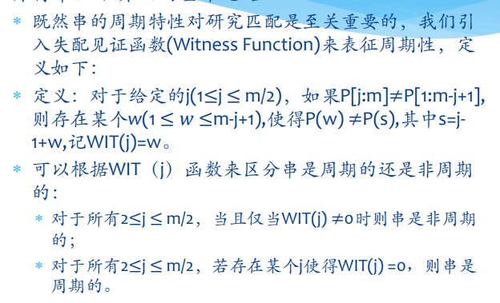
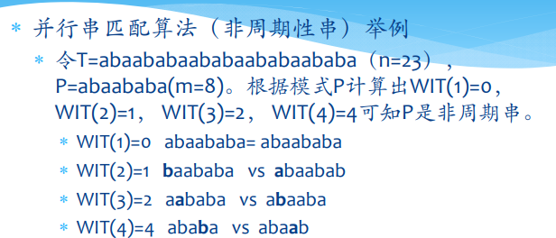
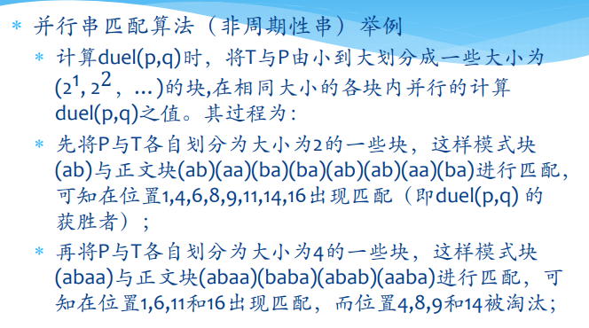
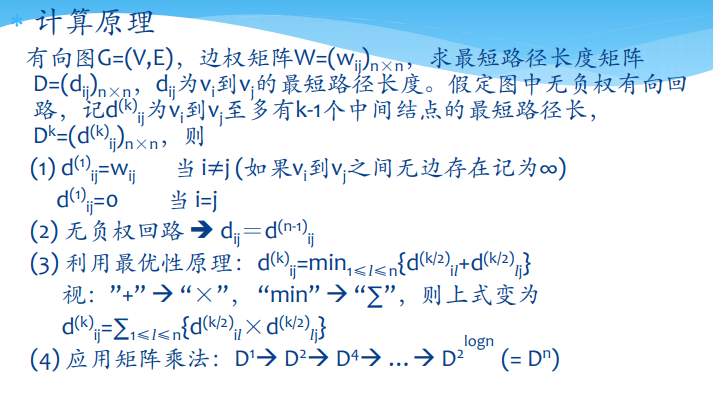

# 并行算法的一般设计算法
---
## 串行算法的直接并行化
+ 发掘和利用现有串行算法中的并行性，直接将串行算法改造为并行算法

#### 快速排序算法的并行化
+ 快速排序算法的性能主要决定于输入数组的划分是否均衡，这与基准元素的选择密切相关

##### 算法1
+ 并行化的一个简单思想是：在划分完成后pivot两侧的子序列分别交给两个处理器去处理

+ 由于左右分支可以并行化处理，即$T(n)=T(n/2)+n$，因此总体执行时间为$\Theta(n)$ 

##### 算法2
+ 算法1中的并行化方法并未改变串行算法本身的属性，划分所需要的时间仍然是$O(n)$，因此要进一步提高效果，需要将划分步也进行高度的并行化  
  
  <!-- TODO没看懂 -->
  + 每次迭代时可在$\Theta(1)$时间内构造一级树，而树高为$\Theta(\log n)$，因此时间复杂度为$\Theta(\log n)$

### 枚举排序算法的并行化
#### 算法1
+ 第一种并行算法思想很简单，只需要对数组中的每个元素都分配一个处理器用于定位其在数组中的位置即可  
  
  + 复杂度分析  
  
+ 实际上这里的算法实在一开始的时候将$n$个数组元素分别广播给$n$个处理器，这样每个处理器只需要在本地就可以完成所有的计算。是不是也可以在排序过程中进行处理器中间的通讯来解决这个问题？n个处理器同时通讯是不是要比单个处理器的广播要快一些？

---
## 从问题描述开始重新设计算法
+ 从问题描述出发，不考虑相应的串行算法，设计一个全新的并行算法

### Case Study：串匹配算法的并行化
+ KMP算法
  + 串行条件下，简单字符串的匹配速度为$O(m*n)$，而KMP算法的时间开销仅为$O(m+n)$
  + KMP算法这种使用指针进行来回移动的算法难于并行化，因此考虑**通过字符串的周期性**来寻找新的算法
+ 并行算法
  + 首先需要判断模式串是否为周期串  
  
  
  + 然后通过分组比赛的方式，将字串划分为$(2^1, 2^2, 2^3,...)$大小的块，并行地进行匹配  
  
  

---
## 利用已有算法通过更优的算法表梳求解并行问题
