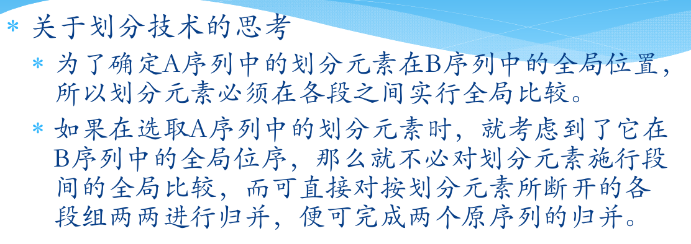
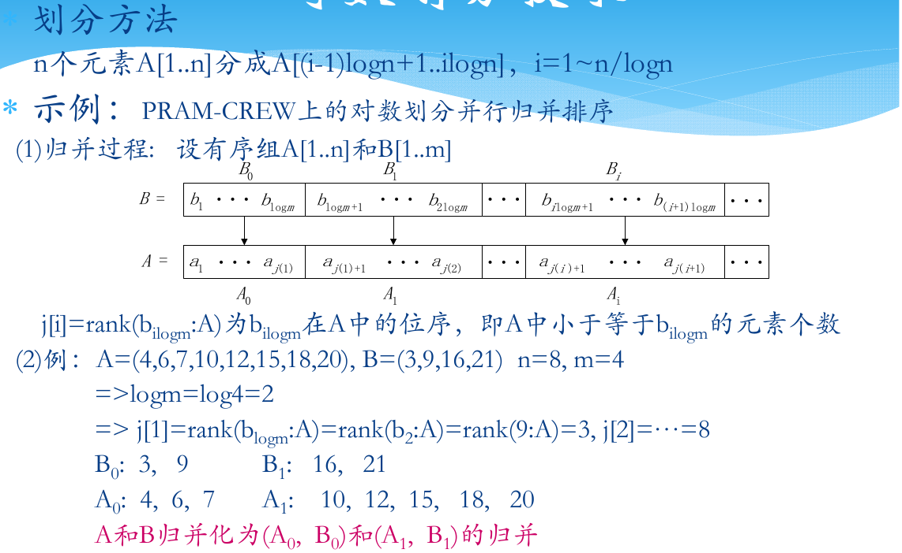
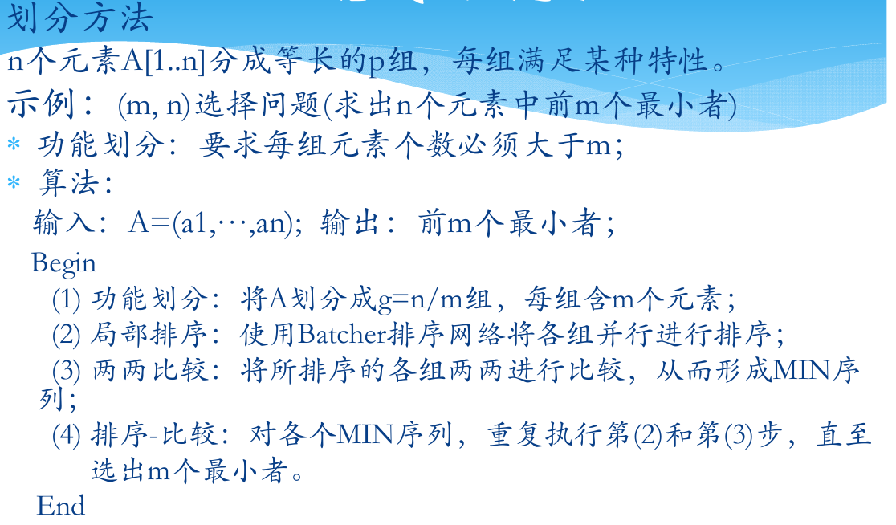
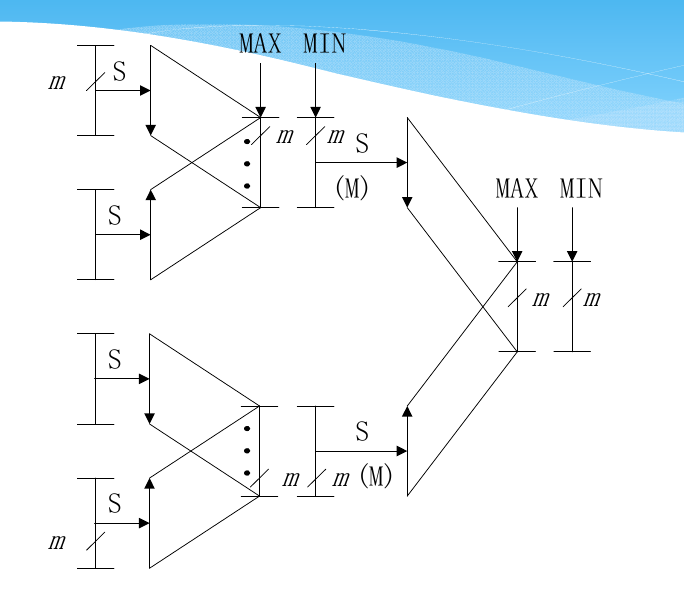
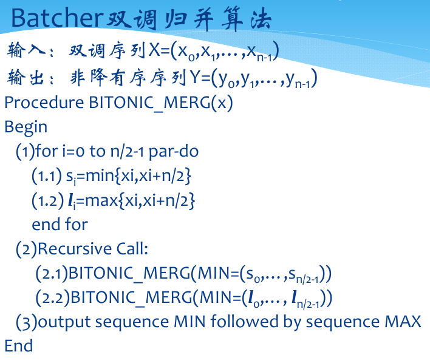
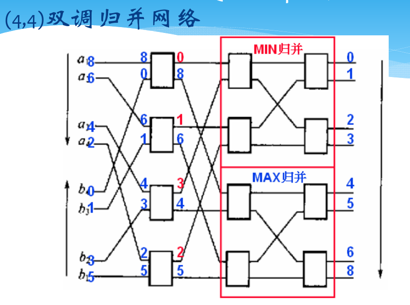
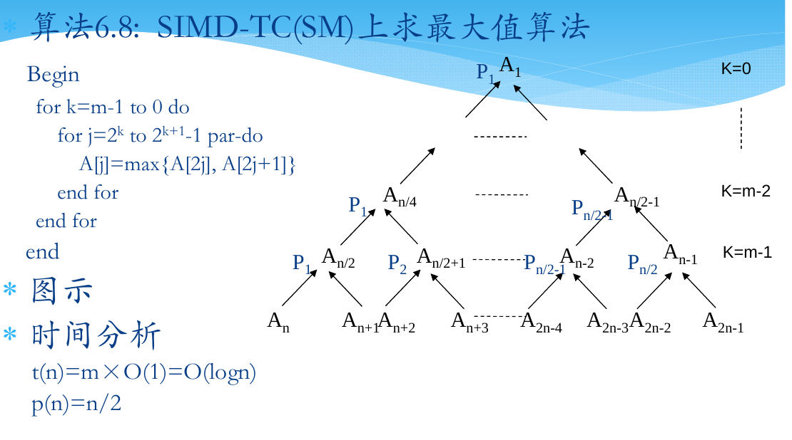
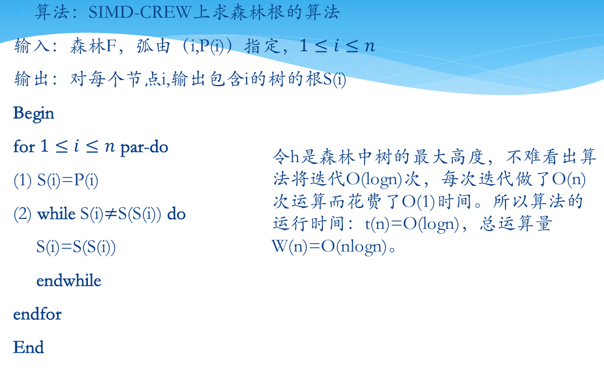

# 并行计算的基本设计技术
---

## 划分设计技术
### 均匀划分技术
+ 以归并排序为例
  + 归并排序基于两个思想：1.更小的列表排序所需要的步数更少；2.比起从头开始排序一个大的列表而言，将大的数组划分为两个小的数组，对小数组分别排序，然后将两个有序的小数组归并成为一个大的有序数组往往更快
+ 并行算法框架下的均匀划分技术  
  
  

### 方根划分技术（其实是归并有序数组的方法）
+ 假设A数组的长度为p，B数组的长度为q，处理器数目为$\lfloor \sqrt{pq}\rfloor$
+ 方根划分：将$A, B$分别按照$\lceil \sqrt{p}\rceil$和$\lceil \sqrt{q}\rceil$的长度进行划分
+ 段间比较：将A的划分元和B的划分元进行比较，确定A的划分元应插入B的区段
+ 段内比较：A的划分元与B相应段内元素进行比较，并插入适当的位置
+ 递归归并：B按照插入的A的划分元重新分段，与A相应的段（A除去原划分元）构成了成对的段组。对每队段组递归执行上述步骤，直到A组为0时递归结束。
+ 方根划分技术的算法分析
  + 处理器数目分析    
  
  + 时间分析  
  

### 对数划分技术

### 功能划分技术
+ 问题背景：假定欲从长为n的序列中选取前$m$个最小者，即所谓$(m, n)$选择问题
+ 此时可以使用功能划分法，将长为n的序列划分为等长的一些数组，每组中元素数量$\geq m$，然后各组可以并行处理

---
## 分治设计技术
###  并行分治设计步骤
+ 将输入划分为若干个规模相同的子问题
+ 并行地递归求解这些子问题
+ 并行地归并子问题的解，直到得到原问题的解
+ **与划分法的不同点在于**
  + 分治法的侧重点在于子问题的归并上
  + 划分法的注意力集中在原问题的划分上

### 双调归并网络
+ 双调序列：两个单调区间的序列
+ **Batcher定理**：给定双调序列$(x_0,  x_1, ..., x_{n-1})$，对于所有的$0\leq i\leq \frac i2-1$，执行$x_i$和$x_{i+n/2}$的比较交换得到$s_i=\min\{x_i, x_{i+n/2}\}, l_i=\max\{x_i, x_{i+n/2}\}$，则
  + 小序列$\{s_0,s_1, ..., s_{n-1}\}$和大序列$\{l_0,l_1, ..., l_{n-1}\}$仍然是双调序列
  + 对于所有的$0\leq i, j\leq \frac n2 -1$，满足$s_i\leq l_j$
+ 于是在有双调序列时，可使用双调归并算法进行排序  
  
+ 可进一步使用双调归并网络进行硬件加速  
  

---
## 平衡树设计技术
### 设计思想
+ 以树的叶节点作为输入，中间节点为处理节点，由叶向根或者由根向叶逐层进行并行处理

### Cases
+ 求最大值  

+ 计算前缀和
  + 略，前面提过

---
## 倍增设计技术
+ 倍增设计技术又称指针跳跃技术，特别适合于处理链表或者有向树之类的数据结构
+ 当递归调用时，所要处理数据之间的**距离逐步加倍**，经过$k$步之后即可完成距离为$2^k$的所有数据的计算

### Case 1：表序问题
+ 表序/rank：链表中元素到链表尾的距离
+ 倍增指针算法
  

### Case 2：求森林的根

---
## 流水线设计技术
+ 将算法流程分成p个前后衔接的任务片段，每个任务片段的输出作为下一个片段的输入
