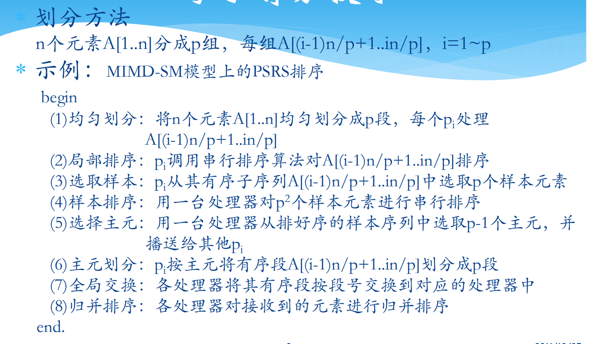
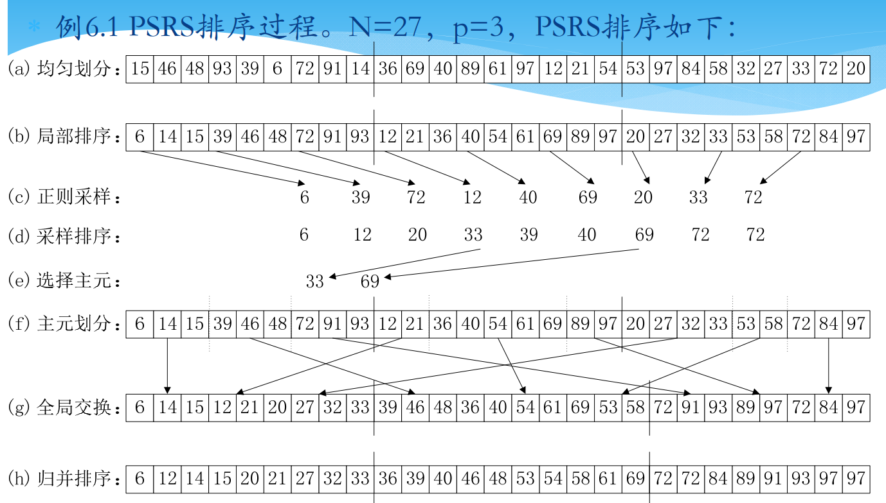
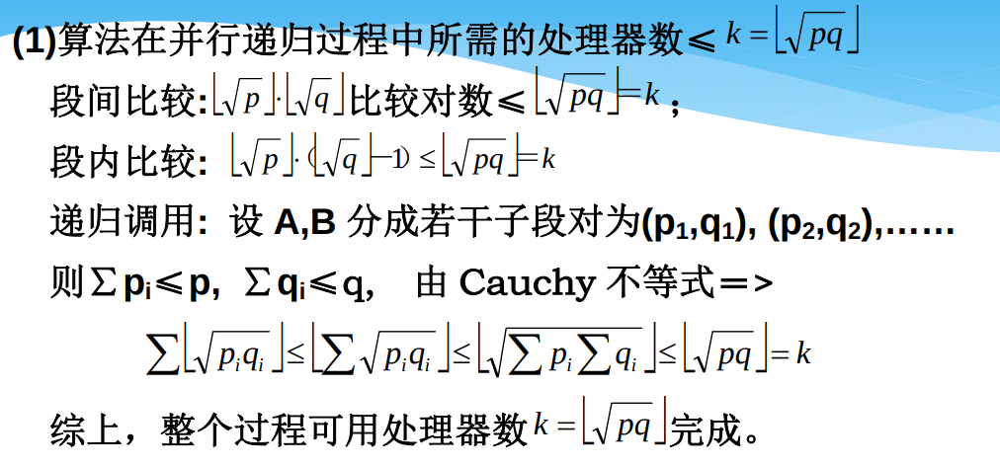
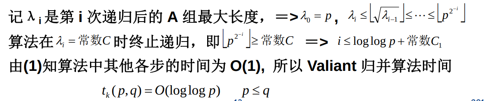

# 并行计算的基本设计技术
---

## 划分设计技术
### 均匀划分技术
+ 以归并排序为例
  + 归并排序基于两个思想：1.更小的列表排序所需要的步数更少；2.比起从头开始排序一个大的列表而言，将大的数组划分为两个小的数组，对小数组分别排序，然后将两个有序的小数组归并成为一个大的有序数组往往更快
+ 并行算法框架下的均匀划分技术  
  
  

### 方根划分技术（其实是归并有序数组的方法）
+ 假设A数组的长度为p，B数组的长度为q，处理器数目为$\lfloor \sqrt{pq}\rfloor$
+ 方根划分：将$A, B$分别按照$\lceil \sqrt{p}\rceil$和$\lceil \sqrt{q}\rceil$的长度进行划分
+ 段间比较：将A的划分元和B的划分元进行比较，确定A的划分元应插入B的区段
+ 段内比较：A的划分元与B相应段内元素进行比较，并插入适当的位置
+ 递归归并：B按照插入的A的划分元重新分段，与A相应的段（A除去原划分元）构成了成对的段组。对每队段组递归执行上述步骤，直到A组为0时递归结束。
+ 方根划分技术的算法分析
  + 处理器数目分析    
  
  + 时间分析  
  

### 对数划分技术

## 分治设计技术
## 平衡树设计技术
## 流水线设计技术
