# 并行算法的一般设计过程
+ **PCAM设计方法学**：设计并行算法的四个阶段
  + 划分（Partition）：分解成小的任务，开拓并发性。
  + 通讯（Communication）：确定诸任务间的数据交换，监测划分的合理性。
  + 组合（Combination）：依据任务的局部性，组合成更大的任务。
  + 映射（Mapping）：将每个任务分配到处理器上，提高算法的性能。
---
## 划分

### 域分解
+ 划分的对象是数据，可以是算法的输入数据、中间处理数据和输出数据
+ 示例  
  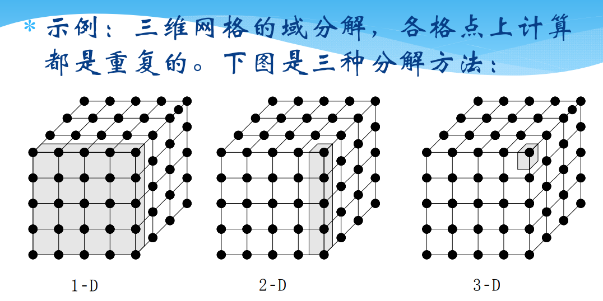
  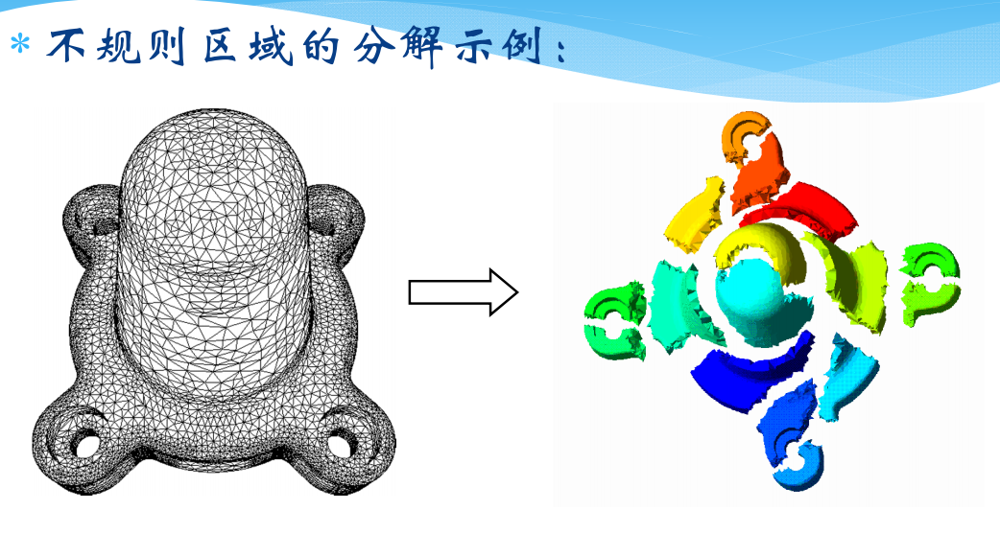

### 功能分解
+ 划分的对象是计算，将计算划分为不同的任务，其出发点不同于域分解
+ 划分后，研究不同任务所需要的数据。如果这些数据是不相交的，则划分成功；如果数据有相当的重叠，意味着要重新进行域分解和功能分解
+ **功能分解是一种更深层次的分解。**
+ 例子
  + 搜索树  
  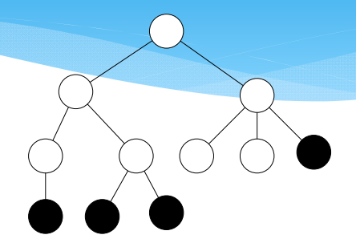
  + 气候模型  
  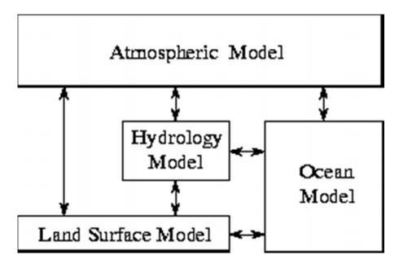

### 划分判据
+ 划分是否有灵活性？
+ 划分是否避免了冗余计算和存储？
+ 划分任务尺寸是否相当？
+ 任务数与问题尺寸是否成比例？

> 关于处理器指派方法（循环指派法、块循环指派法等），可参考[这篇博文](https://blog.csdn.net/qq_40765537/article/details/106098554)

---

## 通讯
+ 通讯是PCAM设计过程的重要阶段
+ 划分产生的任务一般不能完全独立执行，需要在任务间进行数据交流，从而产生了通讯
+ 通讯限制了并发性

### 通讯模式
#### 局部/全局通讯
+ 局部通信限制在一个邻域内  
  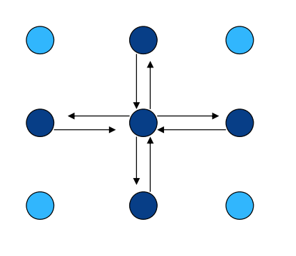
+ 全局通讯分为All-to-All和Master-Worker两种
  + All-to-All  
  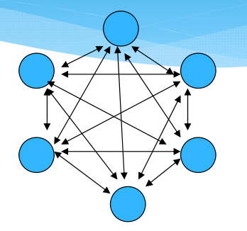
  + Master-to-Worker：分治求和树等等  
  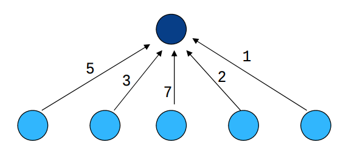

#### 结构化/非结构化通讯
+ 结构化通讯：每个任务的通讯模式是相同的
  + 例：下图的通讯模式为各节点与其相邻节点产生双向通讯  
  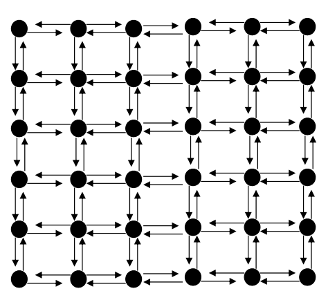
+ 非结构化通讯：没有统一的通讯模式  
  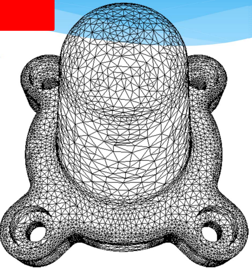

### 通讯判据
+ 所执行的任务是否执行大致相当的通讯？
+ 是否尽可能地局部通讯？
+ 通讯操作是否能并行执行？
+ 同步任务的计算能否并行执行？

---

## 组合
+ 组合是由抽象到具体的过程，是将组合的任务在一类并行机上有效的执行
+ 合并小尺寸任务，减少任务数。如果任务数恰好等于处理器数，则也完成了映射过程
+ **通过增加任务的粒度和重复计算，可以减少通讯成本**
+ 保持映射和扩展的灵活性，降低软件工程的成本

### 表面-容积效应
+ 通讯量与任务子集的表面成正比，计算量与任务子集的体积成正比
+ **增加重复计算有可能减少通讯量**  
  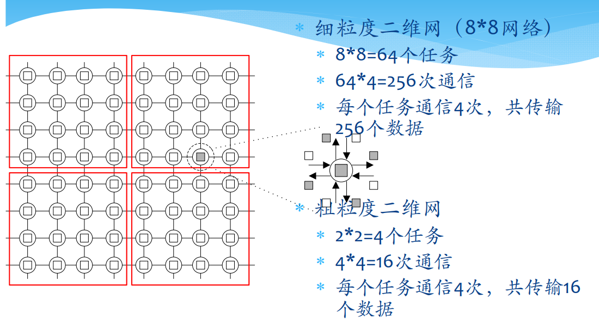

### 重复计算
+ 重复计算减少了通讯量，但增加了计算量，应保持恰当的平衡
+ 重复计算的目标应减少算法的总运行时间
+ 例子
  + 二叉树求全和  
  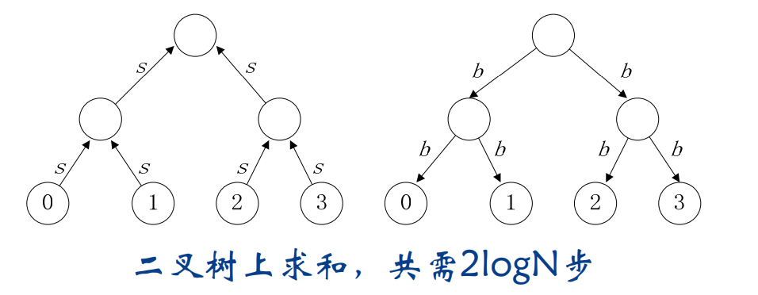
  + 蝶式结构求全和：使用重复计算减少通讯成本
  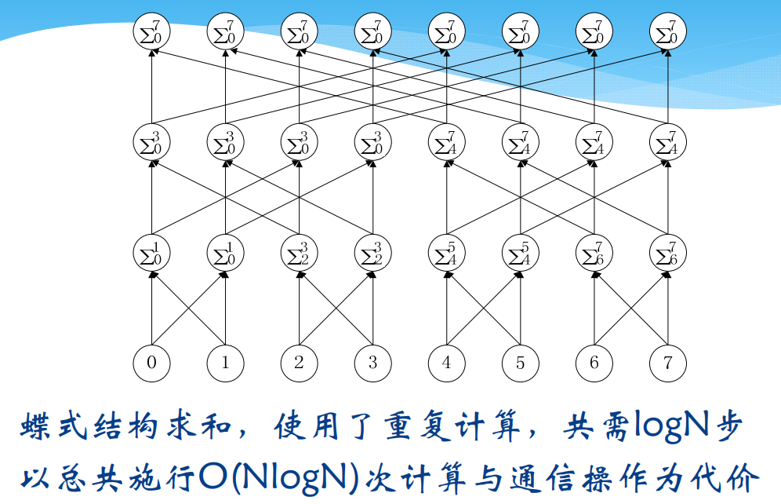

### 组合判据
+ 增加粒度是否减少了通讯成本？
+ 重复计算是否已经权衡了得失？
+ 是否保持了灵活性和可扩放性？
+ 组合的任务数是否与问题尺寸成比例？
+ 是否保持了类似的计算和通讯？
+ 有没有减少并行执行的机会？

---

## 映射
+ 每个任务要映射到具体的处理器，定位到运行机器上
+ 任务数大于处理器数目时，存在负载平衡和任务调度问题
+ 映射的目标：减少算法的执行时间
  + 并发的任务 -> 不同处理器
  + 高通讯要求的任务 -> 同一处理器
+ 映射实际是一种权衡，为NP完全问题

### 负载均衡算法
+ 负载均衡算法可以是
  + 静态的：事先确定
  + 概率的：随机确定
  + 动态的：执行期间动态加载
  + 基于域分解的：
    + 递归对剖
    + 局部算法
    + 概率方法
    + 循环映射

### 任务调度算法
+ 经典调度模式
  + 经理/雇员模式
  + 非集中模式

### 映射判据
+ 采用集中式负载均衡方案，是否存在通讯瓶颈？
+ 采用动态负载均衡方案，调度策略的成本如何？