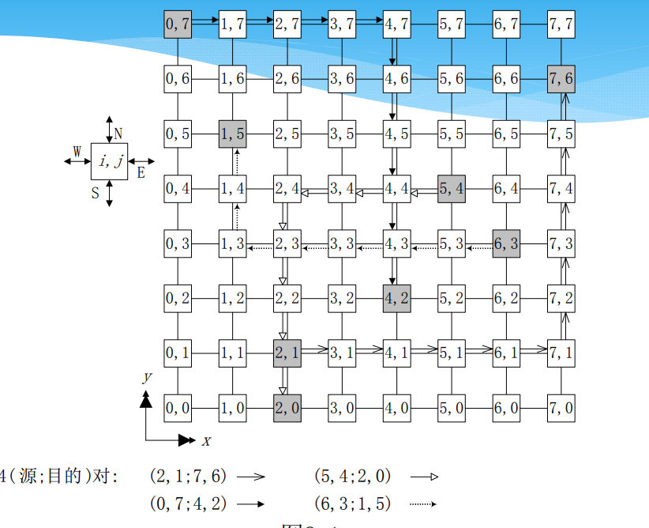
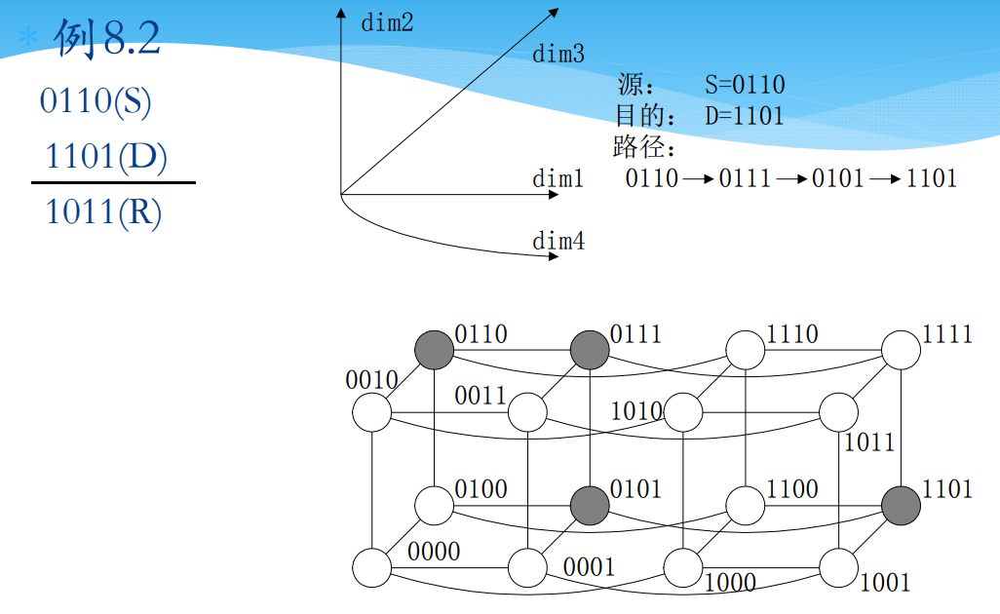
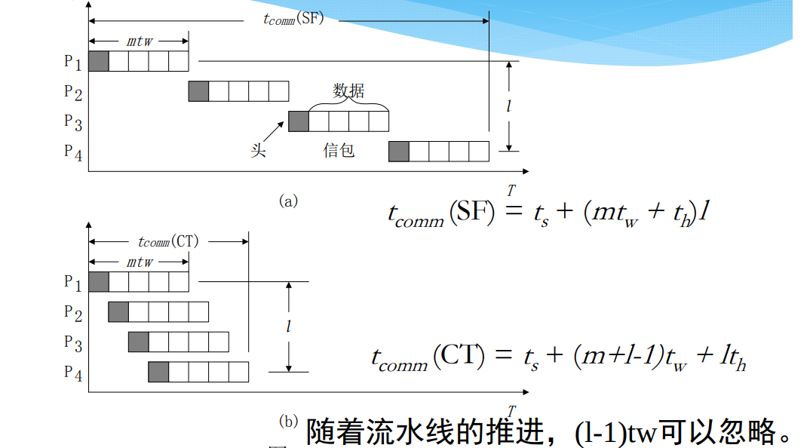
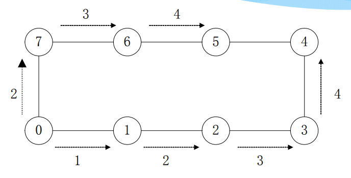
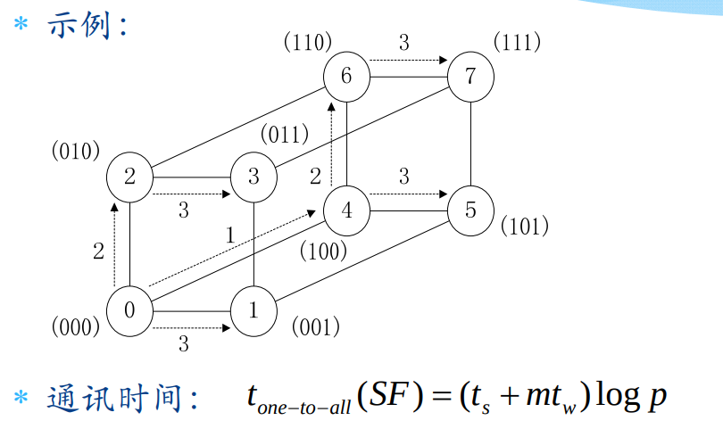

# 并行数值算法和基本通讯操作

## 预备知识
+ 选路（Routing）
  + 选取消息从发源地传输到目的地的路径，要求较低的通讯延迟、无死锁、容错能力高
+ 消息
  + 是指在多计算机系统的处理节点之间传递包含数据和同步消息的消息包，是一种逻辑单位
  + 包的长度随协议不同而不同，是消息传送的最小单位
  + 片的长度固定，一般为8位

---
## 选路方法和开关技术
### 选路方法

#### 二维选路： X-Y选路
+ 首先沿X方向将信包发送至目的地处理器所在的列
+ 再沿Y方向将信包发送至目的地处理器所在的行  
  

#### 超立方选路：E-立方选路
+ 首先将源地址和目的地址进行按位亦或，得到路由值
+ 按照路由值在每个维度上一次进行跳跃
+ 超立方选路的好处在于每个维度上只有“跳”或“不跳”两种选择

### 开关技术
+ 存储转发（Store-and-Forward）选路
  + 消息被分成基本的传输单位---信包，每个信包都含有寻路信息
  + 当一个信包到达中间节点A时，A把整个信包放入其通信缓冲器中，然后在选路算法的控制下选择下一个相邻节点B，当从A到B的通道空闲且B的通信缓冲器可用时，把信包从A发向B
  + 传输时间：$t_{comm}(SF)=t_s+(mt_w+t_h)l=O(ml)$
  + 缺点
    + 每个节点必须对整个消息和信包进行缓冲
    + 网络时延和发送消息所经历的节点数成正比
+ 切通（Cut Trough）选路
  + 在传递一个消息之前，为其建立一条从源节点到目的节点的物理通道。在传递的过程中，线路的每一段都被占用，当消息的尾部经过网络后，整条物理链路才被废弃。
  + 传输时间：$t_{comm}(CT)=t_s+mt_w+lt_h=O(m+l)$
  + 缺点
    + 物理通道非共享
    + 传输过程中物理通道一直被占用

+ 比较  
  
  + 一般情况下$t_s$不容忽略，$t_w$比$t_h$大得多，因此SF和CT的时间可近似为
  $$t_{comm}(SF)=t_s+(mt_w+t_h)l=t_s+mt_wl$$
  $$t_{comm}(CT)=t_s+mt_w+lt_h=t_s+mt_w$$

---
## 一到一传输

---
## 一到多播送

### SF模式
+ 环
  + 先向左邻居或右邻居传送，再左右两个方向同时播送  
  
  + 通讯时间：$t_{one-to-all}(SF)=(t_s+mt_w)\lfloor p/2\rfloor$
+ 环绕网孔
  + 先完成一行中的播送，并行度为$2$
  + 再同时进行各列的环一到多播送，并行度为$2\sqrt{p}$
  + 通讯时间：$t_{one-to-all}(SF)=2(t_s+mt_w)\lfloor \frac {\sqrt{p}}{2}\rfloor$
+ 超立方
  + 从低维到高维，依次进行播送  
  

### CT模式
+ 注意CT模式中中间节点是不能缓存信息的，因为一旦有缓存操作就会出现类似SF中的等待时间

---
## 多到多