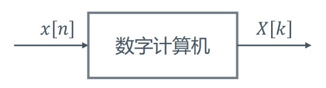

# 几类变换的关系

## 四类信号的傅立叶变换

+ 连续周期信号：傅立叶级数
  + 频谱离散非周期
+ 连续非周期信号：傅立叶变换
  + 频谱连续非周期
+ 离散周期信号：离散傅立叶级数
  + 频谱为周期为N的离散谱
+ 离散非周期信号
  + 频谱为周期为$2\pi$的连续谱

## 信号的数字处理
+ 在信号的计算机处理中，输入与输出一般均为离散信号  
  
+ 输入为一般离散信号时基于DTFT，输出为**连续频谱**，而这是计算机无法做到的
+ 如果我们期望**输入输出都是离散信号**，那么就要求使用DFS
  + 在这种前提下，如果输入为非周期序列，那么在计算机处理时可当做由$x[n]$延拓的周期序列处理。由此引出离散傅立叶变换

---
## 离散傅立叶变换
+ 基于主值序列定义长度为N的（非周期）序列的离散傅立叶变换