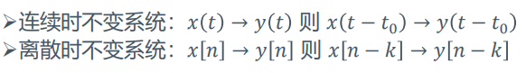
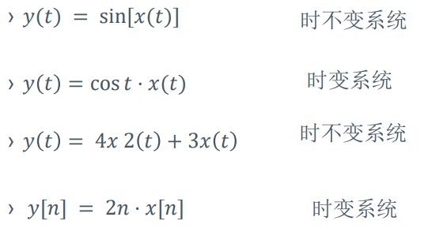
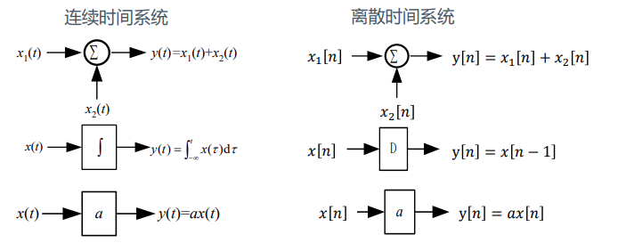
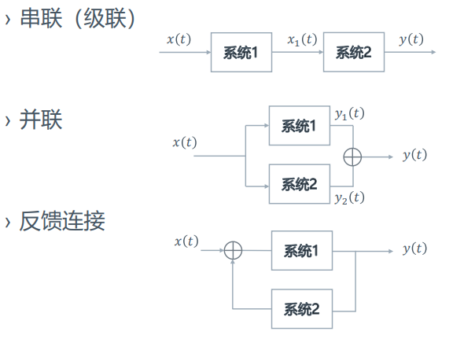

# 系统基础
---
## 基础定义
### 系统的定义
+ 系统是指由相互作用和依赖的若干事物组成的、具有特定功能的整体。

### 系统的分类
#### 连续型和离散型
+ **连续时间系统**
  + 输入输出和激励信号必须为连续时间信号
  + 连续时间系统的数学模型是微分方程
+ **离散时间系统**
  + 输入输出和激励信号必须为离散时间信号
  + 离散时间系统的数学模型是差分方程

#### 记忆系统和无记忆系统
+ **无记忆系统**：系统的输出只取决于系统该时刻的输入
  e.g. 恒等系统
  $$y(t)=x(t)$$
+ **记忆系统**：系统的输出和之前时刻的输入相关
  e.g. 累加器
  $$y[n]=\sum_{k=-\infty}^n x[k]$$

#### 可逆性
+ 系统在不同输入下导致不同输出，则系统**可逆**
+ 如果一个系统可逆，则存在一个逆系统，与原系统级联后可得到一个恒等系统
  e.g. 累加器与其逆系统
  $$y[n]=\sum_{k=-\infty}^n x[k]$$
  $$w[n]=y[n]-y[n-1]$$

#### 因果系统和非因果系统
+ **因果系统**：当且仅当输入信号激励系统时才产生系统输出响应的系统
+ 如果响应$y(t)$并不依赖于将来的激励（例如$x(t+1)$），那么系统就是因果的

#### 稳定性
+ **稳定系统**：在微小的输入下的响应不会发散
  + 指有界输入产生有界输出的系统（BIBO）
+ **不稳定系统**
  e.g. 
  $$y(t)=tx(t)$$ 

#### 线性系统和非线性系统
+ **线性系统**：如果一个输入信号是由几个信号加权组成的，则线性系统的输出是系统对组信号中每一个信号的响应的加权和，并且权重组成和输入信号相同。
  + 线性系统性质(其实是线性系统的**充要条件**)
    + 齐次性：若$x_1(t)\rightarrow y_1(t)$，则$Kx_1(t)\rightarrow Ky_1(t)$。（这里的$\rightarrow$表示$y$是对$x$的响应）
    + 可加性：若$x_1(t)\rightarrow y_1(t), x_2(t)\rightarrow y_2(t)$，则$x_1(t)+x_2(t)\rightarrow y_1(t)+y_2(t)$
  + **增量线性系统**：系统可表示为一个线性系统的输出与一个等于该系统零输入响应。
    + e.g. $y(t)=2x(t)+4$
      信号不满足齐次性，因而不是线性系统；但却是增量线性系统。

#### 时变系统和非时变系统
+ 系统的输出响应与输入激励的关系不随输入激励作用于系统的时间起点而改变。就称为时不变系统。否则，就称为时变系统。  
  
+ 时不变系统的判定  
  

> **时不变性和线性是对系统分别在时域和频域上的刻画。**

### 系统描述
+ 模型描述
  + 输入输出描述：N阶微分方程或差分方程
  $$L\frac {di(t)}{dt}+Ri(t)=x(t)$$
  其中$i(t)$是输入信号，$x(t)$是输出信号
  **通过求解微分方程可以得到输出关于输入的具体形式。**
  + 状态空间描述：使用n个一阶微分方程来描述，在这门课的内容中不作讨论
+ 方框图表示  

+ 系统的串联、并联和反馈连接  

