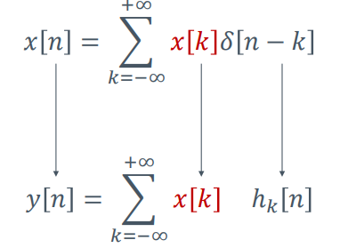
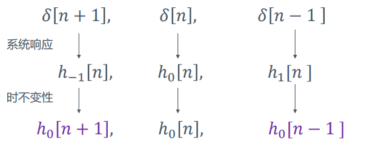
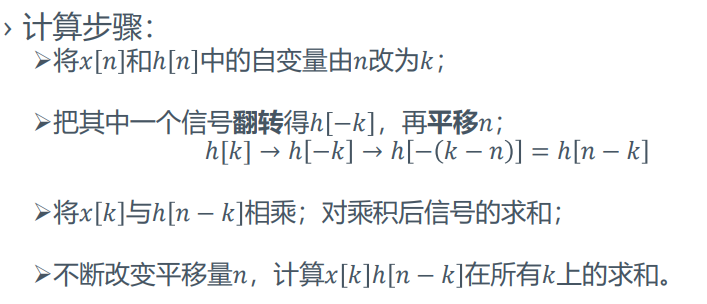
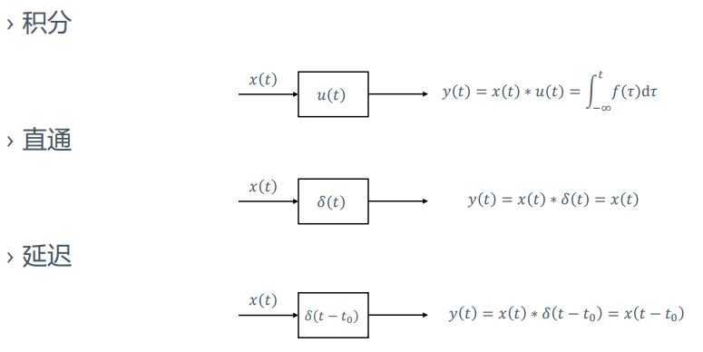
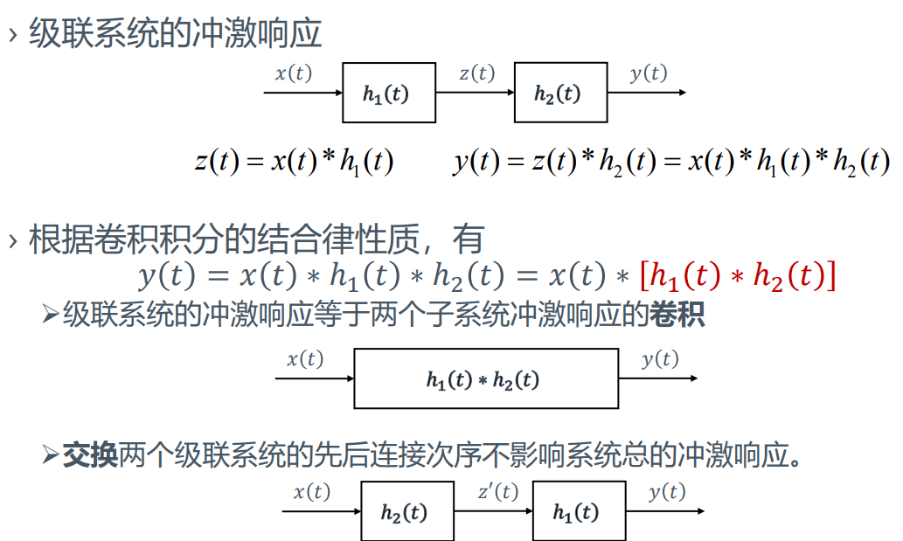
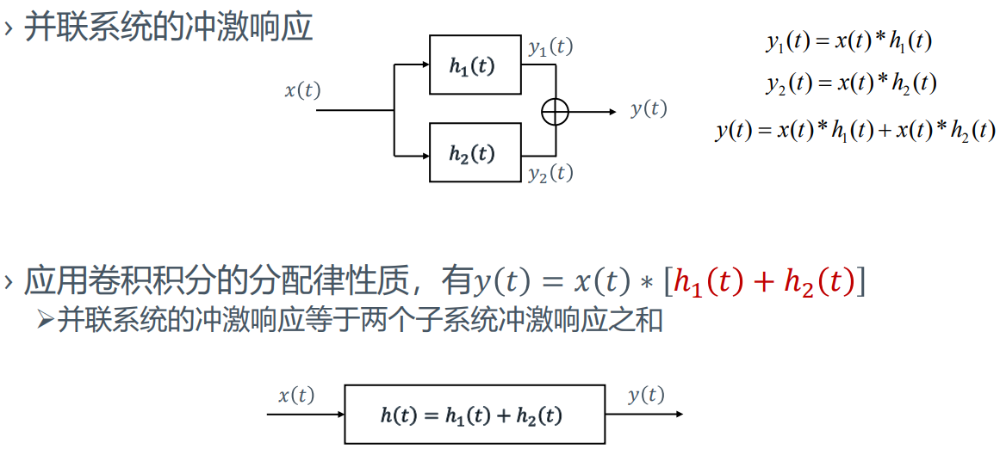
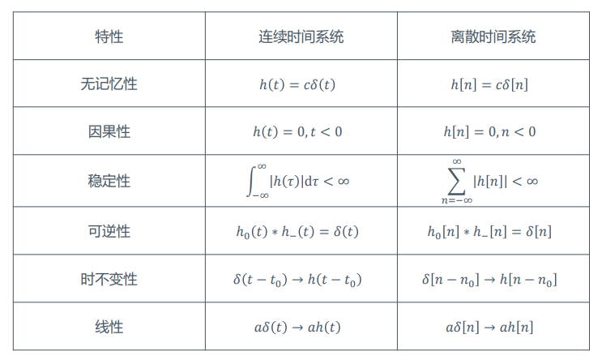
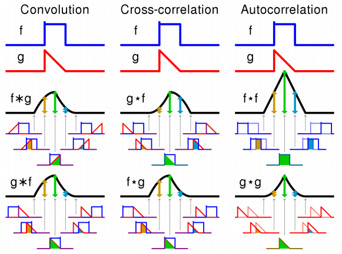

# 信号的卷积运算

## 信号脉冲分解
+ 注意到**线性时不变系统**的以下性质
  + 信号的筛选性质
  $$x[n] = \sum_{k=-\infty}^{\infty}x[k]\delta[n-k]$$
+ 因而对于线性系统，当使用筛选性质进行分解时，可把每一项$x[k]$看作是常数$a_k$，并设系统对信号$\delta[n-k]$的响应为$h_k[n]$，从而得到  
  
+ 然而在上面的式子中仍然有许多的信号$h_k[n]$，因此考虑利用时不变性进行进一步化简  
  
+ 因此最终系统的响应可表示为
  $$y[n]=\sum_{k=-\infty}^{+\infty}x[k]h[n-k]$$
+ 含义
  + **对于任何线性时不变系统，输出信号对输入激励的响应都可表示为$y[n]=\sum_{k=-\infty}^{+\infty}x[k]h[n-k]$，即由输入激励和系统对0时刻单位脉冲信号的响应来描述。**
  + **线性时不变系统对单位脉冲的响应刻画了系统的性质。**

## 卷积
+ **卷积和**：
  $$y[n]=\sum_{k=-\infty}^{+\infty}x[k]h[n-k]$$
  记作
  $$y[n]=x[n]*h[n]$$
+ 卷积和的计算  
  
+ 卷积积分
  $$y(t) = \int_{-\infty}^{+\infty}x(\tau)h(t-\tau)d\tau$$
  与卷积和的计算方式同理

## 卷积的性质
+ 交换律
  $$x_1(t)*x_2(t)=x_2(t)*x_1(t)$$
+ 分配律
  $$[x_1(t)+x_2(t)]*x_3(t)=x_1(t)*x_3(t)+x_2(t)*x_3(t)$$
+ 结合律
  $$[x_1(t)*x_2(t)]*x_3(t) = x_1(t)*[x_2(t)*x_3(t)]$$
+ **平移特性**
  若有$x_1(t)*x_2(t)=y(t)$
  则$x_1(t-t_1)*x_2(t-t_2)=y(t-t_1-t_2)$
+ **展缩特性**
  $$x_1(at)*x_2(at)=\frac 1{|a|}y(at)$$
+ **微分特性**
  $$\frac{\mathrm{d}}{\mathrm{d} t}\left[x_{1}(t) * x_{2}(t)\right]=x_{1}(t) * \frac{\mathrm{d}}{\mathrm{d} t} x_{2}(t)=\frac{\mathrm{d}}{\mathrm{d} t} x_{1}(t) * x_{2}(t)$$
+ **积分特性**
  $$\int_{-\infty}^{t}\left[x_{1}(\tau) * x_{2}(\tau)\right] \mathrm{d} \tau=x_{1}(t) * \int_{-\infty}^{t}\left[x_{2}(\tau)\right] \mathrm{d} \tau=\int_{-\infty}^{t}\left[x_{1}(\tau)\right] \mathrm{d} \tau * x_{2}(t)$$
+ **等效特性**
  $$y(t) = x_1(t)*x_2(t)$$
  $$y^{(i)}(t) = x_1^{(j)}(t)*x_2^{(i-j)}(t)$$
+ 因果信号的卷积
  + 设$x(t), y(t)$为两个因果信号，则它们的卷积信号的积分/求和限为$0\to +\infty$
+ 几个结论
  $$x'(t) = x(t)*\delta '(t)$$
  $$x(t) = x(t)*\delta(t)$$
  $$x^{-1}(t) = x(t)*u(t)$$
## 卷积的系统解释

---
# 使用卷积运算分析LTI系统
+ 前面提到，**LTI系统的响应可被写作激励和系统对0时刻单位脉冲（冲激响应）的卷积，即$y(t)=x(t)*h(t)$，因而可以通过分析冲激响应，从而得到有关系统的一些性质。**
+ **冲激响应的形式可通过在系统微分方程/差分方程中将激励$x(t)$替换为$(\delta(t))$来得到。**
## 级并联系统的冲激响应

## 冲激响应与因果性
+ LTI系统满足因果性的充要条件
  $$h(t)=0\quad\quad t<0$$
+ proof
$$
\begin{aligned}
&\because y(t)=\int_{-\infty}^{+\infty}x(\tau)h(t-\tau)d\tau \\
&\therefore \text{for }\tau \geq t\text{ , }h(t-\tau)=0\\
&\therefore h(t)=0\quad\quad t<0\\
\end{aligned}
$$

## 冲激响应与稳定性
+ 系统的稳定性：系统对任意有界输入，其输出也有界
+ LTI系统稳定的充要条件
  $$\int_{-\infty}^{+\infty}|h(\tau)|d\tau<\infty$$
+ proof
$$
\begin{aligned}
&\because y(t)=\int_{-\infty}^{+\infty}x(\tau)h(t-\tau)d\tau\\
&\therefore y(t)<|B_x|\int_{-\infty}^{+\infty}h(t-\tau)d\tau\\
&\therefore \int_{-\infty}^{+\infty}|h(\tau)|d\tau<\infty
\end{aligned}
$$

## 冲激响应与系统的其他性质

---
# 卷积与相关性
+ 对比
  + 卷积运算
  $$x(t)*h(t)=\int_{-\infty}^{+\infty}x(\tau)h(t-\tau)d\tau$$
  + 相关性运算
  $$x(t)\star h(t)=\int_{-\infty}^{+\infty}x(\tau)h(\tau+t)d\tau$$

  