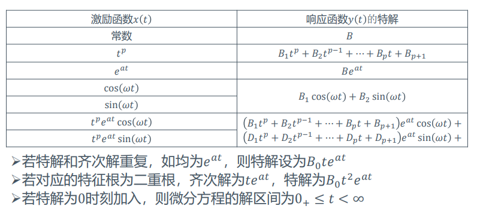
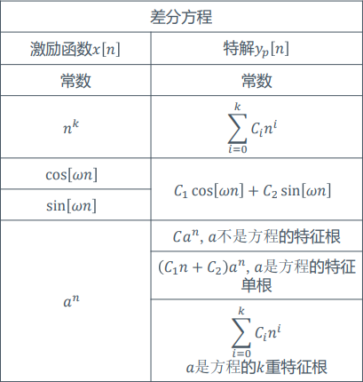
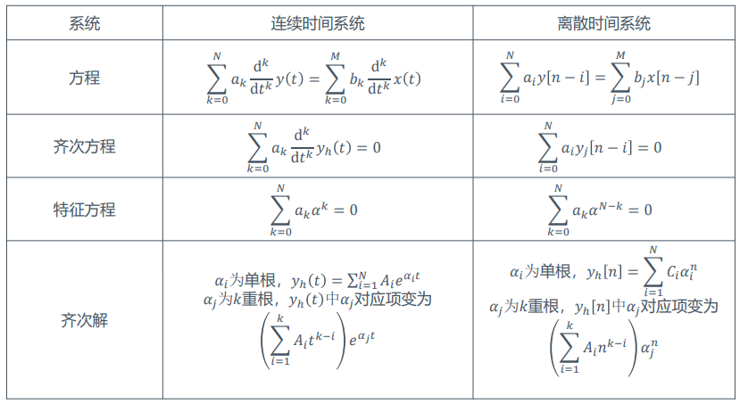
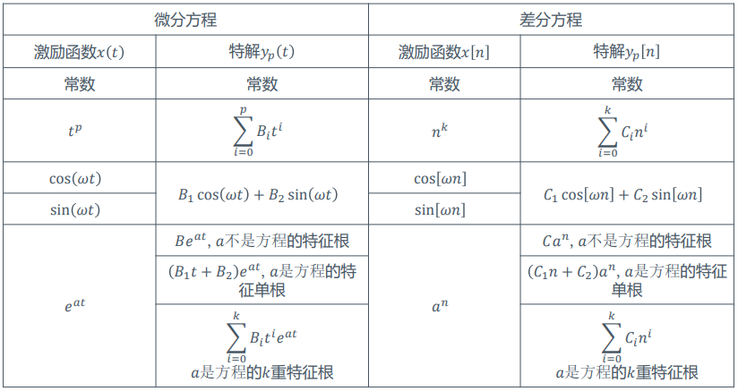
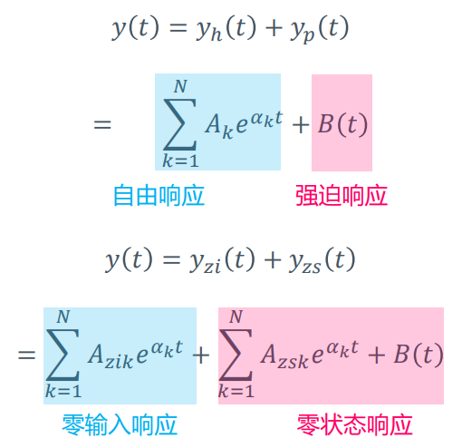

# 系统解算
---
## 1 连续系统：微分方程
+ 如果组成系统的元件都是参数恒定的线性元件，则相应的数学模型是一个线性常系数常微分方程
  $$\sum_{k=0}^{N}a_{k}y^{(k)}(t)=\sum_{k=0}^{M}b_k x^{(k)}(t)$$
+ 若进一步此时系统中各元件在初始状态下无储能，则构成一个线性时不变系统

+ 求解步骤
  + 求齐次解：输入有关的各项全部为0时方程的解
  + 求特解：方程的任意一个解
  + 借助初始条件求待定系数

### 1.1 求齐次解
$$y^{(N)}(t)+a_{N-1}y^{(N-1)}(t)+...+a_1y'(t)+a_0y(t)=0$$
转化为解特征方程
$$\alpha^N+a_{N-1}\alpha^{N-1}+...+a_0=0$$
求解得到$N$个特征根$\alpha_1, \alpha_2, ..., \alpha_{N-1}$

##### 1.1.1 特征根各不相同
齐次解为
$$y_h(t)=A_1e^{\alpha_1 t}+A_2e^{\alpha_2t}+...+A_Ne^{\alpha_N t}$$
$A_1, A_2...$为待定系数。

##### 1.1.2 特征根中存在重根
设$\alpha_1$为$k$阶重根，则齐次解为
$$
\begin{aligned}
y_h(t)=&(A_{11}t^{k-1}+A_{12}t^{k-2}+...+A_{1,k-1}t+A_{1,k})e^{\alpha_1t}\\
&+A_2e^{\alpha_2t}+...+A_{N-k+1}e^{\alpha_{N-k+1}t}\\
\end{aligned}
$$

### 1.2 求特解
+ 特解的形式与激励函数的形式有关。一般做法是：先根据激励函数查表得到特解形式，然后代入特解的形式求解待定系数。  
  

### 1.3 求待定系数
+ 首先基于齐次解$y_h(t)$和特解$y_p(t)$构造完全解$y(t)=y_h(t)+y_p(t)$，然后借助边界条件确定齐次解中的待定系数

---
## 2 离散系统：差分方程
+ 在离散系统下，用于描述系统模型的差分方程形式与微分方程略有不同
  $$\sum_{i=0}^{N}a_iy[n-i]=\sum_{i=0}^M a_ix[n-i]$$
### 2.1 求齐次解
$$\sum_{i=0}^{N}a_iy[n-i]=0$$
齐次解为形如$C\alpha^n$函数的线性组合，令$y[n]=C\alpha^n$，代入有
$$a_{N} C \alpha^{n-\dot{N}}+a_{N-1} C \alpha^{N-1}+\cdots+a_{0} C \alpha^{0}=0$$
化简得到特征方程
$$a_{0} \alpha^{N}+a_{1} \alpha^{N-1}+\cdots+a_{N}=0$$
得到$N$个特征根
$$\alpha_1, ..., \alpha_N$$
##### 2.1.1 特征根各不相同
齐次解为
$$y_h[n]=\sum_{i=1}^N C_i\alpha_i^n$$
##### 2.1.2 特征根中存在重根
设$\alpha_j$为重根，则$y_h[n]$中$\alpha_j$的对应项变为$(\sum\limits_{i=1}\limits^kA_in^{k-i})\alpha_j^n$
### 2.2 求特解

### 2.3 求待定系数
+ 首先基于齐次解$y_h(t)$和特解$y_p(t)$构造完全解$y(t)=y_h(t)+y_p(t)$，然后借助边界条件确定齐次解中的待定系数

---

## 总结
求齐次解  

求特解  

---

## 3 附加条件相关
### 3.1 初始松弛条件与因果性
+ 在使用附加条件确定系统状态方程的完全解时，我们常常假设系统满足一类特殊的附加条件——**初始松弛条件**
  + 微分方程版本：
  $$若对t\leq t_0有x(t)=0，则对t\leq t_0有y(t)=0$$
  + 差分方程
  $$若对n\leq n_0有x[n]=0，则对n\leq n_0有y[n]=0$$
+ **若边界条件满足初始松弛条件，则系统为因果、线性、时不变的**
  + 详情青见《信号与系统》书后习题2-33、2-34

### 3.2 初始条件的跳变
+ 实际系统中，系统的初始条件要根据激励信号接入瞬时系统所处的状态决定。但是由于激励信号的作用，响应$y(t)$及其各阶导数可能在接入激励信号的时间前后发生跳变$(0_-\rightarrow 0_+)$
+ $0_-$状态：$y^{(n)}\left(0_{-}\right)=\left[y\left(0_{-}\right), y^{\prime}\left(0_{-}\right), \ldots, y^{(n-1)}\left(0_{-}\right)\right]$
+ $0_+$状态：$\left[y\left(0_{+}\right), y^{\prime}\left(0_{+}\right), \ldots, y^{(n-1)}\left(0_{+}\right)\right]$
+ **跳变确定方法**
  + 奇异函数匹配法
  + 差分方程迭代法
---

## 4 系统响应
### 4.1 系统响应的两种分解

### 4.2 自由响应和强迫响应
+ **自由响应**：系统微分方程的齐次解，反应系统的固有平率（本身特性）。*齐次解的形式和激励信号无关，但是待定系数和激励信号有关。*
+ **强迫响应**：特解，和激励函数的形式有关。

### 4.3 零输入响应和零状态响应
设原微分方程为
$$y^{(N)}(t)+a_{N-1}y^{(N-1)}+...+a_1y'(t)+a_0y(t)=0$$
+ **零输入响应**：无外加激励信号（输入信号均为0），仅由系统的起始状态（起始时刻系统储能）单独作用而产生的响应，记作$y_{zi}(t)$
  + 零输入响应的形式满足齐次方程
  $$y_{zi}^{(N)}(t)+a_{N-1}y_{zi}^{(N-1)}+...+a_1y'_{zi}(t)+a_0y_{zi}(t)=0$$
  + 零输入响应的初始条件约束一般将$y^{(N)}(0_-)$状态视作$y_{zi}^{(N)}(0_-)$作为约束，因为在$0_-$时刻及之前系统还没有输入激励，满足零输入响应”无外加激励信号“的要求。而$y^{(N)}(0_+)$状态的约束可能会因为激励信号的输入产生跳变，因此$y^{(N)}(0_+)\not = y_{zi}^{(N)}(0_+)$，除非已经证明$y$从$0_-\rightarrow 0_+$时不存在跳变。
  $$y_{zi}^{(N)}(0_-) = y^{(N)}(0_-)=y^{(N)}(0_+)-跳变量$$
  + 对于$y_{zi}$来说，由于$y_{zi}信号$在0时刻没有激励信号的输入，因此它的值在0时刻不会产生跳变，即$y^{(N)}_{zi}(0_-)=y^{(N)}_{zi}(0_+)$
  + *零输入响应包含齐次解中满足$0_-$约束的那一部分*
+ **零状态响应**：不考虑系统起始时刻储能的作用（令$y(0_-)=0$），仅由系统外加激励信号所产生的响应，记作$y_{zs}(t)$
  + 零状态响应的形式满足非齐次方程
  $$
  \begin{aligned}
  &y_{zs}^{(N)}(t)+a_{N-1}y_{zs}^{(N-1)}(t)+...+a_1y'_{zs}(t)+a_0y_{zs}(t)\\
  &=b_Mx^{(M)}(t)+b_{M-1}x^{(M-1)}(t)+...+b_1x'(t)+b_0x(t)
  \end{aligned}
  $$
  + 零状态响应的附加条件一般为$y_{zs}^{(N)}(0_+)$，通常情况下这个量满足
  $$y_{zs}^{(N)}(0_+)=y^{(N)}(0_+)-y_{zi}(0_+)=y^{(N)}(0_+)-y_{zi}^{(N)}(0_-)=y^{(N)}(0_+)-y^{(N)}(0_-)$$
  + 由于$y_{zi}$无跳变，因此若响应信号出现跳变，则跳变一定出现在$y_{zs}$中
  + *零状态响应包含齐次解的一部分和特解*

### 4.4 响应信号求解
+ 自由响应与强迫响应：分别求齐次解和特解，代入初始条件即可
+ 零输入响应：求齐次解，然后代入$y_{zi}^{(N)}(0_-)$约束求解系数
+ 零状态响应：求完全解，然后根据系统是否有跳变求解$y_{zs}^{(N)}(0_+)$，代入约束求解系数