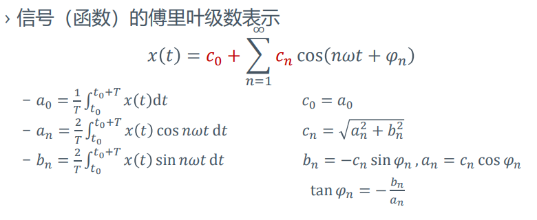

# 连续信号的傅立叶级数
+ 为什么考虑三角级数
  + 三角级数的特殊性质：**是LTI系统的特征信号**
  $$
  \begin{aligned}
  y(t)&=e^{j\omega t}*h(t) \\
  &=\int_{\infty}^{\infty}e^{j\omega (t-\tau)}h(\tau)d\tau \\
  &=e^{j\omega t}\int_{\infty}^{\infty}e^{-j\omega \tau}h(\tau)d\tau\\
  &\propto e^{j\omega t}\\
  \end{aligned}
  $$
  + **三角级数构成完备正交函数集**
    + 考虑区间$(t_0, t_0+T)$
    + 三角函数：令$\omega=\frac {2\pi} T$，完备正交集为
        $$\{\cos n\omega t, \sin n\omega t\}, n=0,1,2...,\infty$$
    + 复指数函数：令$\omega=\frac {2\pi}T$，完备正交集为
        $$\{e^{jn\omega t},n=0,\pm 1, \pm 2, ...\}$$
+ 因此需要找到尽可能多的线性时不变系统的三角形式的特征信号，从而对于任何输入，输出都能表示成三角特征信号的加权形式

---

## 函数族正交性证明
#### 三角函数族的正交性
+ 三角函数族：令$\omega=\frac {2\pi}T$
  $$\{\cos n\omega t, \sin n\omega t \}, n=0,1,2...,\infty$$
+ 正交性证明：  
  

#### 复指数函数族的正交性
+ 复指数函数族：令$\omega=\frac {2\pi}T$
  $$\{e^{jn\omega t}\},n=0,\pm 1,\pm 2...\pm\infty$$
+ 正交性证明：  
  

---
## 基于三角函数族和指数函数族的分解
### 三角函数族的分解
+ 基函数集
  $$\{\cos n\omega ,\sin n\omega t\}, n=0,1,2,...,\infty$$
+ 分解系数
  $$a_0=\frac{\langle x,1\rangle}{\langle 1,1\rangle}=\frac 1T\int_{t_0}^{t_0+T}x(t)dt$$
  $$a_{n}=\frac{\langle x, \cos n \omega t\rangle}{\langle\cos n \omega t, \cos n \omega t\rangle}=\frac{2}{T} \int_{t_{0}}^{t_{0}+T} x(t) \cos n \omega t \mathrm{d} t$$
  $$b_{n}=\frac{\langle x, \sin n \omega t\rangle}{\langle\sin n \omega t, \sin n \omega t\rangle}=\frac{2}{T} \int_{t_{0}}^{t_{0}+T} x(t) \sin n \omega t \mathrm{d} t$$
+ 函数表示
  $$x(t)=a_{0}+\sum_{n=1}^{\infty} a_{n} \cos n \omega t+\sum_{n=1}^{\infty} b_{n} \sin n \omega t$$

### 指数函数族的分解
+ 基函数集
  $$\{e^{jn\omega t}\}, n=0,\pm 1,\pm 2,...,\pm \infty$$
+ 分解系数
  $$X_{n}=\frac{\left\langle x, e^{j n \omega t}\right\rangle}{\left\langle e^{j n \omega t}, e^{j n \omega t}\right\rangle}=\frac{1}{T} \int_{t_{0}}^{t_{0}+T} x(t) \cdot e^{-j n \omega t} \mathrm{d} t$$
+ 函数表示
  $$x(t)=\sum_{n=-\infty}^\infty X_ne^{jn\omega t}$$

### 联系
$$
\begin{aligned}
X_{n}&=\frac{\left\langle x, e^{j n \omega t}\right\rangle}{\left\langle e^{j n \omega t}, e^{j n \omega t}\right\rangle}\\
&=\frac{1}{T} \int_{t_{0}}^{t_{0}+T} x(t) \cdot e^{-j n \omega t} \mathrm{d} t\\
&=\frac{1}{T} \int_{t_{0}}^{t_{0}+T} x(t) \cdot(\cos n \omega t-j \sin n \omega t) \mathrm{d} t\\
&=\frac 12 a_n-\frac j2 b_n\\
\end{aligned}
$$

## 傅立叶级数的计算和性质
### 直流、正余弦分解与傅立叶级数
+ 信号$x(t)$的直流分量
  $$a_0=\frac {\langle x,1\rangle}{\langle 1,1\rangle}=\frac 1T\int_{t_0}^{t_0+T}x(t)dt$$
+ 余弦分量
  $$a_{n}=\frac{\langle x, \cos n \omega t\rangle}{\langle\cos n \omega t, \cos n \omega t\rangle}=\frac{2}{T} \int_{t_{0}}^{t_{0}+T} x(t) \cos n \omega t \mathrm{d} t=a_{-n}$$
+ 正弦分量
  $$b_{n}=\frac{\langle x, \sin n \omega t\rangle}{\langle\sin n \omega t, \sin n \omega t\rangle}=\frac{2}{T} \int_{t_{0}}^{t_{0}+T} x(t) \sin n \omega t \mathrm{d} t=-b_{-n}$$
### 三角形式的傅立叶级数
  

