# 连续信号的傅立叶级数
+ 为什么考虑三角级数
  + 三角级数的特殊性质：**是LTI系统的特征信号**
  $$
  \begin{aligned}
  y(t)&=e^{j\omega t}*h(t) \\
  &=\int_{\infty}^{\infty}e^{j\omega (t-\tau)}h(\tau)d\tau \\
  &=e^{j\omega t}\int_{\infty}^{\infty}e^{-j\omega \tau}h(\tau)d\tau\\
  &\propto e^{j\omega t}\\
  \end{aligned}
  $$
  + **三角级数构成完备正交函数集**
    + 考虑区间$(t_0, t_0+T)$
    + 三角函数：令$\omega=\frac {2\pi} T$，完备正交集为
        $$\{\cos n\omega t, \sin n\omega t\}, n=0,1,2...,\infty$$
    + 复指数函数：令$\omega=\frac {2\pi}T$，完备正交集为
        $$\{e^{jn\omega t},n=0,\pm 1, \pm 2, ...\}$$
+ 因此需要找到尽可能多的线性时不变系统的三角形式的特征信号，从而对于任何输入，输出都能表示成三角特征信号的加权形式

---

## 函数族正交性证明
#### 三角函数族的正交性
+ 三角函数族：令$\omega=\frac {2\pi}T$
  $$\{\cos n\omega t, \sin n\omega t \}, n=0,1,2...,\infty$$
+ 正交性证明：  
  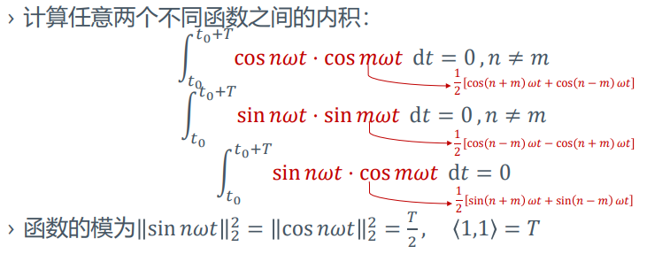

#### 复指数函数族的正交性
+ 复指数函数族：令$\omega=\frac {2\pi}T$
  $$\{e^{jn\omega t}\},n=0,\pm 1,\pm 2...\pm\infty$$
+ 正交性证明：  
  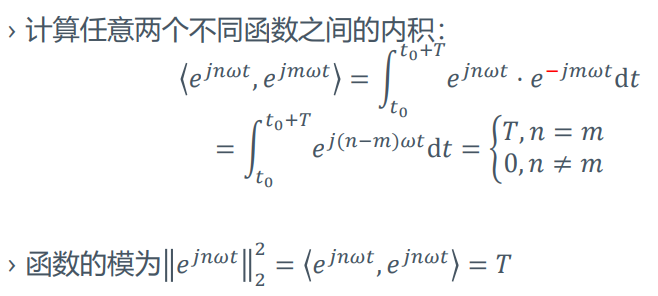

---
## 基于三角函数族和指数函数族的分解
### 三角函数族的分解
+ 基函数集
  $$\{\cos n\omega ,\sin n\omega t\}, n=0,1,2,...,\infty$$
+ 分解系数
  $$a_0=\frac{\langle x,1\rangle}{\langle 1,1\rangle}=\frac 1T\int_{t_0}^{t_0+T}x(t)dt$$
  $$a_{n}=\frac{\langle x, \cos n \omega t\rangle}{\langle\cos n \omega t, \cos n \omega t\rangle}=\frac{2}{T} \int_{t_{0}}^{t_{0}+T} x(t) \cos n \omega t \mathrm{d} t$$
  $$b_{n}=\frac{\langle x, \sin n \omega t\rangle}{\langle\sin n \omega t, \sin n \omega t\rangle}=\frac{2}{T} \int_{t_{0}}^{t_{0}+T} x(t) \sin n \omega t \mathrm{d} t$$
+ 函数表示
  $$x(t)=a_{0}+\sum_{n=1}^{\infty} a_{n} \cos n \omega t+\sum_{n=1}^{\infty} b_{n} \sin n \omega t$$

### 指数函数族的分解
+ 基函数集
  $$\{e^{jn\omega t}\}, n=0,\pm 1,\pm 2,...,\pm \infty$$
+ 分解系数
  $$X_{n}=\frac{\left\langle x, e^{j n \omega t}\right\rangle}{\left\langle e^{j n \omega t}, e^{j n \omega t}\right\rangle}=\frac{1}{T} \int_{t_{0}}^{t_{0}+T} x(t) \cdot e^{-j n \omega t} \mathrm{d} t$$
+ 函数表示
  $$x(t)=\sum_{n=-\infty}^\infty X_ne^{jn\omega t}$$

### 联系

$$
\begin{aligned}
X_{n}&=\frac{\left\langle x, e^{j n \omega t}\right\rangle}{\left\langle e^{j n \omega t}, e^{j n \omega t}\right\rangle}\\
&=\frac{1}{T} \int_{t_{0}}^{t_{0}+T} x(t) \cdot e^{-j n \omega t} \mathrm{d} t\\
&=\frac{1}{T} \int_{t_{0}}^{t_{0}+T} x(t) \cdot(\cos n \omega t-j \sin n \omega t) \mathrm{d} t\\
&=\frac 12 a_n-\frac j2 b_n\\
\end{aligned}
$$ 

---
## 傅立叶级数
### 傅立叶级数（三角形式）
$$
\begin{aligned}
x(t)&=a_0+\sum_{n=1}^\infty a_n\cos n\omega t+\sum_{n=1}^\infty b_n\sin n\omega t\\
&=c_0+\sum_{n=1}^\infty c_n\cos(n\omega t+\phi_n)\\
\end{aligned}
$$

+ $a_0=\frac 1T\int_{t_0}^{t_0+T}x(t)\ dt$
+ $a_n=\frac 2T\int_{t_0}^{t_0+T}x(t)\cos n\omega t\ dt$
+ $b_n=\frac 2T\int_{t_0}^{t_0+T}x(t)\sin n\omega t\ dt$
+ $c_0=a_0$
+ $c_n=\sqrt{a_n^2+b_n^2}$
+ $b_n=-c_n\sin(\phi_n), a_n=c_n\cos(\phi_n)$
+ $\tan(\phi_n)=-\frac {b_n}{a_n}$
+ $c_0$为信号的直流分量
+ $c_n\cos(n\omega t+\phi_n)$、$a_n\cos n\omega t+b_n\sin n\omega t$为$n$次谐波分量

### 傅立叶级数（指数形式）
$$x(t)=\sum_{n=-\infty}^{\infty}X_n e^{jn\omega t}$$
$$X_n=\frac {\langle x,e^{jn\omega t}\rangle}{\langle e^{jn\omega t, e^{jn\omega t}}\rangle}=\frac 1T\int_{t_0}^{t_0+T}x(t)e^{-jn\omega t}\ dt$$

+ $n=\pm 1$，两项的基波频率为$\omega$，两项之和为信号的基波分量
+ $n=\pm N, N\not=1$，两项的基波频率为$N\omega$，两项之和为信号的$N$次谐波分量

+ 公式
  + $X_0=c_0=a_0$
  + $X_n=\frac 12 a_n-\frac j2 b_n$
  + $X_n=\frac 12 a_n+\frac j2 b_n$
  + $|X_n|=\frac 12\sqrt{a_n^2+b_n^2}$
  + $a_n=X_n+X_{-n}$
  + $b_n=j(X_n-X_{-n})$
  + $c_n=|X_n|+|X_{-n}|$

### 频谱图
+ 可以发现，$a_n,b_n,X_n$都是关于$\omega$的函数，与$t$无关。因而可以画出分量关于基波频率的图像
+ 三角形式下$a_n,b_n$关于$n$的图像  
  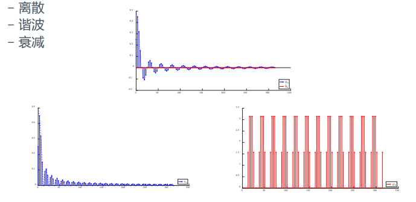
+ 指数形式下$X_n$关于$n$的图像  
  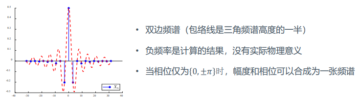

### 傅立叶级数的收敛条件（表示能力）
+ 收敛
  + 分析公式中的积分收敛（系数有穷）
  + 代入系数后，要能够收敛于（重构）原始信号
+ 所有的**连续**信号都有傅立叶级数表示
+ 大多数**不连续**信号也有类似的性质
+ **收敛条件**
  + 能量条件
    + 周期信号$x(t)$在一个周期内的能量
      $$\int_{-T/2}^{T/2}|x(t)|^2dt<\infty$$
    + 能量有限不不代表重构的信号在每一个$t$值上都相等，只说明二者在能量上没有差异
  + Dirichlet条件
    1. 在一个周期内绝对可积，即$\int_{-T/2}^{T/2}|x(t)|dt<\infty$
    2. 在一个周期内只有有限个**有限的**不连续点
    3. 在一个周期内只有有限个极大值和极小值
    + 满足Dirichlet条件时，在$x(t)$的不连续点处，傅立叶级数重构信号收敛于不连续点两边的平均值

### 帕塞瓦尔定理
+ 时域和频域能量守恒定理
  $$
  \begin{aligned}
  P&=\frac 1T \int_{-T/2}^{T/2}|x^2(t)|\ dt\\
  &=a_0^2+\frac 12\sum_{n=1}^\infty(a_n^2+b_n^2)\\
  &=c_0^2+\frac 12\sum_{n=1}^\infty c_n^2\\
  &=\sum_{n=\infty}^{\infty}|X_n|^2
  \end{aligned}
  $$
+ 物理意义
  + 任意周期性信号的平均功率等于信号所包含的直流、基波以及各次谐波的平均功率之和
  + 帕塞瓦尔定理的意义在于，把计算能量/功率时复杂的积分运算转化成级数运算
+ 周期信号的功率频谱：$|X_n|^2$随$n\omega$分布情况称为周期信号的功率频谱，简称功率谱

### 对称特性
+ 偶信号：$x(t)=x(-t) $
  + 只含有直流项和余弦项，即$b_n=0, X_n=X_{-n}=\frac {a_n}2$  
  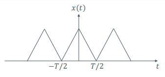
+ 奇信号：$-x(t)=x(-t)$
  + 只含有正弦项，即$a_0=a_n=0, X_n=X_{-n}=-j$  
  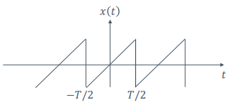
+ 奇谐（半波镜像）信号：$x(t)=-x(t\pm \frac T2)$
  + 只含有奇次谐波分量，无直流分量和偶次谐波分量
  + $a_0=X_0=0$
  + $a_{2k}=b_{2k}=0$
  + $a_{n}=\frac{4}{T} \int_{0}^{T / 2} x(t) \cos n \omega t \mathrm{d} t$，$n$为奇数
  + $b_{n}=\frac{4}{T} \int_{0}^{T / 2} x(t) \sin n \omega t \mathrm{d} t$，$n$为奇数
  + $X_n=\frac{a_n-jb_n}2$，$n$为奇数  
  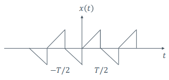
+ 偶谐（半波重叠）信号：$x(t)=x(t\pm \frac T2)$
  + 只有直流分量和正弦与余弦的偶次谐波分量，无奇次谐波分量  
  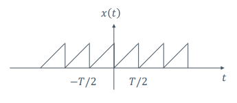

### Gibbs现象
+ 在重构一个信号时，并不一定要使用从$-\infty\to\infty$的基来进行重构，可使用有限的基来重构
+ **Gibbs现象**：如果我们用有限次的谐波分量来近似原信号，在**不连续点**处会出现过冲（震荡），过冲峰值不随谐波分量的增加而减少，随$N$的增大趋近一个常数，约等于跳变值的9%
+ **Gibbs现象产生原因**：时间信号存在跳变破坏了信号的收敛性，使得在间断点处傅立叶级数出现非移植收敛。
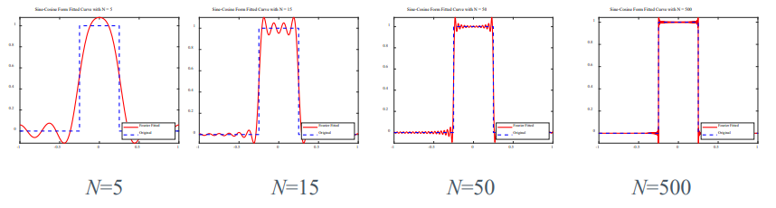

---
## 傅立叶级数的计算

### 例：周期矩形脉冲信号的傅立叶级数
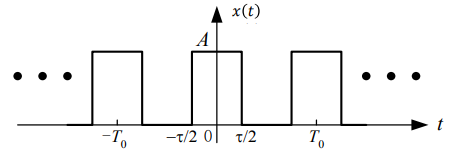
+ 直流分量
  $$a_0=\frac 1T\int_{-T/2}^{T/2}x(t)dt=\frac {A\tau}T$$
+ 正余弦分量
  $$a_n=\frac {2A\tau}T Sa(\frac{\pi n\tau}T), b_n=0$$
  $$x(t)=\frac {A\tau}T+2\frac {A\tau}T\sum_{n=1}^{\infty}Sa(\frac {\pi n\tau} T)\cos n\omega t$$
+ 指数形式
  $$x(t)=\frac {A\tau}T\sum_{n=-\infty}^{\infty}Sa(\frac {n\omega\tau}2)e^{jn\omega t}$$
  
  

> 信号的有效带宽
> + $0\sim 2\pi/\tau$这段频率范围称为周期矩形脉冲信号的有效频带宽度，即$\omega_B=\frac{2\pi}\tau$
> + 信号的有效带宽与信号时域的持续时间$\tau$成反比
> + 有效带宽的物理意义：在信号的有效带宽内，**集中了信号绝大部分谐波分量**，若信号丢失有效带宽外的谐波成分，不会对信号产生明显的影响，当信号通过系统时，信号与系统的有效带宽必须匹配

> 离散频谱的幅度衰减特性
> + 信号时域波形变化越平缓，高次谐波成分就越少，幅度频谱随$n$的衰减就越快
> + 信号时域波形变化跳变越多，高次谐波成分越多，幅度频谱衰减越慢
> + $x(t)$不平滑，$|X_n|$按照$1/n$的速度衰减
> + $x(t)$平滑，$|X_n|$按照$1/{n^2}$的速度衰减

> 周期矩形脉冲信号的$\tau$和$T$  
> 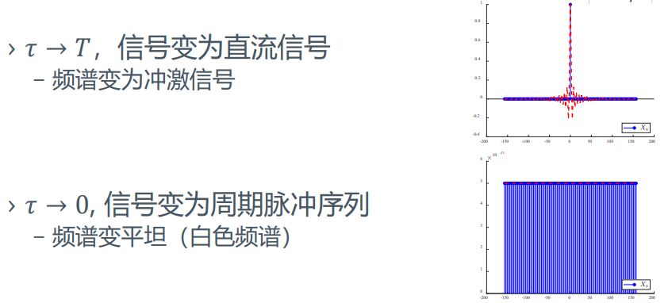

---
## 系统函数
+ 设$h(t)$为线性时不变系统的单位冲激响应，则
  $$
  \begin{aligned}
  y(t)&=e^{j\omega t}*h(t)\\
  &=\int_{-\infty}^{\infty}e^{j\omega(t-\tau)}h(\tau)\ d\tau\\
  &=e^{j\omega t}\int_{-\infty}^{\infty}e^{-j\omega\tau}h(\tau) d\tau \\
  &=H(j\omega)e^{j\omega t}
  \end{aligned}$$