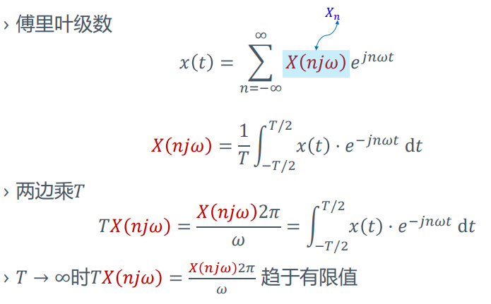
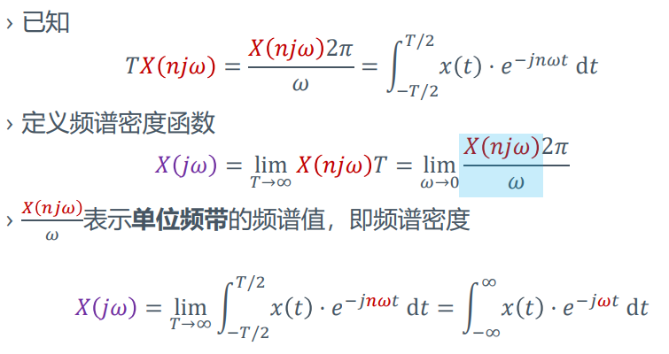
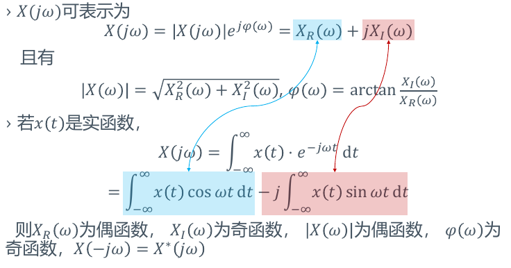
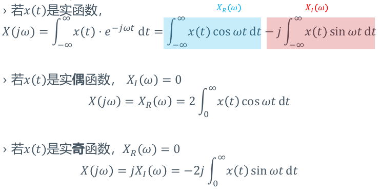
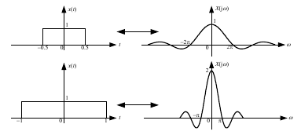

# 连续信号的傅立叶变换
> 如何将傅立叶级数推广到非周期信号？
> + 增大周期$T\to \infty$
>   + 信号近似非周期信号，谱线间隔$\omega\to 0$，离散频谱趋于连续频谱

## 傅立叶变换
### 频谱密度

### 收敛条件
+ 能量条件
+ 波形条件
  + 非周期信号在无限区间上绝对可积
  $$\int_{-\infty}^{\infty}|x(t)|dt<\infty$$
  + 在任意有限区间内，信号只有有限个最大值和最小值
  + 在任意有限区间内，信号仅有有限个不连续点，且这些点必须是有限值

## 傅立叶变换的性质
+ 线性性
  + 若$x_1(t)\leftrightarrow_F X_1(j\omega), x_2(t)\leftrightarrow_F X_2(j\omega)$，则$ax_1(t)+bx_2(t)\leftrightarrow_F X_1(j\omega)+bX_2(j\omega)$
+ 对称性
  + 若$x(t)\leftr·ightarrow_F X(j\omega)$，则$X(t)\leftrightarrow_F 2\pi x(-j\omega)$
  + 若$x(t)$为偶函数，则$X(t)\leftrightarrow_F 2\pi x(j\omega)$
+ 奇偶虚实性
  
  
+ 尺度变换特性
  + 若$x(t)\leftrightarrow_F X(j\omega)$，则$x(at)\leftrightarrow_F \frac 1{|a|}X(j\omega/a)$
  + 若$a=-1$，则$x(-t)\leftrightarrow_F X(-j\omega)$，时域翻转频域也翻转
  + 时域压缩，则频域拉伸；时域拉伸，则频域压缩  
  