  # 傅立叶变换的应用
---
## 信号的调制与解调
### Overview
#### 通信系统
+ 通信：把发送者拥有的消息传递给接受者
+ 为了达到通信的目的
  + 要把信源消息经发送设备转变为适合信道传输的信号，因此需要进行调制、编码、方法等操作
  + 发送和接收设备还可能包括多路复用、加密、纠错等处理设备  
  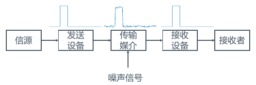

#### 通信系统的分类
+ 按传输介质分类
  + 有线
  + 无线
+ 按照频率范围分类，不同波段使用的传输媒质不同
  $$波长(m)=\frac {波速(m/s)}{ 频率(Hz)}$$  
  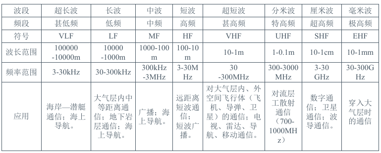
  + 高于$30Hz$的电波称为微波
  + 长中短波所占频带总和约为30MHz，而微波频带约300GHz

#### 信道传输
+ 调制的解调的motivation来源于以下两点事实
  + 在传输信号时，天线长度需要与辐射电波波长的数量级一致（1/4波长以上）时才能有较好的辐射特性
  + 低频信号（20Hz-20kHz）在大气层传输式会剧烈衰减，但高频信号可在大气层中传播到较远的距离。
+ 调制
  + 将低频信号加载或嵌入到一个高频震荡信号上
+ 解调
  + 从含有低频信号的高频振荡信号中提取低频信号

### 信号的调制
+ notation
  + $x(t)$：调制信号，是待发送信号
  + $c(t)$：载波信号，是用于完成载送信号任务的高频振荡信号
+ 载波$c(t)$的某个参数（幅度、频率或相位）随$x(t)$作有规律变化
  $$c(t)=A\cos(\omega_c t +\phi)A\cos(\theta(t))$$
  + **幅度调制（Amplitude Modulation，AM）**：A随$x(t)$线性改变，保持$\omega_c, \phi$不变
  + **角度调制**：$\theta(t)$随$x(t)$线性改变，而$A$不变，分为h频率调制(FM)和相位调制(PM)

#### 正弦载波调幅
+ 设$c(t)=\cos(\omega_c t)$
+ 为了使幅度$A$随调制信号$x(t)$线性变化，将二者相乘
  $$y(t)=x(t)\cdot c(t)=x(t)\cos(\omega_c t)$$
+ 调制分析
  + 设$x(t)\stackrel{\mathcal{F}}{\leftrightarrow} X(j\omega)$
  + 由于$\cos(\omega_c t)\stackrel{\mathcal{F}}{\leftrightarrow} \pi[\delta(\omega+\omega_c)+\delta(\omega-\omega_c)]$
  + 由调制定理，有
  $$
  \begin{aligned}
  Y(j\omega)&=\frac 1{2\pi}[X(j\omega)*\pi[\delta(\omega+\omega_c)+\delta(\omega-\omega_c)]]\\
  &=\frac{1}{2}\left[X\left(j\left(\omega+\omega_{c}\right)\right)+X\left(j\left(\omega-\omega_{c}\right)\right)\right]\\
  \end{aligned}
  $$
  TODO 验证正确性
  + **调制后，原始频谱幅度减半，左右移动**  
  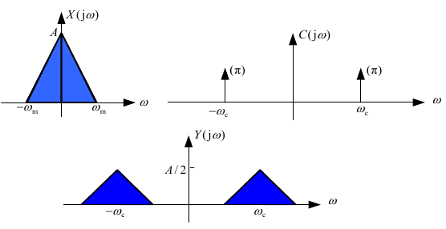
    + 若$\omega_c>\omega_m$，则两部分频谱不会发生重叠，能量也不会发生损失。

#### 正弦载波调幅（单边带传输与双边带传输）
+ 仍然使用上面的例子，可以发现对于两部分频谱，我们只需要各自发送一般的频谱就可以恢复出原信号。这被称为单边带传输。
  + 可通过高通、低通滤波器来实现。   
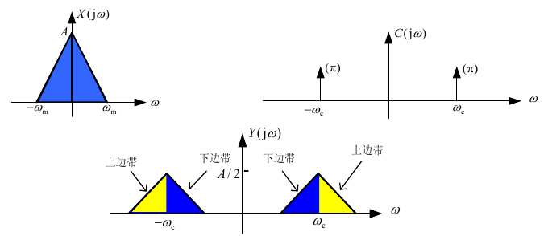

#### 复指数载波调制
+ 设$c(t)=e^{j(\omega_ct+\phi)}, \phi=0$进行调幅，可得
  $$
  \begin{aligned}
    Y(j\omega)&= \frac 1{2\pi}[X(j\omega)*2\pi[\delta(\omega-\omega_c)]] \\
    &= X(j(\omega-\omega_c)) \\
  \end{aligned}
  $$
  + 不要求$\omega_c>\omega_m$，可避免混叠带来的能量损失。
  + 可通过滤波法（高通、低通滤波器）分别得到上下边带。

### 信号的解调
#### 同步解调（双边带）
+ 从$y(t)$中恢复出$x(t)$，也就是从$Y(j\omega)$中恢复出$X(j\omega)$
+ 令
  $$
  \begin{aligned}
    r(t)&= y(t) \cos \left(\omega_{c} t\right)=x(t) \cos ^{2}\left(\omega_{c} t\right) \\
    &=x(t)\left(\frac{1}{2}+\frac{1}{2} \cos \left(2 \omega_{c} t\right)\right) \\
    &= \frac{1}{2} x(t)+\frac{1}{2} x(t) \cos \left(2 \omega_{c} t\right)
  \end{aligned}
  $$
  对$r(t)$作傅立叶变换，得到
  $$R(j\omega)=\frac 12 X(j\omega)+\frac 14 [X(j(\omega+2\omega_c))+X(j(\omega-2\omega_c))]$$
  + **可以看作是对$Y(j\omega)$中的两部分频谱各自再进行一次左右搬移的过程**  
  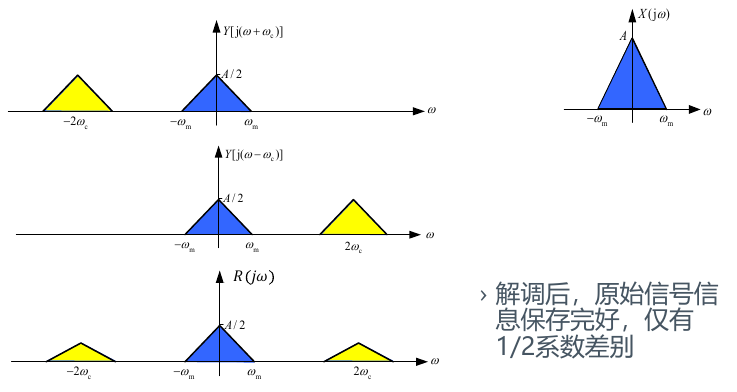
  + 此时在频域上进行一次低通滤波即可，滤波器带宽满足$\omega_m<B<2\omega_c-\omega_m$

#### 同步解调（单边带）
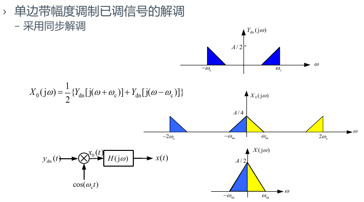

#### 非同步解调
+ 若调制与解调端载波相位不等，则解调后的信号将会失真

---
## 频分复用
TODO
---
## 时分复用
+ 时分复用的基础是抽样定理
  + 假设存在三个信号和一个控制开关，控制开关不断旋转，轮流扫过三个信号的触发点。  
  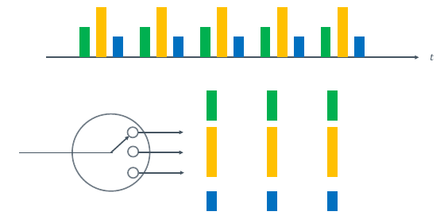
+ 本质上指的是通过在一个周期内密集发送信号，我们可以仅对一个周期内的波形密集采样，从而恢复出这三种在时域上复用的三个信号

---
## 码分复用
+ 对信号乘正交随机码，由于信号相互正交，因此可以恢复
  + 例子：假设发送端信号为$x_1(t),x_2(t)$，发送时乘正交信号$x_1(t)\sin(\omega_ct),x_2(t)\cos(\omega_c t)$，接受时再乘$\sin(\omega_ct),\cos(\omega_c t)$进行恢复。

---
> 系统频谱分析例题  
> 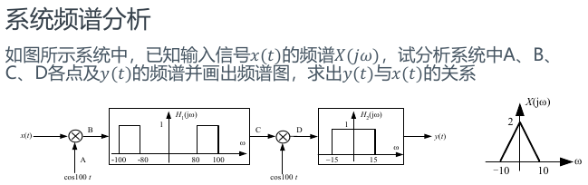
> + A点  
>   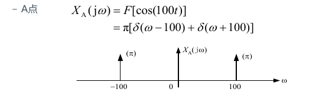
> + B点  
>   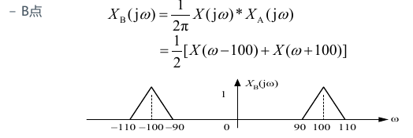
> + C点  
>   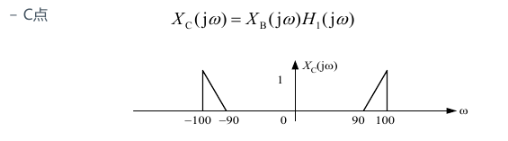
> + D点  
>   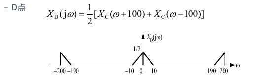
> + 输出$y(t)$与$x(t)$关系  
>   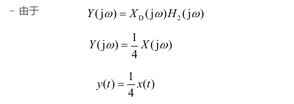

---
## 信号的抽样
+ 对时序信号进行抽样后，原本连续的信号就会变成离散信号
+ 两类问题
  + 为什么要对信号进行抽样？
    + 信号稳定性好：数据用二进制表示，受外界影响小
    + 信号可靠性高：存储无损耗，传输抗干扰
    + 信号处理简便：信号压缩、信号编码、信号加密等
    + 系统精度高：可通过增加字节长度来提高信号精度
    + 系统灵活性强：改变系统的系数来使系统完成不同的功能
  + 如果抽样（确定抽样间隔$T$）才能保证抽样后即能精简地表示信号，同时不损失过多的信息？

### 信号的时域抽样
+ 对信号$x(t)$使用脉冲序列
  $$\delta_{T_s}(t)=\sum_{n=-\infty}^{\infty}\delta(t-nT_s)$$
  得到
  $$x_s(t)=x(t)\delta_{T_s}(t)=x(t)\sum_{n=-\infty}^{\infty}\delta(t-nT_s)=\sum_{n=-\infty}^{\infty}x(nT_s)\delta(t-nT_s)$$
  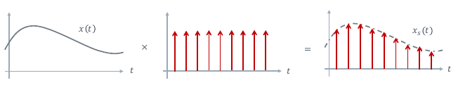
+ 对抽样后信号作傅立叶变换
  $$
  \begin{array}{l}
  \mathcal{F}\left[x_{s}(t)\right]=\frac{1}{2 \pi}\left[X(j \omega) * \mathcal{F}\left[\delta_{T_{s}}(t)\right]\right] \\
  =\frac{1}{2 \pi}\left[X(j \omega) * \omega_{s} \sum_{-\infty} \delta\left(\omega-n \omega_{s}\right)\right] \\
  \quad=\frac{1}{T_{S}} \sum_{n=-\infty}^{\infty} X\left(j\left(\omega-n \omega_{s}\right)\right)
  \end{array}
  $$

TODO

### 信号的频域抽样
TODO

### 时域抽样定理
+ 频带受限：若$|\omega| >\omega_m$则$X(j\omega)=0, \omega_m=2\pi f_m$
+ 抽样定理：若连续信号$x(t)$是一个频带受限的信号，$x(t)$的等间隔样本值$x_s(t)$，用$x_s(t)$**唯一表示**$x(t)$的条件是
  $$T_s<\frac 1{2f_m}$$
  或者
  $$\omega_s>2\omega_m$$
  其中$f_s=2f_m$为最小抽样频率，称为Nyquist Rate
