# 拉普拉斯变换及其应用
+ 对频率$\omega$概念的扩充
+ 傅里叶变换的缺陷
  + 表达信号受限制（不满足绝对可积条件）
  + 变换形式相对复杂
  + 分析系统有限制
  + 求解微分方程过程复杂
+ 拉普拉斯变换的优势
  + 将微分方程求解转换为代数方程，简化步骤
  + 指数函数等有不连续点的函数可以转换为简单的初等函数
  + 时域中的卷积变换为复频域中的乘积，建立了系统函数的概念
  + 利用系统函数零极点分布可以直观表达系统的很多特性

---
## 拉普拉斯变换
### 双边拉普拉斯变换
+ 针对一般信号$x(t)$
  $$
  \begin{aligned}
  \mathcal{F}[x(t)e^{-\sigma t}]&=\int_{-\infty}^{\infty} x(t)e^{-\sigma t}e^{-j\omega t}dt \\
  &= \int_{-\infty}^{\infty} x(t)e^{-(\sigma +j\omega)}dt\\
  &=\int_{-\infty}^{\infty} x(t) e^{-st}dt=X(s) \\
  &= \mathcal{L}[x(t)] \\
  \end{aligned}
  $$
+ 由$x(t)e^{-\sigma t}$的傅里叶反变换可以推出
  $$x(t)=\frac 1{2\pi j}\int_{\sigma-j\infty}^{\sigma+j\infty} X(s)e^{st}ds $$

+ 因此有
  + **拉普拉斯正变换（LT）**
  $$X(s)=\mathcal{L}[x(t)]=\int_{-\infty}^{\infty}x(t)e^{-st}dt $$
  + **拉普拉斯反变换**
  $$x(t)=\mathcal{L}^{-1}[X(s)]=\frac 1{2\pi j}\int_{\sigma-j\infty}^{\sigma+j\infty}X(s)e^{st}ds $$
  + **与傅里叶变换仅在逆变换的积分域上有所区别，正变换的形式完全相同。信号$x(t)$可以被分解为复指数$e^{st}$的线性组合，不同信号只是复指数$e^st$的系数$X(s)$不同。$X(s)$是复频率$s$的函数，称为复频谱。**

### 单边拉普拉斯变换
+ 单边拉普拉斯正变换
  $$X(s)=\int_{0_-}^{\infty}x(t)e^{-st}dt $$
  + 此时$x(t)$是因果信号
  + 从$0_-$开始积分，为了考虑$0$处的冲激值
+ 单边拉普拉斯反变换
  $$x(t)=\frac 1{2\pi j}\int_{\sigma-j\infty}^{\sigma +j\infty}X(s)e^{st}ds $$

### 单边拉普拉斯变换存在条件
+ 以单边为例，拉普拉斯变换存在的条件
  + 充分条件：绝对可积
  $$X(s)=\int_{0_-}^{\infty}|x(t)|e^{-\sigma t}dt=C<\infty $$
  + 对任意信号$x(t)$，若满足上式，则$x(t)$应满足
  $$\lim_{t\to \infty} x(t)e^{-\sigma t}=0$$
    + 称满足上述条件的$\sigma$下界为$\sigma_0$，为绝对收敛坐标  
    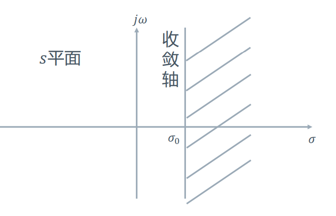
+ 几个例子
  + 对于有限区间内、能量有限的信号，收敛区为整个复平面；有界非周期信号的LT一定存在。
  + 随时间的幂次增长的信号，收敛坐标位于原点
  $$\lim_{t\to\infty} t^ne^{-\sigma t}=0$$
  + 指数增长的信号，收敛坐标与$a$有关
  + 比指数增长更快的信号无法进行LT
+ 考虑到双边拉普拉斯变换需要对$t\to-\infty$的区域进行考虑，其收敛条件与形式往往较复杂。

---
## 常用信号的拉普拉斯变换
### 指数型函数$e^{\lambda t} u(t)$
$$ \mathcal{L}[e^{\lambda t}u(t)]=\int_{0_-}^{\infty}e^{\lambda t}e^{-st}dt=\frac 1{s-\lambda}\quad \quad \sigma > \lambda $$
+ **注意这里的$\lambda$是有条件的。积分$\int_{0_-}^{\infty}e^{(\lambda-s)t}dt$中，若$\lambda-s$是一个纯虚数，那么$e^{(\lambda-s)t}$在$\pm\infty$是没有取值的。只有$\lambda-s$的实部小于0时，该积分才能够存在且等于$\frac 1{s-\lambda}$。如果$\lambda-s$，则需要通过配上$e^{-\alpha t},\alpha\to 0$的方式计算积分，得到的结果是一个冲激函数。**
+ 同理有  
  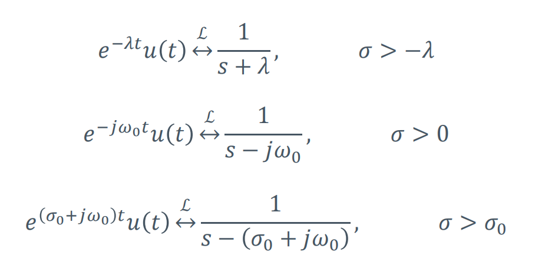

### 冲激信号
$$ \mathcal{L}[\delta(t-t_0)]=\int_{0_-}^{\infty}\delta(t-t_0)e^{-st}dt=e^{-st_0}\quad\quad \sigma>-\infty $$

### 阶跃函数
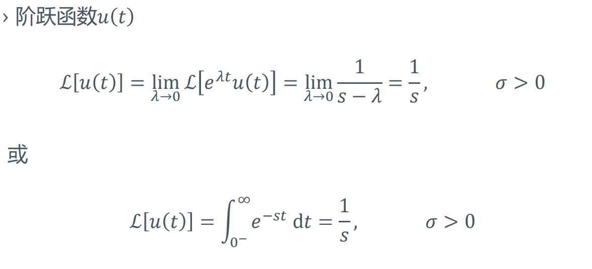

### $t$的幂指数函数$t^n$
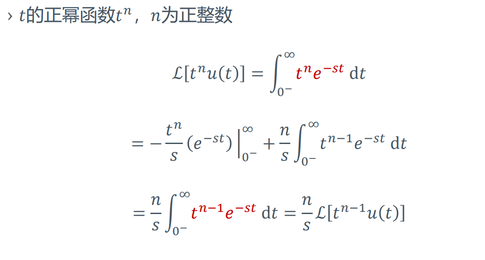
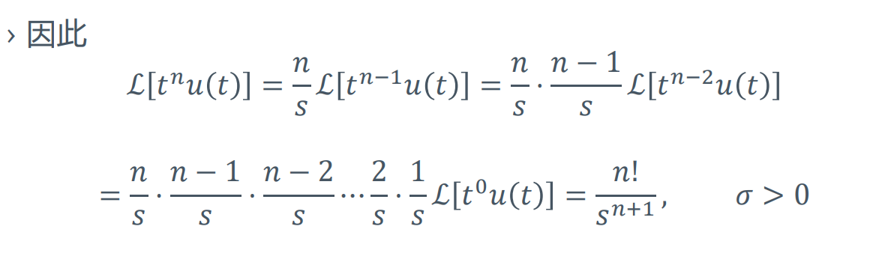

### 正余弦函数
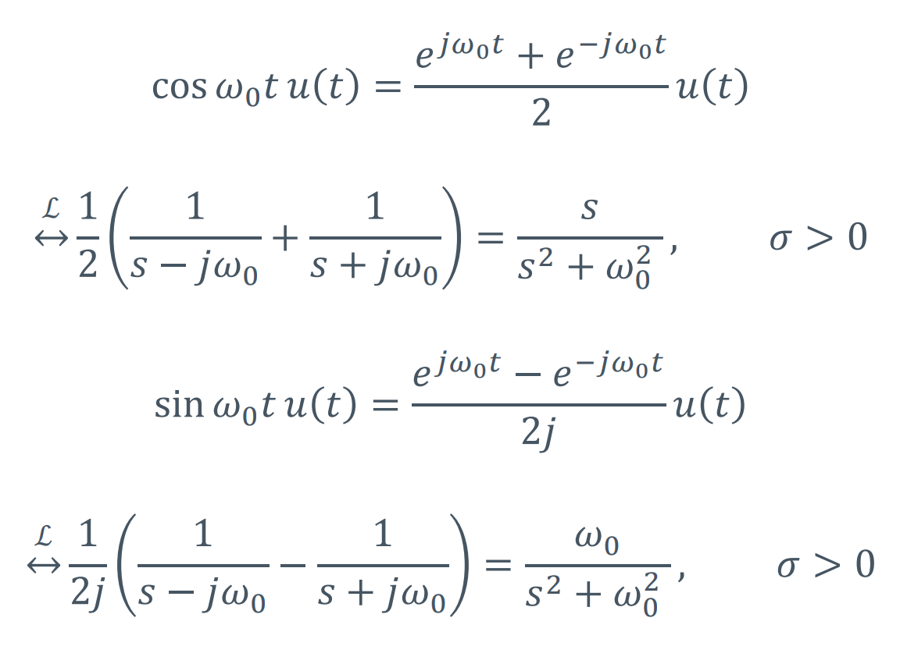

### 例子
+ 计算$x(t)=e^{-a(t+1)}u(t+1)$的LT
$$
\begin{aligned}
X(s)&=\int_{0_-}^{\infty}e^{-a(t+1)}u(t+1)e^{-st}dt\\
&=\int_{0_-}^{\infty}e^{-a}e^{-t(s+a)}dt\\
&=\frac{e^{-a}}{s+a}\quad\quad \sigma>-a
\end{aligned}
$$

---

## 单边拉普拉斯变换的性质
### 线性特性
+ 若$x_1(t)\stackrel{\mathcal{L}}{\leftrightarrow} X_1(s), \sigma>\sigma _1;x_2(t)\stackrel{\mathcal{L}}{\leftrightarrow} X_2(s),\sigma>\sigma_2$，则有
  $$a_1x_1(t)+a_2x_2(t)\stackrel{\mathcal{L}}{\leftrightarrow} a_1X_1(s)+a_2X_2(s)\quad\quad \sigma >\max(\sigma_1, \sigma_2)$$ 

### 展缩变换
+ 若$x(t)\stackrel{\mathcal{L}}{\leftrightarrow} X(s), \sigma >\sigma_0$，则
$$x(at)\stackrel{\mathcal{L}}{\leftrightarrow} \frac 1a X(\frac sa)\quad\quad \sigma>a\sigma_0,a>0$$

### 时移特性
+ 若$x(t)\stackrel{\mathcal{L}}{\leftrightarrow} X(s),\sigma>\sigma_0$，则
$$x(t-t_0)u(t-t_0)\stackrel{\mathcal{L}}{\leftrightarrow} e^{-st_0}X(s)\quad\quad\sigma >\sigma_0$$
  + 这里无论原始的$x(t)$在$0$前有没有值，时移后都要将$t_0$前的值置$0$，也就是乘以$u(t-t_0)$

> 已知$ \mathcal{L}[x(t)]=X(s)$，若$a>0, b>0$，求解$\mathcal{L}[f(at-b)u(at-b)]$
> 方法一  
> 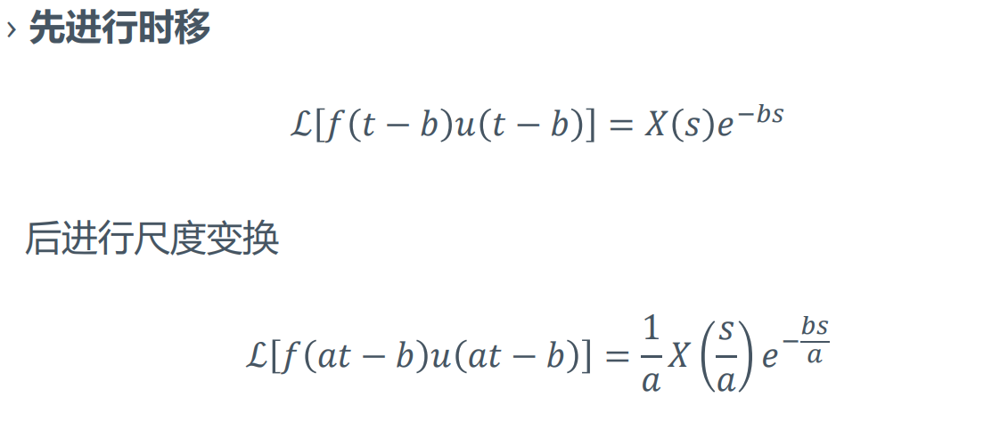
> 方法二  
> 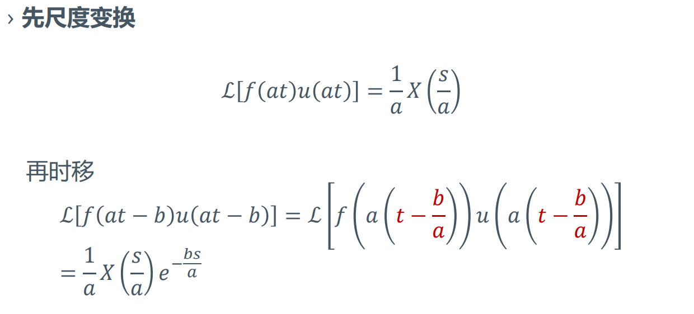

### 时域卷积特性
+ 若$x_1(t)\stackrel{\mathcal{L}}{\leftrightarrow}X_1(s), \sigma>\sigma_1;x_2(t)\stackrel{\mathcal{L}}{\leftrightarrow} X_2(s), \sigma>\sigma_2$，则
$$x_1(t)*x_2(t)\stackrel{\mathcal{L}}{\leftrightarrow}X_1(s)X_2(s)\quad\quad\sigma>\max(\sigma_1,\sigma_2)$$

### 时域乘积特性
+ 若$x_1(t)\stackrel{\mathcal{L}}{\leftrightarrow} X_1(s), \sigma>\sigma_1; x_2(t)\stackrel{\mathcal{L}}{\leftrightarrow} X_2(s), \sigma>\sigma_2$，则
$$x_1(t)x_2(t)\stackrel{\mathcal{L}}{\leftrightarrow} \frac{1}{2\pi j}[X_1(s)*X_2(s)]\quad\quad \sigma>\sigma_1+\sigma_2$$
+ 时域乘积的特殊形式
  + 指数加权（s域平移）：若$x(t)\stackrel{\mathcal{L}}{\leftrightarrow} X(s),\sigma>\sigma_0$，且$\lambda$为实数、$\lambda>0$，则
  $$e^{-\lambda t}x(t)\stackrel{\mathcal{L}}{\leftrightarrow} X(s+\lambda)\quad\quad \sigma>\sigma_0-\lambda$$
    + 推导非常复杂，在此不表，如何推导出冲激函数的形式可参考傅里叶变换性质一章
  + 线性加权（s域微分）：若$x(t)\stackrel{\mathcal{L}}{\leftrightarrow}X(s),\sigma>\sigma_0$，则
  $$-tx(t)\stackrel{\mathcal{L}}{\leftrightarrow}\frac{d X(s)}{ds}, \sigma>\sigma_0$$

### 时域微分特性
+ 若$x(t)\stackrel{\mathcal{L}}{\leftrightarrow} X(s), \sigma>\sigma_0$，则
$$\frac {dx(t)}{dt}\stackrel{\mathcal{L}}{\leftrightarrow}sX(s)-x(0_-)\quad\quad \sigma>\sigma_0$$
$$\frac{d^n x(t)}{d^n t}\stackrel{\mathcal{L}}{\leftrightarrow}s^nX(s)-\sum_{r=0}^{n-1}s^{n-r-1}x^{(r)}(0_-)\quad\quad\sigma>\sigma_0$$

### 时域积分特性
+ 若$x(t)\stackrel{\mathcal{L}}{\leftrightarrow} X(s), \sigma>\sigma_0$，则
$$\int_{-\infty}^{t}x(\tau)d\tau\stackrel{\mathcal{L}}{\leftrightarrow}\frac {X(s)}s+\frac {x^{-1}(0_-)}s\quad\quad \sigma>\max(\sigma_0, 0)$$

### 初值定理和终值定理
+ **初值定理**
  + 对于因果序列，若$x(t)\stackrel{\mathcal{L}}{\leftrightarrow}X(s), \sigma>\sigma_0$，且其导数可进行LT，那么当$x(t)$在$t=0$处不包含冲激及其各阶导数时，有
  $$\lim_{t\to 0} x(t)=x(0_+)=\lim_{s\to\infty}sX(s)$$
+ **终值定理**
  + 若$sX(s)$的收敛域包含$j\omega$轴
  $$\lim_{t\to\infty}x(t)=x(\infty)=\lim_{s\to\infty}sX(s)$$

---
## 拉普拉斯变换和傅里叶变换的关系
+ 当收敛域包含$j\omega$轴时，拉普拉斯变换很傅里叶变换均存在
  $$X(j\omega)=X(s)|_{s=j\omega}$$
  + 可以认为当收敛域包含$j\omega$轴时，拉普拉斯变换令$\sigma=0$不需要配平也可以使得原信号收敛。
+ 当收敛域不包含$j\omega$轴时，拉普拉斯变换存在而傅里叶变换不存在
+ 当收敛域的收敛边界位于$j\omega$轴时，拉普拉斯变换和傅里叶变换均存在，且
  $$X(j\omega)=X(s)|_{s=j\omega}+\pi \sum_n K_n\delta(\omega-\omega_n)$$
  + $K_n$为待定系数
---
## 单边拉普拉斯变换的反变换
+ 单边拉普拉斯变换的反变换
$$x(t)=\frac 1{2\pi j}\int_{\sigma-j\infty}^{\sigma+j\infty}X(s)e^{st}ds$$
+ 计算反变换的方法：
  + 复变函数中的留数定理
  + 部分分式展开法

### 部分分式展开法
+ 对于LT的结果，一般可以表示为  
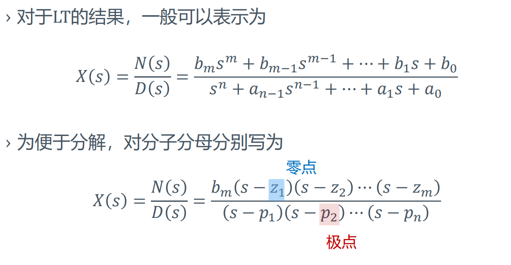
+ 下面分情况对拉普拉斯的反变换方法进行阐述

#### $X(s)$为有理真分式（$m<n$），极点均为一阶极点
+ 将$X(s)$表示为
  $$
  \begin{aligned}
    X(s)&=\frac{N(s)}{D(s)} \\
    &=\frac {k_1}{s-p_1}+\frac {k_2}{s-p_2}+...+\frac{k_n}{s-p_n}
  \end{aligned}
  $$
+ 此时有$k_i=(s-p_i)X(s)\big |_{s=p_i}$
+ 则由$\frac{1}{s+\lambda}$形式的拉普拉斯反变换，可以得到
  $$x(t)=\left(k_1e^{p_1t}+k_2e^{p_2t}+...+k_ne^{p_nt}\right)u(t)$$

#### $X(s)$为有理假分式（$m\geq n$）
+ $X(s)$为有理假分式（$m\geq n$）时，可被表示为
  $$
  \begin{aligned}
    X(s)&=\frac {N(s)}{D(s)}\\
    &= B_0+B_1s+...+B_{m-n}s^{m-n}+\frac {N_1(s)}{D_1(s)}\\
  \end{aligned}
  $$
  其中$\frac{N_1(s)}{D_1(s)}$为真分式
+ 可以利用下面的结论进行反变换
  $$
  \begin{aligned}
    B_0 &\stackrel{\mathcal{L}}{\leftrightarrow}B_0\delta(t)\\
    B_1s &\stackrel{\mathcal{L}}{\leftrightarrow}B_1\delta'(t)\\
    B_{m-n}s^{m-n} &\stackrel{\mathcal{L}}{\leftrightarrow}B_{m-n}\delta^{(m-n)}(t)\\
  \end{aligned}
  $$
  使用的是时域微分性质，结合$u(0^-)=\delta(0^-)=...=\delta^{(n)}(0^-)=0$

#### $X(s)$为有理真分式（$m<n$），极点为$r$重极点
+ 此时$X(s)$可以被表示成
  $$
  \begin{aligned}
    X(s)&=\frac{N(s)}{D(s)}\\
    &=\frac{N(s)}{(s-p_1)^{r}(s-p_{r+1})...(s-p_n)}\\
    &=\frac{k_1}{(s-p_1)^1}+\frac{k_2}{(s-p_1)^{2}}+...+\frac{k_r}{(s-p_1)^{r}}+\frac{k_{r+1}}{s-p_{r+1}}+...+\frac{k_n}{s-p_n}
  \end{aligned}
  $$
+ 对于重极点$s=p_1$的系数，有
  $$k_i=\frac{1}{(i-1)!}\frac{\mathrm{d}^{i-1}}{\mathrm{d}s^{i-1}}\left[(s-p_1)^rX(s)\right]\quad\quad i=1,2,...,r$$
+ 此时有
  $$x(t)=\left[\sum_{i=1}^{r}\frac{k_i}{(i-1)!}t^{i-1}e^{p_1t}\right]u(t)+\sum_{i=r+1}^n k_ie^{p_{i}t}u(t)$$

#### $X(s)$为有理假分式，极点为$r$重极点
+ 无重极点情况下的讨论，略

#### $X(s)$存在共轭极点
+ 例如$X(s)=\frac{1}{3s^2(s^2+4)}$，存在一对共轭极点。共轭极点形式一般可以用$\sin(\omega t)$的形式配凑出来，因为$\sin(\omega t)=\frac 1{2j}(e^{\omega t}-e^{-\omega t})$。两者分别进行反变换后分母同分可得$\frac 1{s^2+p^2}$的形式

---
## 连续时间系统的复频域分析
+ 借助拉普拉斯变换，可以将系统的微分方程描述转变为代数方程描述  
  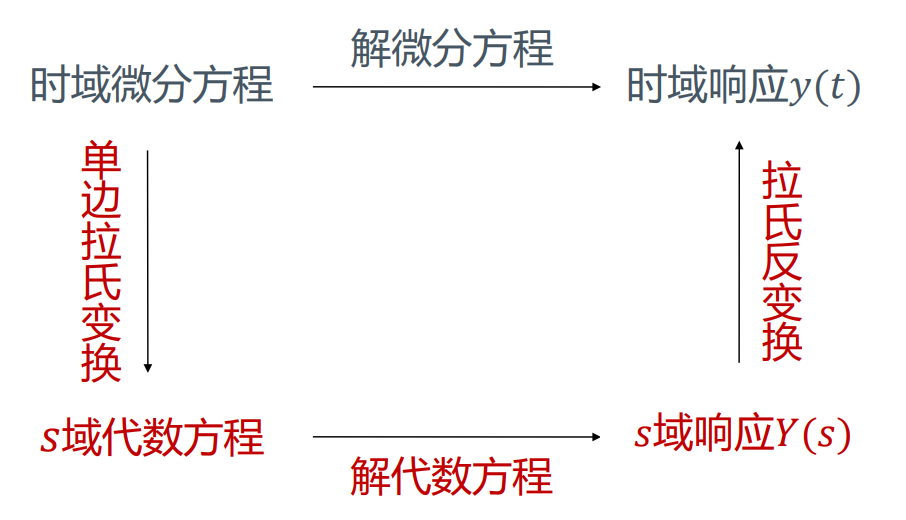
  + 求解步骤
    + 使用时域微分性质将时域微分方程变换为s域代数方程

---
## 系统函数
+ 系统在零状态（$y(0_-)=0$）条件下，输出的LT与输入的LT之比叫做系统函数，记作$H(s)$。
  $$ H(s)=\frac {\mathcal{L}[y_{zs}(t)]}{\mathcal{L}[x(t)]}=\frac {Y_{zs}(s)}{X(s)} $$
+ $H(s)$与$h(t)$的关系
  由于$y_{zs}(t)=\delta(t)*h(t)=h(t)$
  因此$H(s)=\frac{\mathcal{L}[y_{zs}(t)]}{\mathcal{L}[x(t)]}=\mathcal{L}[h(t)] $
+ 系统函数的求解方法
  + 使用系统的冲击响应求解：$H(s)=\mathcal{L}[h(t)] $
  + 使用定义式：$H(s)=\frac {\mathcal{L}[y_{zs}(t)]}{\mathcal{L}[x(t)]}$
  + 由系统的微分方程直接写出$H(s)$

> 例：已知LTI连续时间系统满足的微分方程为
> $$y''(t)+3y'(t)+2y(t)=3x(t)+2x'(t)$$
> 对微分方程进行单边的Laplace变换，代入零状态条件，得到
> $$(s^2+3s+2)Y_{zs}(s)=(2s+3)X(s)$$
> 由此可直接写出系统函数形式
> $$H(s)=\frac{2s+3}{s^2+3s+2}$$
> 对$H(s)$进行反变换可得到系统的冲激响应$h(t)=(e^{-t}+e^{-2t})u(t)$

> 由系统函数也可求解系统的微分方程  
> 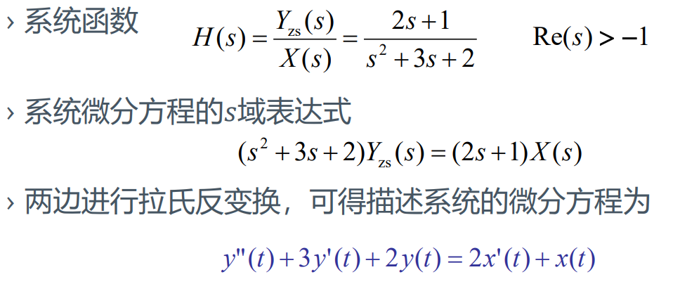

### 系统函数的零极点与特性
+ 下面讨论$H(s)$的零极点与系统特性的关系

#### 系统函数与时域特性
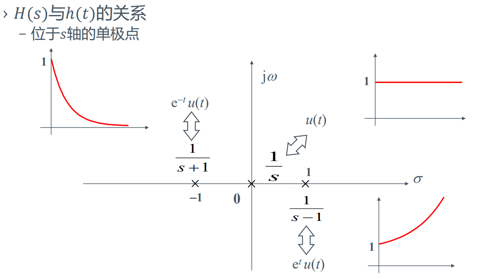
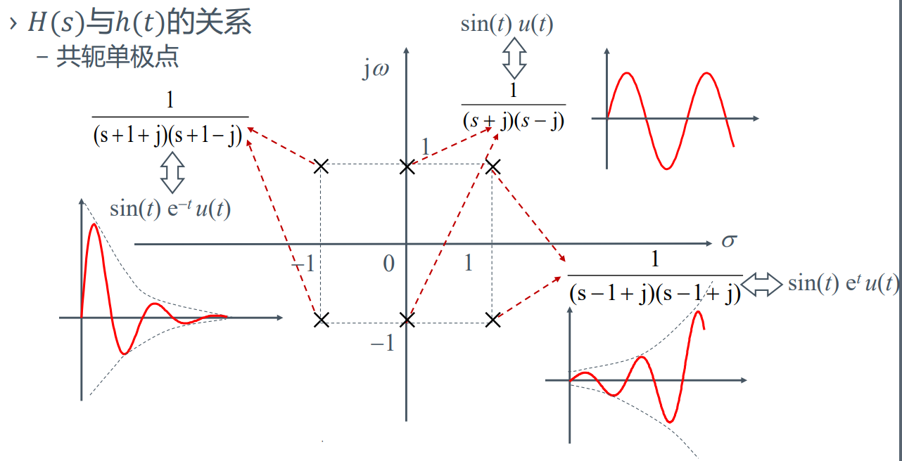

#### 系统函数与系统稳定性
+ 连续时间LTI系统BIBO稳定的充要条件为
  $$\int_{-\infty}^{+\infty}|h(\tau)|d\tau=S<\infty$$
+ 因果系统在s域有界输入有界输出（BIBO）的充要条件是**系统函数$H(s)$的全部极点位于左半s平面。**

> 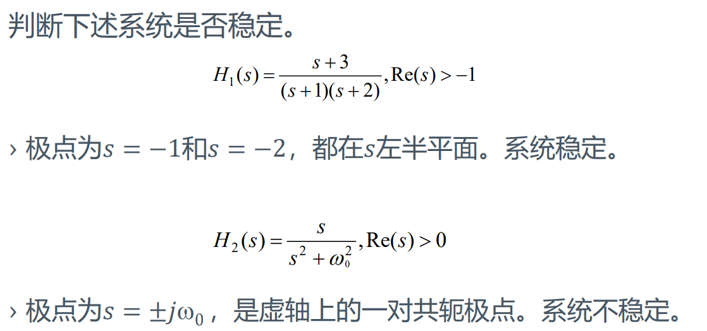

