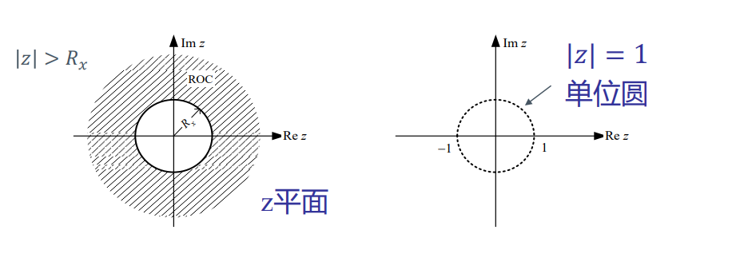
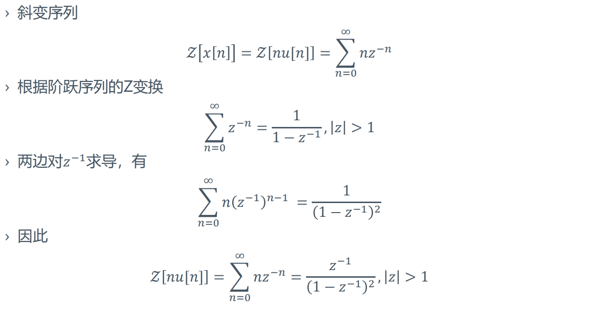
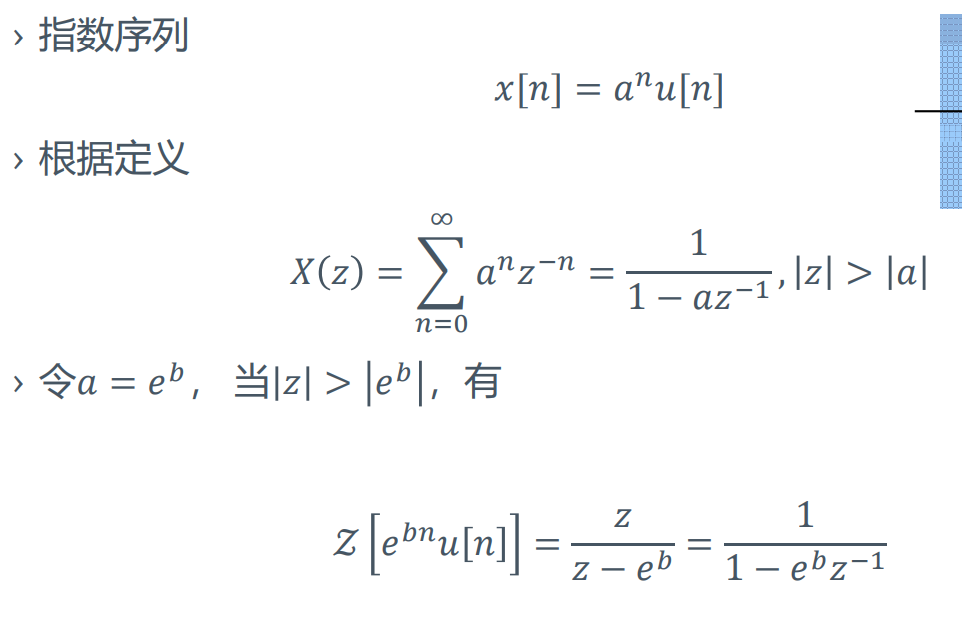
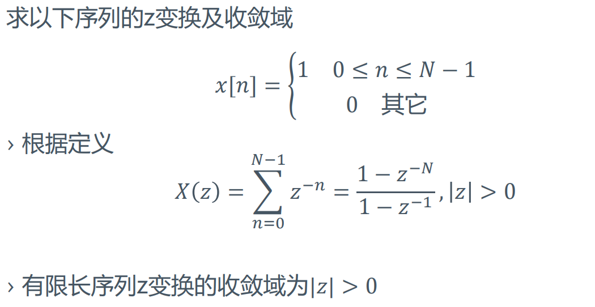

# Z变换

+ 连续因果信号通过抽样可得到离散信号
  $$x_s(t)=x(t)\delta_{T_s}(t)=\sum_{n=0}^\infty x(nT_s)\delta(t-nT_s)$$
+ 两边同时取Laplace变换
  $$
  \begin{aligned}
  X_s(s)&=\int_{0}^{\infty}x_s(t)e^{-st}dt\\
  &=\int_{0}^{\infty}\left[\sum_{n=0}^{\infty}x(nT_s)\delta(t-nT_s)\right]e^{-st}dt\\
  &=\sum_{n=0}^\infty x(nT_s)e^{-snT_s}dt\\
  \end{aligned}
  $$
  令$z=e^{sT_s}$得到
  $$X(z)=\sum_{n=0}^{\infty}x(nT_s)z^{-n}$$
  大多数情况下，$T_s=1$，即$z=e^{s}$。

---
## 单边Z变换
$$
\begin{aligned}
X(z)&=\mathcal{Z}[x[n]]=\sum_{n=0}^{\infty}\\
&=x[0]+\frac{x[1]}{z}+\frac {x[2]}{x^2}+...\\
\end{aligned}
$$
+ 其中$z$为复数，离散信号的Z变换是$z^{-1}$级数形式

### 单边Z变换收敛域
+ 单边Z变换为
  $$X(z)=\mathcal{Z}[x[n]]=\sum_{n=0}^{\infty}x[n]z^{-n} $$
+ 收敛域
  + 能够使上述级数收敛的所有$z$的范围称作$X(z)$的收敛域
  + 一般为$z$平面的一个圆外区域  
  

## 双边Z变换
$$X(z)=\mathcal{Z}[x[n]]=\sum_{n=-\infty}^{\infty}x[n]z^{-n} $$

## Z反变换
$$x[n]=\mathcal{Z}^{-1}[X(z)]=\frac{1}{2\pi j}\oint_cX(z)z^{n-1}dz $$

---
## 常用单边序列的Z变换
+ **单位脉冲序列**
  $$ \mathcal{Z}[\delta[n]]=1\quad\quad z\geq 0 $$
+ **单位阶跃序列**
  $$ \mathcal{Z}[u[n]]=\sum_{n=0}^{\infty}z^{-n}=\frac {1}{1-z^{-1}}\quad\quad |z|> 1 $$
+ **斜变序列**  
  
+ **指数序列**  
  
+ **有限长序列：分解为两个无限长序列之差或者直接使用定义**   
  
+ **一个特殊的例子**  
  

---

## Z变换的性质

### 线性特性
