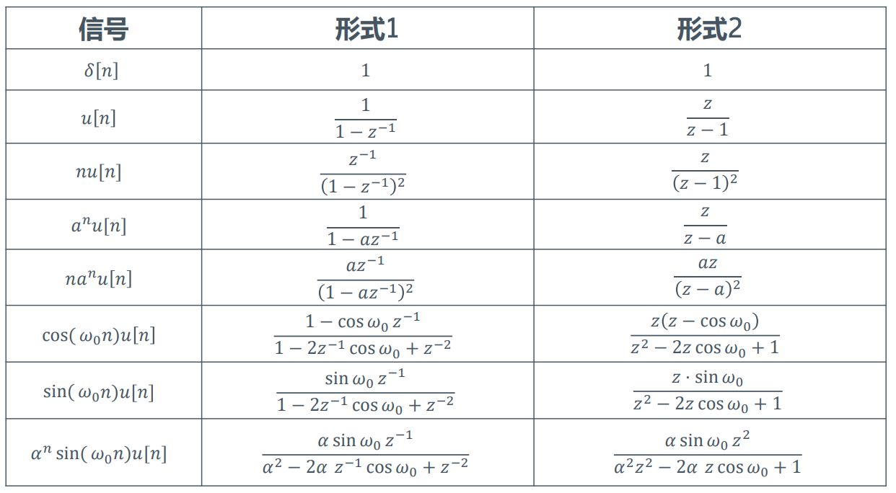
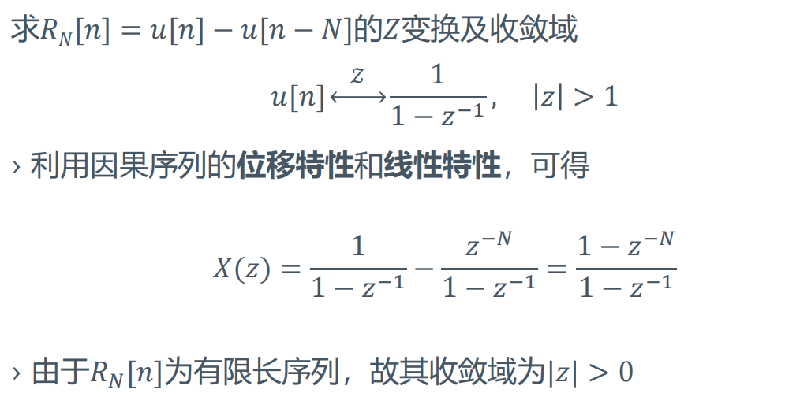
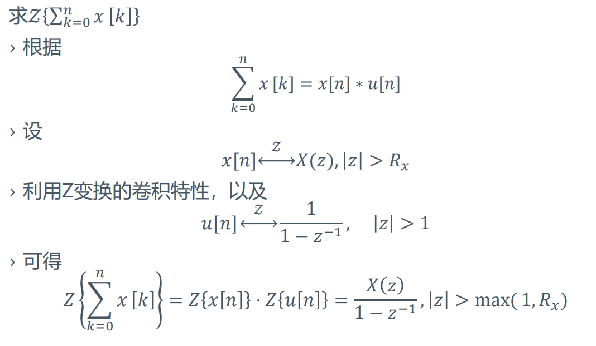
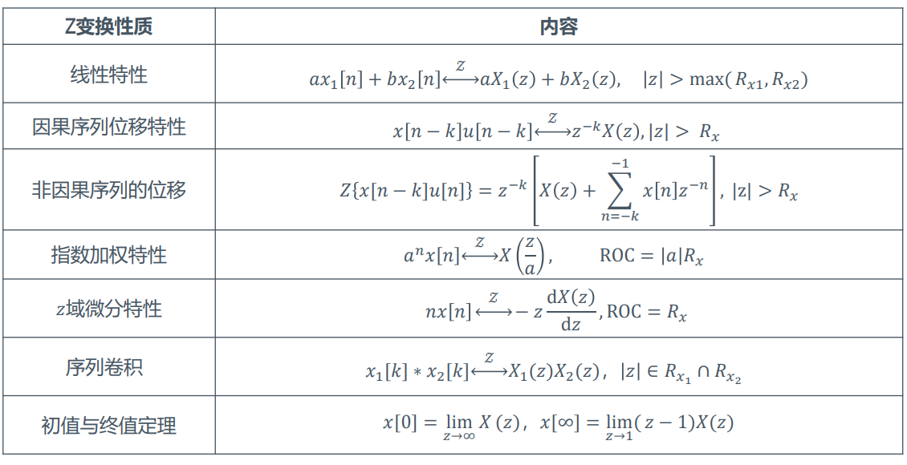
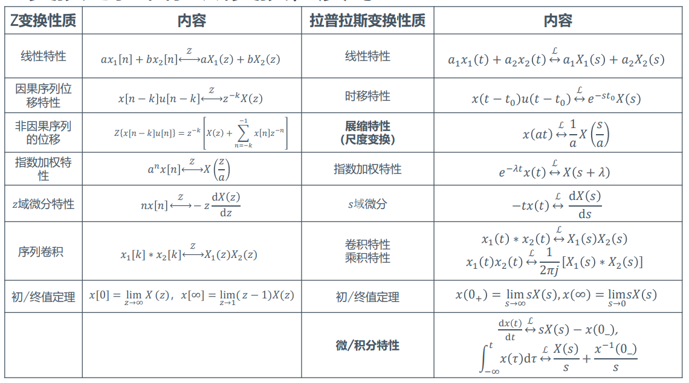

# Z变换

+ 连续因果信号通过抽样可得到离散信号
  $$x_s(t)=x(t)\delta_{T_s}(t)=\sum_{n=0}^\infty x(nT_s)\delta(t-nT_s)$$
+ 两边同时取Laplace变换
  $$
  \begin{aligned}
  X_s(s)&=\int_{0}^{\infty}x_s(t)e^{-st}dt\\
  &=\int_{0}^{\infty}\left[\sum_{n=0}^{\infty}x(nT_s)\delta(t-nT_s)\right]e^{-st}dt\\
  &=\sum_{n=0}^\infty x(nT_s)e^{-snT_s}dt\\
  \end{aligned}
  $$
  令$z=e^{sT_s}$得到
  $$X(z)=\sum_{n=0}^{\infty}x(nT_s)z^{-n}$$
  大多数情况下，$T_s=1$，即$z=e^{s}$。

---
## 单边Z变换
$$
\begin{aligned}
X(z)&=\mathcal{Z}[x[n]]=\sum_{n=0}^{\infty}x[n]z^{-n}\\
&=x[0]+\frac{x[1]}{z}+\frac {x[2]}{z^2}+...\\
\end{aligned}
$$
+ 其中$z$为复数，离散信号的Z变换是$z^{-1}$级数形式

### 单边Z变换收敛域
+ 单边Z变换为
  $$X(z)=\mathcal{Z}[x[n]]=\sum_{n=0}^{\infty}x[n]z^{-n} $$
+ 收敛域
  + 能够使上述级数收敛的所有$z$的范围称作$X(z)$的收敛域
  + 一般为$z$平面的一个圆外区域  
  

---
## 双边Z变换
$$X(z)=\mathcal{Z}[x[n]]=\sum_{n=-\infty}^{\infty}x[n]z^{-n} $$

## Z反变换
$$x[n]=\mathcal{Z}^{-1}[X(z)]=\frac{1}{2\pi j}\oint_cX(z)z^{n-1}dz $$

---
## 常用单边序列的Z变换
+ **单位脉冲序列**
  $$ \mathcal{Z}[\delta[n]]=1\quad\quad z\geq 0 $$
+ **单位阶跃序列**
  $$ \mathcal{Z}[u[n]]=\sum_{n=0}^{\infty}z^{-n}=\frac {1}{1-z^{-1}}\quad\quad |z|> 1 $$
+ **斜变序列**  
  
+ **指数序列**  
  
+ **有限长序列：分解为两个无限长序列之差或者直接使用定义**   
  
+ **一个特殊的例子**  
  
+ 表格  
  
---

## 单边Z变换的性质
### 线性性质
+ 若$x_1[n]\stackrel{\mathcal{Z}}{\leftrightarrow}X_1(z), |z|>R_{x_1}, x_2[n]\stackrel{\mathcal{Z}}{\leftrightarrow} X_2(z), |z|>R_{x_2}$，则
$$
ax_1[n]+bx_2[n]\stackrel{\mathcal{Z}}{\leftrightarrow}aX_1(z)+bX_2(z)
$$
$$
|z|>\max(R_{x_1}, R_{x_2})
$$

### 时移特性
+ 因果序列
  $$x[n-k]u[n-k]\stackrel{\mathcal{Z}}{\leftrightarrow}z^{-k}X(z)\quad\quad |x|>R_x$$
+ 非因果序列
  $$
  x[n+k]u[n]\stackrel{\mathcal{Z}}{\leftrightarrow}z^k\left[X(z)-\sum_{n=0}^{k-1}x[n]z^{-n}\right]\quad\quad |z|>R_x
  $$
  $$
  x[n-k]u[n]\stackrel{\mathcal{Z}}{\leftrightarrow}z^{-k}\left[X(z)+\sum_{n=-k}^{-1}x[n]z^{-n}\right]\quad\quad |z|>R_x
  $$

> 小例子：
> 
> **注意到线性加权后序列z变换的ROC可能比原序列z变换的ROC大**

### 指数加权特性
$$a^nx[n]\stackrel{\mathcal{Z}}{\leftrightarrow}X(\frac za)\quad\quad ROC=|a|R_x$$

### z域微分
$$nx[n]\stackrel{\mathcal{Z}}{\leftrightarrow}-z\frac {\mathrm{d}X(z)}{\mathrm{d}z}\quad\quad ROC=R_x$$

### 时域卷积（z域乘积）
+ 若$x_1[n]\stackrel{\mathcal{Z}}{\leftrightarrow}X_1(z), |z|>R_{x_1}, x_2[n]\stackrel{\mathcal{Z}}{\leftrightarrow} X_2(z), |z|>R_{x_2}$，则
$$
x_1[k]*x_2[k]\stackrel{\mathcal{Z}}{\leftrightarrow}X_1(z)X_2(z)\quad\quad|z|\in R_{x_1}\cap R_{x_2}
$$

> 例子
> 

### 单边Z变换的初值定理
$$x[0]=\lim_{z\to\infty}X(z)$$

### 单边Z变换的终值定理
+ 若$(z-1)X(z)$的收敛域包含单位圆，则
$$x[\infty]=\lim_{z\to 1}(z-1)X(z)$$

> **Z变换的性质**
> 

> **Z变换与拉普拉斯变换的性质对比**
> 

---

## 单边Z反变换
+ 单边z反变换的定义
  $$x[n]=\frac 1{2\pi j}\oint_c X(z)z^{k-1}\mathrm{d}z $$
  $c$为$X(z)$的ROC中的一个闭合曲线

## 部分分式展开法
+ 将z变换的结果表示为
  $$X(z)=\frac {B(z)}{A(z)}=\frac{b_0+b_1z^{-1}+...+b_mz^{-m}}{1+a_1z^{-1}+...+a_nz^{-n}}$$

#### $m<n$，无重极点
+ 则$X(z)$可被表示为
  $$X(z)=\sum_{i=1}^{n}\frac {r_i}{1-p_iz^{-1}}$$
+ 此时直接使用指数加权性质可得反变换为
  $$x[n]=\sum_{i=1}^{n}r_ip_i^nu[n]$$

#### $m<n$，在$z=u$处有$l$阶重极点
+ 此时$X(z)$被表示为
  $$X(z)=\sum_{i=1}^{n-l}\frac {r_i}{1-p_iz^{-1}}+\sum_{i=0}^{l-1}\frac {q_i}{(1-uz^{-1})^{l-i}}$$
  系数的求解方法和拉普拉斯变换中相同，但是这里一般只能通过配凑的方法，没有太好的通用公式。

---

## z变换与系统分析
略。

