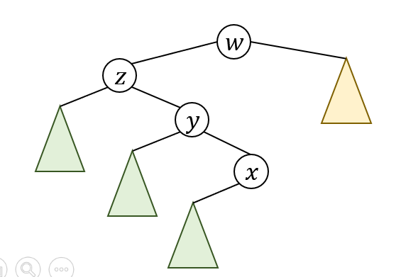
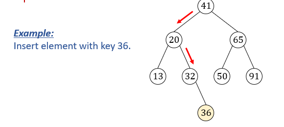
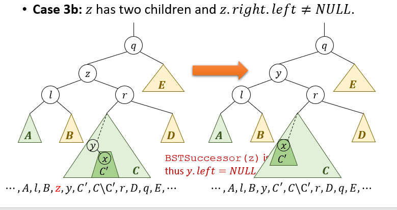
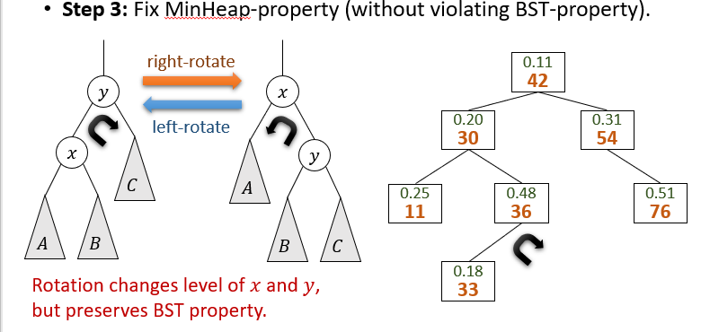

# 二叉搜索树（BST）和Treap

## 抽象数据类型：Set
**Set是拥有通常不同键值的一系列元素的集合**
+ Set对象应当支持的操作
  + Search(S, k)：找到集合中键为k的元素
  + Insert(S, x)：将x加入到S。（如果x存在？）
  + Remove(S, x)：将S中的元素x删除
  + Remove(S, k)：将键为k的元素从S中删除
+ 如果集合中的元素存在全序关系
  + Min(S)和Max(S)
  + Successor(S, x) or Successor(S, k)：找到集合中比最小的比元素x或者键值k代表的元素x大的元素。
  + Predecessor(S, x) or Predecessor(S, k)


## 二叉搜索树 BST
+ 对于树的所有节点x，如果y在其左子树中，那么$y\leq x$；如果y在其右子树中，那么$y\geq x$. (BST property)

## OSet数据类型在BST上的实现
### 查找
+ 给定BST和一个键值k，要求查找值为k的节点是否存在。
+ 如果某个节点值为k，那么返回这个节点。如果小于k，递归到右子树；如果大于k，递归到左子树查找。
+ 最坏情况下，时间开销为$\Theta (h)$，h是BST的高度。

### 查找最小元素和最大元素
+ 查找最小元素：一直向左子树查找即可
+ 查找最大元素：一直向右子树查找即可

### 查找后继节点
+ case 1：如果x的右子树非空，在x的右子树中查找最小元素即可
+ case 2：如果x的右子树为空，那么x的后继是x的祖先中左节点也是x的祖先的第一个祖先。如图。
+ 最坏需要$O(h)$时间开销
```
BSTSuccessor(x):
if (x.right!=NULL)
    return BSTMin(x.right)
y = x.right
while (y!=NULL and y.right==x)
    x = y
    y = y.parent
return y
```

### 插入元素
+ 类似查找操作，一直查到某个叶节点后，将需要插入的数值放在该叶节点的左孩子或右孩子处。
+ 时间复杂度$O(h)$


### 移除元素
+ case 1：z没有孩子。直接删除。$O(1)$
+ case 2：有一个子节点，直接将子节点提升。$O(1)$
+ case 3：有两个子节点，则在右子树中查找z的后继，交换z和后继的位置。删除z，然后把右子树提升。最坏$O(h)$
  

## Treap
Treap是每一个节点有一个key value，同时又有一个priority value的BST。Treap同时满足BST性质和最小堆性质。

### 插入元素
1. 为每一个被添加的节点分配一个随机的priority value
2. 根据BST性质添加节点
3. 通过左旋和右旋修复堆性质  


### 删除元素
1. 通过左旋和右旋将待删除节点移动到叶节点位置，同时不破坏BST性质
2. 删除移到叶节点位置的待删除节点