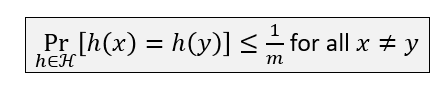

# Hashing
+ 将较大的键值集合映射到较小的位置集合当中

## Chaining：解决碰撞的一种方法
+ 映射到的目标集合的每一个位置上都是一个桶。桶内是一个链表，存放着原键值集合中的值。每次发生碰撞时，将元素添加到表头。
+ 

## Simple Uniform Hashing Assumption
+ 每个键都被等可能地映射到所有的桶中
+ 每个键值的映射情况都是独立的

## Hashing Map实现下各操作的时间开销
+ 查找操作的期望开销
  + 取决于h(k)那个桶内链表的长度。时间开销h(k)
  + 在Simple Uniform Hashing假设下
    + 定义load factor $\alpha = n/m$
    + 
    + 对上图的简单说明。如果要查找的元素不在表内，那么显然是$\Theta(1+\alpha)$。如果要查找的元素在表内，那么定义指示器变量$X_{ij}$，表明第i个元素和第j个元素发生了碰撞。由于每次插入元素都是从表头插入元素，因此真正带来开销的只有第i+1个元素开始向后的元素。由SUH假设，发生碰撞的机率为1/m。求和即可。
+ 查找操作最坏情况下的期望开销
  + $\Theta (\frac{\lg n}{\lg \lg n})$
+ Insert(x) where x is a pointer to an item.
  + O(1)
+ Remove(x) where x is a pointer to an item.
  + O(1)

## SUH假设的局限性
+ 现实生活中SUH假设是难以成立的。键值并不是那么随机的，键值中的固有模式容易导致哈希结果的固有模式。

## 设计哈希函数
### 同余函数:h(k) = k mod m
+ 挑选m
  + 首先，假设k和m有共同的因子d，那么h(k)也是可以被d整除的。
  + 因此，最好挑选一个合适的素数
### 乘法
+ 假设所有的键的长度都是至多w位
+ 令哈希表的大小$m=2^r, r<w$
+ 取定整数$0\leq A\leq 2^w$
+ 哈希值为$h(k) = (Ak \mod 2^w)>>(w-r)$。相当于是相乘后取低位
+ 好处：速度更快，只需要乘法和位运算即可。
+ 

## Universal Hashing Assumption 全域哈希散列假设
+ 在第一次建立哈希表时，从全域哈希函数集合中随机挑选一个哈希函数来建立整个哈希表。这样就不存在某个绝对坏的输入。
+ 全域哈希函数集合$\mathbb{H}$满足：
  $$Pr_{\mathbb{H}}$$

+ 构造全域哈希函数集
  + 首先找到一个足够大的p，使得p能容纳下所有的可能的键值。令$\mathbb{Z}_p={0,1,2...,p-1}$,$\mathbb{Z}^\star={1, 2, ...,p-1}$
  + 令$h_{ab}(k) = (ak+b) mod p ) mod$  
  **TODO：完善**

---
## 解决碰撞的另一种方法：Open Addressing
+ 当发生碰撞的时候，将发生碰撞的值用哈希函数映射到另外一个值上，直到不会发生碰撞。为了实现此功能，需要重新设计哈希函数，并映射到一个比原来关键字的规模更大的哈希表（至少也要规模差不多）
+ $h:U\times \{0, 1, 2, ..., m-1\}\to\{0, 1,...m-1\}$。也就是将查找的次数作为变元加入到哈希函数中。
```
HashInsert(T, k):
i = 0
repeat
    j = h(k ,i)
    if (T[j]==NIL)
        T[j] = k
        return j
    else i = i+1
until (i==m)
return "overflow"
```
+ 查找的时候，先去h(k,0)位置处看存放的是不是想要的元素。如果不是，说明我们想要查找的元素在存入时发生了碰撞，再去h(k, 1)查找。直到查到了或者探查m次后都没查到或者某次查到的东西是NIL，那么就可以终止循环。
```
HashSearch(T, k):
i = 0
repeat
    j = h(k ,i)
    if (T[j]==k)
        return j
    i = i+1
until (i==m or T[j]==NIL and (T[j].delete==false))
```
**TODO**
+ 删除元素时不能直接查找然后删除。因为如果这样，可能会影响到其他元素的探察链断开**TODO：补图**
  + 解决方案：删除照样删除，但是在这个位置设置一个delete标记位，表示这个位置原本是有元素的，但是被我删除了。

### 设计探查哈希函数
+ 线性探查：Linear Probing
  + $h(k ,i) = (h^\prime(k)+i)mod(m)$
  + *缺点在于，哈希映射的cluster会有不断变大的趋势。当cluster逐渐变大时，探查的时间开销也会逐渐变大*  
  **TODO:补图**
+ 二次探查：Quadratic Probing
  + $h(k, i) = (h^\prime(k)+c_1i+c_2i^2)mod(m)$
  + clustering的问题仍然存在，不过比线性探查好一点。
+ Double Probing
  + $h(k, i) = (h_1(k)+ih_2(k))mod (m)$
  + 使用两个哈希函数来进行探查。由于后面带i的项实际上由$h_2$确定，也就是探查的位置由$h_2$确定，因此能够解决clustering的问题

## Uniform Hashing Assumption
+ 内容:探查序列可能是m！排列中的的任意一种，且出现的概率是等可能的。
+ 事实上无论是线性探查还是二次探查都做不到UHA。Double Probing好一点
### 在UH假设下，开放寻址的性能
+ 定义负载因子$\alpha = \frac nm$。注意，由于开放寻址映射出的哈希表相较原关键字规模更大，因此$\alpha < 1$  
  **TODO:补图**
+ 不成功查找时，时间开销一般要比Chaining要更大，为$\frac1{1-\alpha}$
+ 成功查找时，时间开销为$\frac1\alpha\ln(\frac1{1-\alpha})$

---
## Chaining vs Open-addressing
+ 开放寻址的优势
  + 省去了很多内存分配的步骤
  + 由于哈希表是被连续地存储在系统内存中的，因此将哈希表载入cache的次数更少
+ 开放寻址的劣势
  + 哈希函数的选择
  + 装载因子$\alpha$接近1时时间开销很大

---
**以上哈希方法都只能将查找、添加、删除的期望时间缩小到O(1)，但是如果我们放弃添加、删除操作，我们可以把查找的最坏运行时间缩小到O(1)**

+ 使用大小为$n^2$的哈希表
+ 使用universal hash family  
  
+ 期望的collision次数为$C_n^2\dot 1/m\leq 1/2$，因此期望上不会发生碰撞，是完美哈希
+ 哈希表也可以优化，使得空间代价小于$n^2$
  + 首先从$\mathbb{H}$中挑选出一个哈希函数，建立第一级哈希表
  + 对于第一级哈希表同一个桶$n_j$中产生碰撞的关键字值，从$\mathbb{H}$再挑出一个哈希函数，建立第二级哈希表。第二季哈希表用上文$n_j^2$的大小构建即可。可以证明期望的空间仍为$\Theta(n)$  
  **TODO:补充证明图**