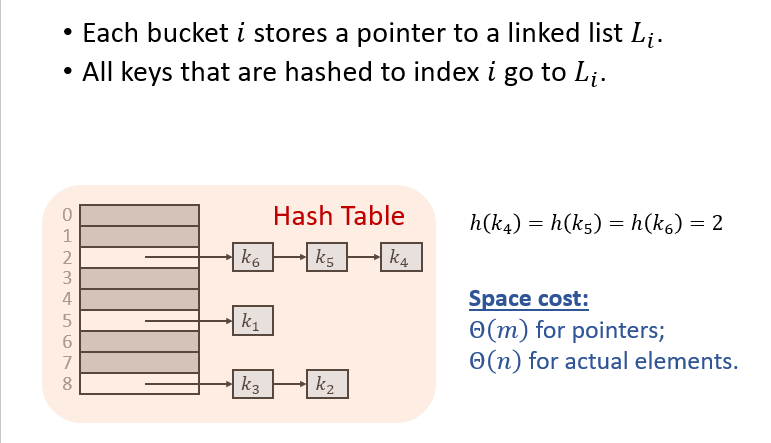
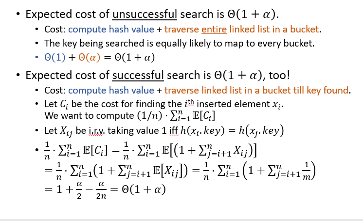
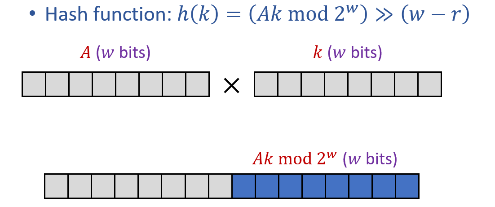

# Hashing
+ 将较大的键值集合映射到较小的位置集合当中

## Collisions in hashing
+ 由于hash函数并不是单射，因此hash函数产生碰撞是不可避免的。
### Chaining
+ 映射到的目标集合的每一个位置上都是一个桶。桶内是一个链表，存放着原键值集合中的值。每次发生碰撞时，将元素添加到表头。
+ 

## Simple Uniform Hashing Assumption
+ 每个键都被等可能地映射到所有的桶中
+ 每个键值的映射情况都是独立的

## Hashing Map实现下各操作的时间开销
+ 查找操作的期望开销
  + 取决于h(k)那个桶内链表的长度。时间开销h(k)
  + 在Simple Uniform Hashing假设下
    + 定义load factor $\alpha = n/m$
    + 
    + 对上图的简单说明。如果要查找的元素不在表内，那么显然是$\Theta(1+\alpha)$。如果要查找的元素在表内，那么定义指示器变量$X_{ij}$，表明第i个元素和第j个元素发生了碰撞。由于每次插入元素都是从表头插入元素，因此真正带来开销的只有第i+1个元素开始向后的元素。由SUH假设，发生碰撞的机率为1/m。求和即可。
+ 查找操作最坏情况下的期望开销
  + $\Theta (\frac{\lg n}{\lg \lg n})$
+ Insert(x) where x is a pointer to an item.
  + O(1)
+ Remove(x) where x is a pointer to an item.
  + O(1)

## SUH假设的局限性
+ 现实生活中SUH假设是难以成立的。键值并不是那么随机的，键值中的固有模式容易导致哈希结果的固有模式。

## 设计哈希函数
### 同余函数:h(k) = k mod m
+ 挑选m
  + 首先，假设k和m有共同的因子d，那么h(k)也是可以被d整除的。
  + 因此，最好挑选一个合适的素数
### 乘法
+ 假设所有的键的长度都是至多w位
+ 令哈希表的大小$m=2^r, r<w$
+ 取定整数$0\leq A\leq 2^w$
+ 哈希值为$h(k) = (Ak \mod 2^w)>>(w-r)$。相当于是相乘后取低位
+ 好处：速度更快，只需要乘法和位运算即可。
+ 

## Universal Hashing Assumption 全域哈希散列假设
+ 在第一次建立哈希表时，从全域哈希函数集合中随机挑选一个哈希函数来建立整个哈希表。这样就不存在某个绝对坏的输入。
+ 全域哈希函数集合$\mathbb{H}$满足：
  $$Pr_{\mathbb{H}}$$

+ 构造全域哈希函数集
  + 首先找到一个足够大的p，使得p能容纳下所有的可能的键值。令$\mathbb{Z}_p={0,1,2...,p-1}$,$\mathbb{Z}^\star={1, 2, ...,p-1}$
  + 令$h_{ab}(k) = (ak+b) mod p ) mod$