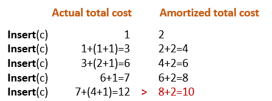
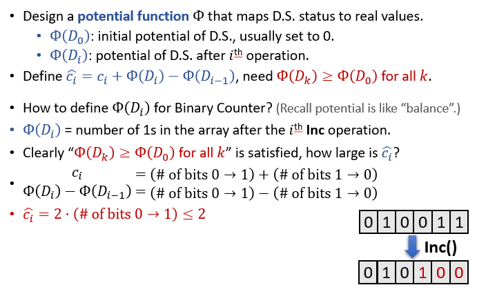

# 均摊分析
+ 均摊分析，用于分析平均花费，经常被应用于数据结构的评估分析。

## 定义
+ Operation has amprtized cost $\hat{c_i}(n)$, if for *every* $k\in \mathbb{N}^+$, the total cost of *any* k operations is $\leq \sum_{i=1}^k\hat{c_i}(n_i)$.
+ *$n_i$ is the size of the data structure when applying the 𝑖 th op* 
---
## 证明均摊开销：记账法
+ 想象有一个账户B
+ 对于第i次操作
  + 如果$\hat{c_i}\geq c_i$，存入$\hat{c_i}- c_i$
  + 如果$\hat{c_i}\leq c_i$，取出$c_i-\hat{c_i}$
+ 证明B始终大于0

## 用循环数组实现队列的均摊分析
+ 未达到数组容量上限时，使用循环数组时插入删除都是O(1)时间操作
+ 但是当数组达到容量上限时，扩容的时间开销为O(n)
+ 假设定义插入操作的均摊开销为2，删除操作的均摊开销为1，下面通过证明实际总开销小于均摊开销之和证明这样的开销分配方案是不是合理的  
  
  + 发现存在某个时刻不满足上述性质，因此均摊开销为2是不合理的
+ 假设定义插入操作的均摊开销为3，发现列举了几个操作后上述性质是满足的。于是猜想3和1是合理的均摊开销。下面使用数学归纳法、记账法证明。  
  

## Binary Counter均摊分析
+ 初始状况下数字为0，inc操作每次对这个数字最低位上+1
```
Inc(A)
i = 0
while (i<n and A[i]==1)
    A[i] = 0
    i++
if (i<n)
    A[i] = 1
```
+ 每一位的比特从1被翻转为0时，它肯定在之前的操作中从0被翻转为1.
+ 因此猜想每次从0变成1时，时间代价为2，从1变成0相应的不需要付出代价。


---
## 证明均摊开销：势能法(The Potential Method)
+ 将该数据结构使用势能函数$\Phi$映射到实数值
  + 初始势能值为0
+ 定义$\hat{c_i}=c_i+\Phi(D_i)-\Phi(D_{i-1})$
+ 只需要证明，for all k, we have $\Phi(D_k)\geq\Phi(D_0)$
+ 虽然实现方法类似，但是势能函数是对整个数据结构的一个整体评价，因此可能适用性更广
+ 应用势能法解决问题的一般思路为
  + 首先找到一个好的势能定义，使得势能始终大于0
  + 然后根据势能定义，定义出每种操作的$\hat{c_i}$
  + 检查该势能定义下各操作的开销是否满足题目/实际问题所给的复杂度要求

## Binary Counter均摊分析：势函数版本
