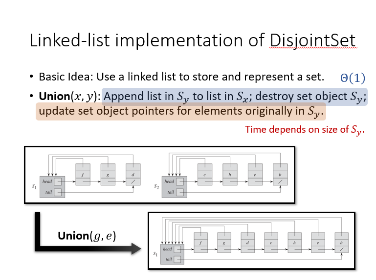
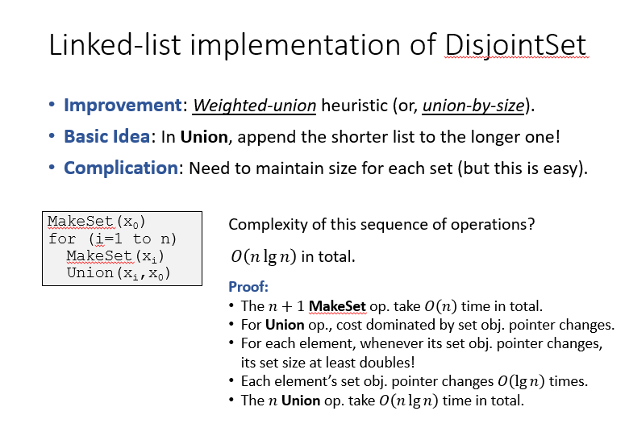
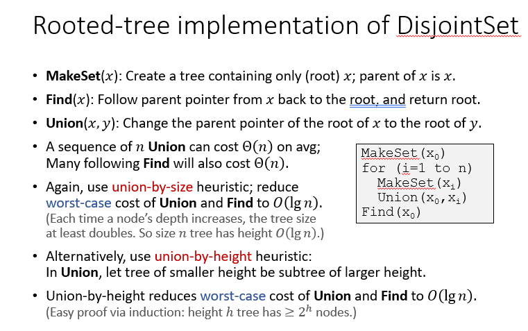
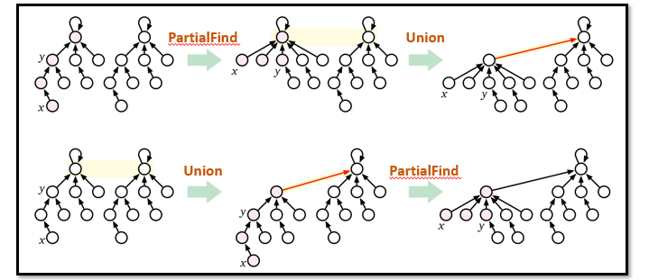
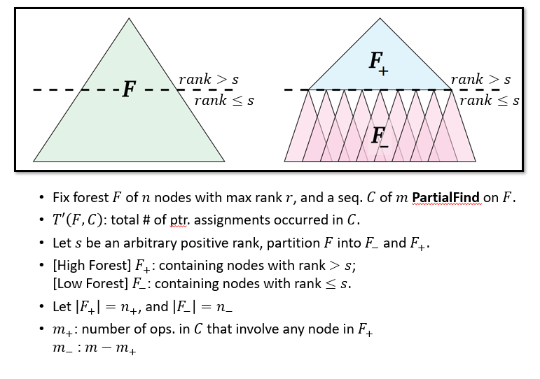
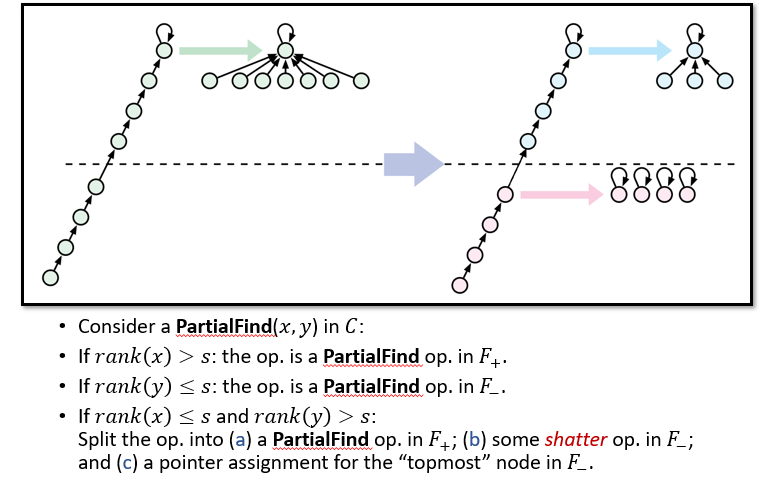
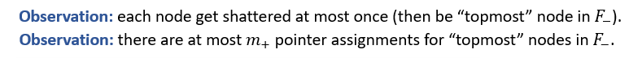
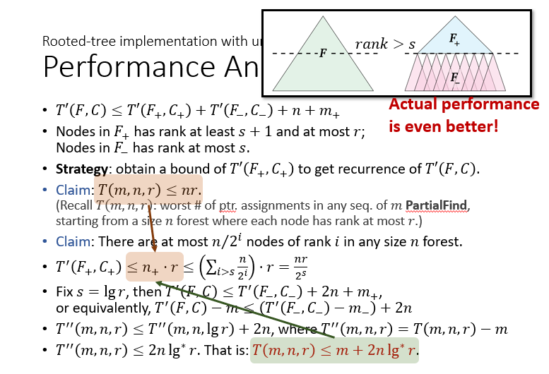
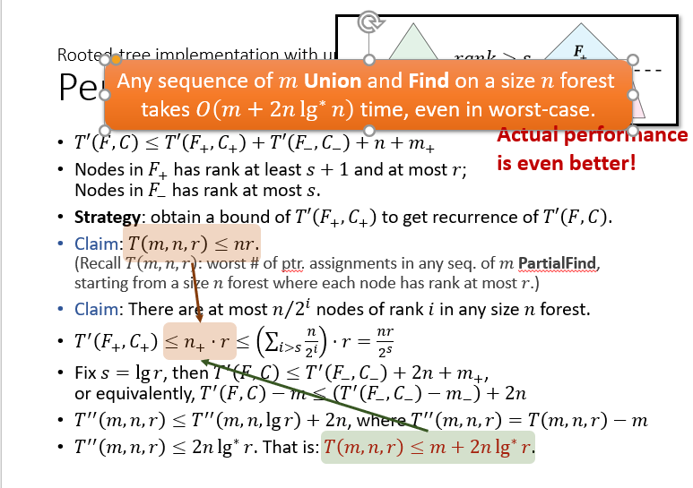

# 抽象数据类型：Disjoint Sets

## disjoint-set 
+ disjoint-set mantains a collections $\mathbb{S}=\{S_1, S_2,...S_k\}$ of sets that are disjoint and dynamic
+ 每一个集合$S_i$都有一个代表元素(representative/leader)
+ 数据类型Disjoint Set需要满足的操作
  + MakeSet(x):创建一个仅包含x的集合，并把该集合加入到$\mathbb{S}$中
  + Union(x, y):找到包含x和y的集合$S_x,S_y$,在$\mathbb{S}$中删除$S_x, S_y$，将$S_x\cup S_y$加入到$\mathbb{S}$中
  + Find(x):给定指向元素x的指针，找到包含元素x的集合，返回指向该集合代表元素的指针

## Implementations
---
## 链表
+ 在链表的表示方法中，集合的代表元素就是链表的第一个元素
+ 链表的实现中，MakeSet和Find操作都较快，Union较慢，平均时间复杂度为$O(n)$  
  
+ 改进：使用Union by size，能够将Union的时间复杂度降至$O(\lg n)$  
  

## 树
+ 树的根为集合的leader，同时树的每个节点都维护一个指针，指向其父亲。
+ MakeSet：$\Theta(1)$复杂度
+ Find(x):直接从x节点向上找到根节点即可。$\Theta(h)$
+ Union(x, y)找到两个根，然后把其中的一个根作为另一个根的孩子。时间开销$O(\lg n)$
+ 
+ TODO:UNION

### 一种让树实现更快的方法：Path Compression
+ 在find操作中，找到根节点后，顺手将路径上所有节点的父节点直接指向根节点
+ 由于path compression会大幅度改变树的结构，很多节点的高度会改变，因此不再维护height变量，而维护rank变量

---
# 使用rank和Path Compression的树实现
+ **MakeSet(x)**：创建一个树，根为x，x的rank为0
+ **Find(x)**【PathCompression】：从x节点向根回溯，将回溯路径上的节点的父节点全部设置为root。
+ **Union(x, y)**【Union-by-rank】：比较x所在树的根root1和y所在树的根root2，将rank较小的root置为rank较大的root的子节点，并视情况更新根节点的rank。rank实际上就是无视Path Compression的树高度

## 性能分析
+ 下面分析任何MekeSet、Find、Union的操作序列具有较小的时间复杂度
+ 由于MakeSet本身时间开销较小，并且MakeSet可以被单独拿出来放在操作序列的开始，因此我们只需要证明对于Find、Union的操作序列有较小的平均时间复杂度即可
+ 由于$Cost(Union(x, y))=Cost(Find(x))+Cost((y))+1$，因此默认Union的参数均为代表元素不会影响问题的分析
+ 下面引入PartialFind(x, y)：要求y是x的祖先节点，从x上溯到根节点，然后将路径上从x到y的部分的节点的父节点全部设置为根节点。相当于find，然后只对x-y上的节点产生结构上的改变。
+ 引入PartialFind后，可将Find-Union操作改变为Union-PartialFind操作。（如图）  
  
+ 在输入节点为根的情况下，Union操作的复杂度为$O(1)$。因此问题简化为一系列PartialFind的操作。又由于PartialFind本质上是一系列指针的改变操作，问题归结为：
+ **GOAL:从n个根节点开始，任何具有m个PartialFind的操作序列具有较低的指针改变次数。**
+ **Proof：**
  + 
  + 
  + 
  + 
  + 
  + 下面由上面得到的递推关系计算时间复杂度
  + 
  + 发现得到的$T(m, n, r)$实际上比之前所猜测的T的上界要更紧确。因此可以考虑将得到的结果作为新的猜测上界进行代入法证明。  
  
