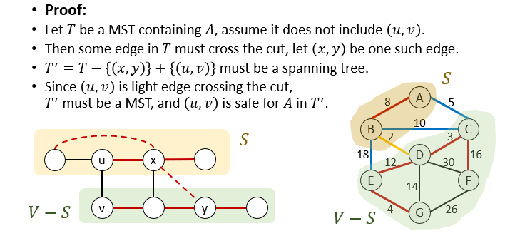
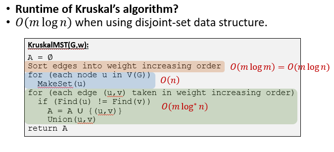
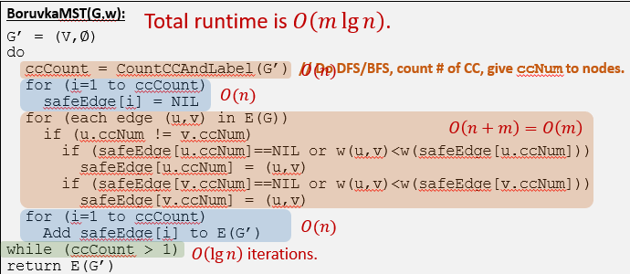

# Minimun Spanning Trees(MST)
+ Consider a connected, undirected, weighted graph G
+ A ***spanning tree*** is a tree containing all nodes in V and a subset T of all edges E
+ A ***minimim spanning tree*** is a spanning tree whose total weight $w(T)=\sum_{(u, v)\in T}w(u, v)$ is minimized

## 寻找最小生成树
### Generic method for computing MST
+ 从所有节点和空的边集A开始
+ 找到一条safe edge加入A，满足加入这个safe edge后A仍然是MST的边集的子集
+ 重复上述过程
+ 这显然是废话，所以下面我们讨论如何不断找到这样的safe egde

### 概念阐述
+ 割(**cut**)：A cut (S, V-S) is a partition of V into two parts
+ An edge **crosses** the cut (S, V-S) if one of its endpoints is in S and the other is in V-S
+ A cut **respects** an edge set A if no edge in A crosses the cut
+ An edge is a **light edge** crossing a cut if the edge has minimum weight among all edges crossing the cut
+ **【Cut Property】:Assume A is included in the edge set of some MST, let (S, V-S) be any cut repecting A. If (u, v) is a light edge crossing the cut, then (u, v) is safe for A**.(consider the process of generating MST steps by steps!)  
  
+ **【Corollary】:Assume A is included in some MST, let $G_A$ = (V, A), then $G_A$ is a forest. Then for any connected component in $G_A$, its minimum-weight-outgoing-edge(MWOE) in G is safe for A**.
+ in $G_A$, an edge in a CC is outgoing if it connects to another CC.

### Kruskal's Algorithm
+ 不断找到能够连通$G_A$中的两个不同连通分量的权重最小的边，直到最后只剩下一个连通分量
+ 实际上应用的就是**cut property**
+ ```
  KruskalMST(G, w)
  A = empty set
  Sort edges into weight increasing order
  for (each edge (u, v) taken in weight increasing order)
    if (adding edge (u, v) does not form cycle in A)
        A = A union {(u, v)}
  return A
  ```
+ 以上Kruskal算法实现伪代码和给出的文字说明之间还是有一些不同的。比如，我们是通过不断检验当前weight最小的边是否满足cut property来生成MST的。同时，为了实现上述检验过程，可以使用**并查集**数据结构，如下：
```c++
KruskalMST(G, w)
A = empty set
Sort edges into weight increasing order
for (each node u in V(G))
    MakeSet(u)
for (each edge (u, v) taken in weight increasing order)
    if (Find(u) != Find(v))
        A = A union {(u, v)}
        Union(u, v)
return A
```
+ 运行时间：$O(m\log^\star n)$  
  

### Prim's Algorithm
算法结构：
```c++
PrimMST(G, w):
A = empty set
Cx = {x}
while (Cx is not a spanning tree)
    Find MWOE (u, v) of Cx
    A = A union {(u, v)}
    Cx = Cx union {v}
return A
``` 
+ 算法思想：从一个连通分支开始，不断找到这个连通分支的MWOE并加入到MST的边集中，通过这种方法不断扩展该连通分支直到生成MST
+ 由于找到一个连通分支的MWOE等价于找到距离这个连通分支最近的节点，因此可使用小底堆来维护每个外点距离这个连通分支的距离
```c++
PrimMST(G, w):
Pick an arbitrary node x
for (each node u)
    u.dist = INF, u.parent = NIL, u.in = false
x.dist = 0;
Build a priority queue Q based on "dist" values
while (Q is not empty)
    u = Q.ExtractMin()
    u.in = true
    for (each edge (u, v))
        if (v.in ==false and w(u, v) < v.dist)
            v.parent = u, v.dist = w(u, v)
            Q.Update(v, w(u, v))
```
+ 时间复杂度：$O(m\log n)+O(n\lg n)=O(m\lg n)$
+ 如果使用斐波那契堆来实现，则Update操作的时间复杂度可进一步降至$O(1)$。因此时间复杂度可进一步降至$O(m+n\lg n)$  
  

### Borůvka’s Algorithm

+ Staring with all nodes and an empty set of edges A
+ Find MWOE for **every remaining cc** in $G_A$, add **all of them** to A
+ repeat above step until we have a spanning tree
+ 同时加入多条边的正确性由以下性质保留：任意两个CC之间的light edge是唯一的
+ 时间复杂度：$O(m\log n)$

### 统一观点
+ Kruskal算法：每次找到能使CC数减一的最小权重的边，加入到A中
+ Prim算法：为固定的一个分支不断寻找MWOE，加入到A中
+ Borůvka算法：为当前所有的连通分支寻找各自的MWOE，全部加入到A中
  + 由于每一次循环中多个连通分支的MWOE可并行寻找，因此通过合适的分布式算法或并行处理可使得Borůvka的效率更高   


