# 贪心算法
## Acitivity Selection Problem
+ 假设有许多活动和一个大礼堂
+ 每个活动都有开始时间和结束时间
+ 任何两个活动都不能在大礼堂中同时发生
+ 求出可供安排的最大活动数目

### 分治法
+ Define $S_i$为在活动$a_i$结束后发生的活动
+ Define $F_i$为在活动$a_i$开始前结束的活动
+ $OPT(S) = max_{1\geq i\geq n}\{OPT(F_i)+OPT(S_i)\}$
  + 复杂度仍然很高
+ $OPT(S) = max_{1\geq i\geq n}\{1+OPT(S_i)\}$
+ **Observation: 为了使$OPT(S)$尽可能大，需要让$OPT(S_i)$尽可能大，也就是挑选出的事件$a_i$需要尽可能早地结束。**

### 贪心法
+ 不断找到当前事件中结束时间最早的节点，将该节点加入到解中，并在原集合中删除所有与该节点冲突的节点
+ 使用下述算法
  ```
  ActivitySelection(S):
  Sort S into increasing order of finish time
  SOL = {a1, }, a' = a1
  for (i=2 to n)
    if (ai.start_time > a'.finish_time)
        SOL.add(ai)
        a' = ai
  return SOL
  ```
+ 下面证明贪心法的正确性

#### 证明贪心法的正确性
+ **【Lemma1】: let $a'$ be the earliest finishing activity in $S$, then $a'$ is in some optimal solution of the problem.**(greedy property)  
  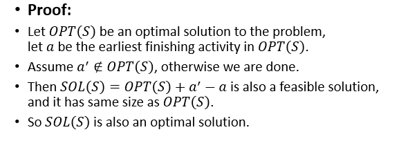
+ **【Lemma2】: let $a'$ be the earliest finishing activity in $S$, let $S'$ be the activities starting after $a'$, then $OPT(S')$$\cup\{a'\}$ is an optimal solution of the problem.**(optimal substructure)  
  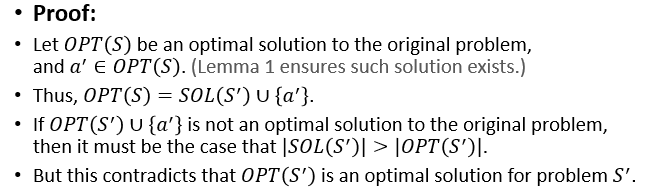
+ **【Theorem】: The greedy algorithm is correct.**  
  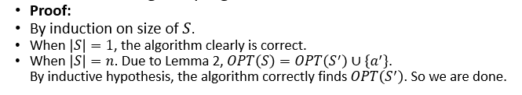
---
## 贪心算法
### optimal substructure
+ 在原问题的最优解中包含的某个子问题的可行解一定也是这个子问题的最优解
+ 设$OPT_{P(n)}$包含子问题$P(n\prime)$的可行解$SOL_{P(n\prime)}$
+ $SOL_{P(n\prime)}=OPT_{P(n\prime)}$

### greedy-choice property
+ 在构造最优解的每一步骤中，都选择在当前状况下看起来最好的策略，而不需要考虑子问题的情况如何。也就是不需要子问题的回溯结果就直接作出当前步骤的选择。
+ 需要做的工作就是先提出一个策略，然后证明该策略作出的选择会出现在最后的某个最优解当中
+ 如果一个问题只满足最优子结构性质
  + 只需要找到i使得i能够$maximize\{Utility(a_i+OPT_{P^i(n_i)})\}$
  + 类似于分治的算法思路，需要计算所有的$Utility(a_i+OPT_{P^i(n_i)})\}$
+ 但是如果一个问题既满足最优子结构又满足贪心选择性质
  + 可以基于一个既定的策略直接选择出正确的$a_i$，无需计算所有的$Utility(a_i+OPT_{P^i(n_i)})\}$
  + 因此可以大幅减少运行时间开销
  + 问题在于正确的贪心选择策略往往很难找到
+ **因此**
  + **最优子结构性质和贪心选择性质保证了贪心算法的正确性**
  + **贪心选择性质保证了运行时间的高效性**
  + **最优子结构是更容易成立、更广泛的性质，任何满足最优子结构的问题都可以使用类似分治法的思路去解决，而且贪心选择性质也依赖于最优子结构性质才能成立。但并不是每个问题都有满足贪心选择性质的策略，因此贪心算法的工作量主要在于：*找到这样一种满足贪心选择性质的策略*。**

---
## 背包问题
+ 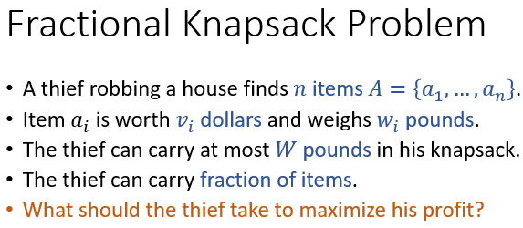

### 贪心
+ 贪心策略：每次都拿性价比最高的物体
+ **【Lemma1: greedy-choice】: let $a_m$ be a most efficient item, then in some optimal solution, at least $w_m^\prime=\min{w_m, W}$ pounds of $a_m$ are taken.**  
  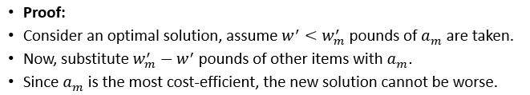
+ **【Lemma2: optimal substructure】: ？？？**
  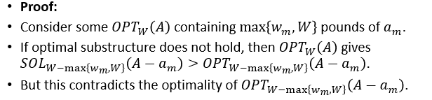

## 0-1背包问题
+ 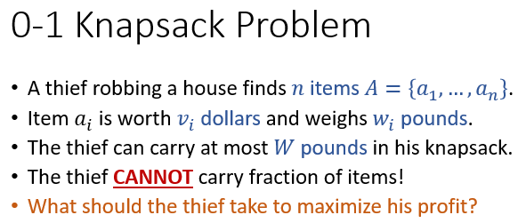
### why greedy fail?
+ 最优子结构性质成立
+ 贪心选择性质不成立
+ 因此可以使用分治和动态规划的思路来解决0-1背包问题

## 数据压缩问题
+ 问题描述  
  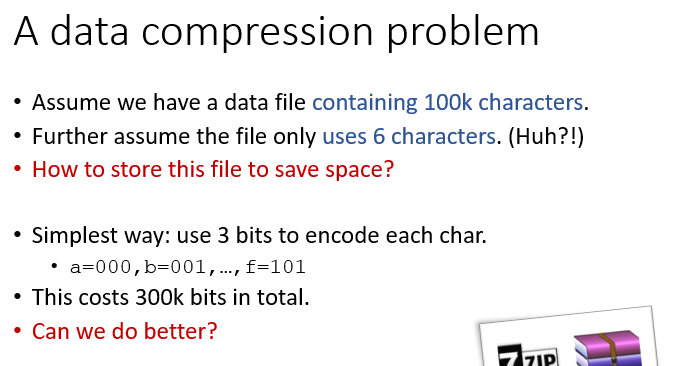
+ prefix-free：任意一个码字都不是另外一个码字的编码前缀
+ 使用变长编码可以有效压缩文件大小。从另一种角度看，定长编码也是prefix-free的，但是并不是最优的变长编码方式
+ 问题在于，如何生成最优变长编码
### 生成最优变长编码
+ 事实上，可以用二叉树来可视化一组prefix-free的编码
+ 
+ 最优的编码方式一定是被可视化为满二叉树的编码方式
+ recursively merge the two least frequent chars to the top of the tree
+ 可使用小顶堆来实现  
  ```
  Huffman(C):
  Build a priority queue Q based on frequency
  for (i=1 to n-1)
      Allocate new node z
      x = z.left = Q.ExtractMin()
      y = z.right = Q.ExtractMin()
      z.frequency = x.frequency + y.frequency
      Q.Insert(z)
  return Q.ExtractMin()
  ```
+ **【Lemma1: greedy choice】: Let $x$ and $y$ be two least frequent chars, then in some optimal code tree, $x$ and $y$ are siblings and have largesr depth**  
  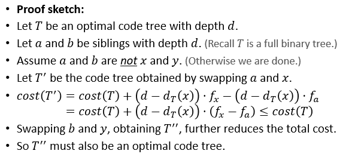
+ **【Lemma2: optimal substructure】：Let 𝑥 and 𝑦 be two least frequent chars in 𝐶. Let 𝐶_𝑧=𝐶−{𝑥,𝑦}+{𝑧} with 𝑓_𝑧=𝑓_𝑥+𝑓_𝑦. Let 𝑇_𝑧 be an optimal code tree for 𝐶_𝑧. Let 𝑇 be a code tree obtained from 𝑇_𝑧 by replacing leaf node 𝑧 with an internal node having 𝑥 and 𝑦 as children. Then, 𝑇 is an optimal code tree for 𝐶.**  
  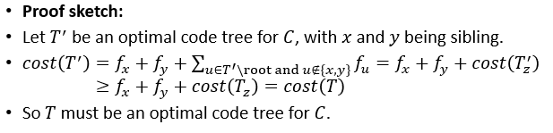

## Set Cover
+ 问题描述  
  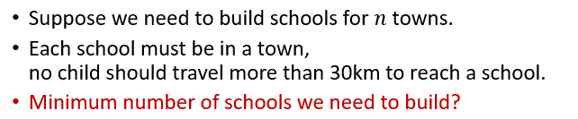
+ 贪心策略
  + 每次都选择能够覆盖最多的未被覆盖的城市，直到完成全部覆盖
  + 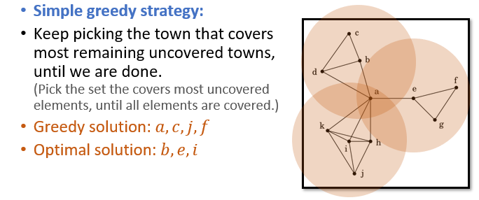
  + 贪心算法的解并不是最优解，但在该问题中能够给出一个较好的近似解
  + **【Theorem】：Suppose thr optimal solution uses k sets, then the greedy strategy will use at most klgn sets.**  
    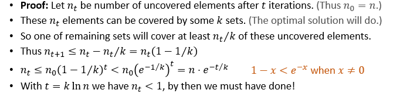