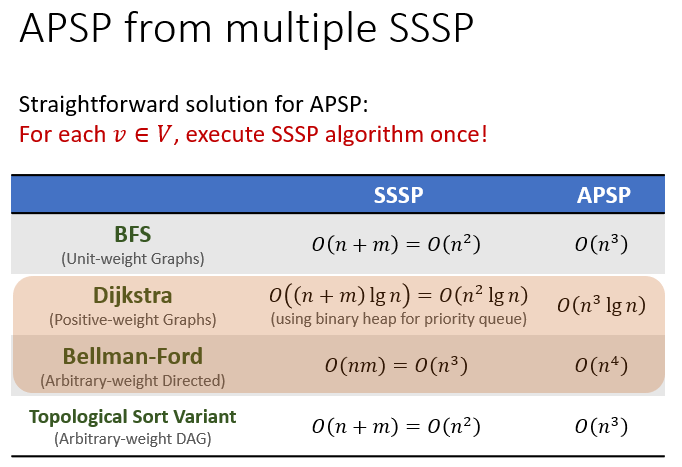
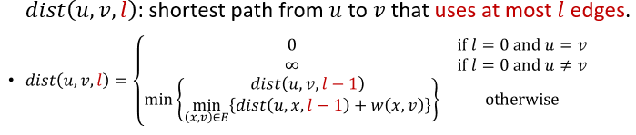
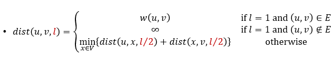
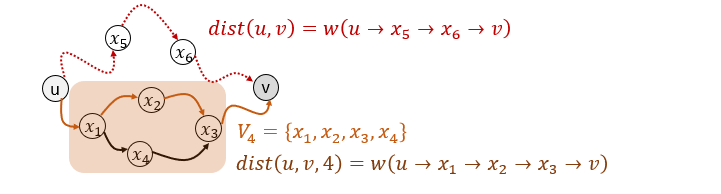
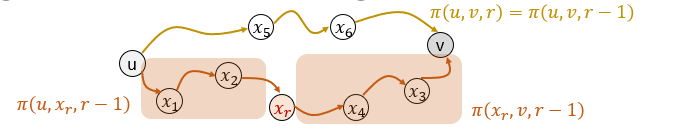
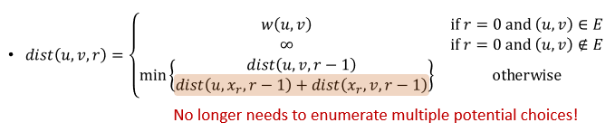
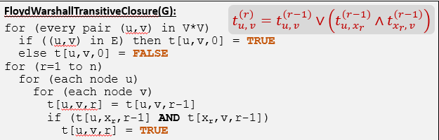

# All-Pairs Shortest Paths Problem
+ 显然，ASAP问题可直接用SSSP方法解决  
  
## APSP from multiple SSSP
+ 从上图可见，Dijkstra算法在ASAP中比Bellman-Ford要快得多。因此可以考虑将图中的边的权重转化为正值，然后使用Dijkstra算法解决ASAP问题


## ASAP via Recursion
### 朴素递归思路
+ 可以使用递归思路来解决该问题，但是环的存在会使递归算法无法终止
+ 可以引入路径长度参数l来解决该问题
+ 递推式为：  
  
+ 实际上我们要计算的是$dist(u, v, n-1)$，因为任何一条最短路径的长度都不会大于n-1
```python
RecursiveAPSP(G):
for every pair (u, v) in V*V
    if u==v then dist[u, v, 0] = 0
    else dist[u ,v, 0] = INF
for (l=1 to n-1)
    for each node u
        for each node v
            dist[u, v, l] = dist[u, v, l-1]
                for each edge (x, v) going to v
                    if dist[u, v, l] > dist[u, x, l-1] + w(x, v)
                        dist[u, v, l] = dist[u, x, l-1]+w(x, v)
```
+ 时间复杂度为$O(n^4)$，并没有改进

#### Inprovement:二分
+ 上述递归算法实际上使用的是1，n-1的分割。可以考虑更快的二分分割
+ 递推式为  
  
```python
FasterRecursiveAPSP(G):
for every pair (u, v) in V*V
    if (u=v) then dist[u, v, 0] = 0
    else dist[u, v, 1] = INF
for (i=1 to Ceil(lg(n)))
    for (each node u)
        for (each node v)
            dist[u,v,i] = INF
            for (each node x)
                if (dist[u,v,i] > dist[u,x,i-1] + dist[x,v,i-1])
                dist[u,v,i] = dist[u,x,i-1] + dist[x,v,i-1]
```
+ 时间复杂度为$O(n^3\lg n)$

### The Floyd-Warshall Algorithm
+ 转换策略，不再使用长度参量l，而是用“可用点集”来解决环带来的问题
+ Strategy：recurse on the set of node the shortest path use
+ 定义$V_r=\{x_1, x_2, ...,x_r\}$
+ 定义dist(u, v, r)是从节点u到节点v的最短路径长度，同时满足路径的中间节点只能出现在结合$V_r$中  
  
+ 【Observation】：令$\pi(u, v, r)$为从u到v的最短路径，那么可分为两种情况考虑，即$\pi(u, v, r)$是否经过$x_r$
  + 如果经过$x_r$：𝜋(𝑢,𝑣,𝑟)=𝜋(𝑢,𝑥_𝑟,𝑟)+𝜋(𝑥_𝑟,𝑣,𝑟)=𝜋(𝑢,𝑥_𝑟,𝑟−1)+𝜋(𝑥_𝑟,𝑣,𝑟−1)
  + 如果不经过$x_r$：𝜋(𝑢,𝑣,𝑟)=𝜋(𝑢,𝑣,𝑟−1)  
    
+ 递推关系如下  
  
+ 由于不需要再对中间节点进行遍历而是直接fix $x_r$，因此算法效率能够大大提高。
```python
FloydWarshallAPSP(G):
for every pair (u, v) in V*V
    if (u, v) in E then dist[u, v, 0] = w(u, v)
    else dist[u, v, o] = INF
for (r=1 to n)
    for each node u
        for each node v
            dist[u, v, r] = dist[u, v, r-1]
            if dist[u, v, r] > dist[u, x_r, r-1] + dist[x_r, v, r-1]
            dist[u, v, r] = dist[u, x_r, r-1] + dist[x_r, v, r-1]
```
+ 时间复杂度为$O(n^3)$

## APSP应用：计算传递闭包
+ 可直接使用Warshall算法，检查每个点对之间的距离是否为INF
+ 尽管无法进一步降低时间开销，但在传递闭包的问题中我们降低空间开销。使用FALSE替代INF，用TRUE替代其他非INF值。这样我们可以使用一个bit来存放点对之间的距离信息。同时，dist的更新公式也简化为位运算  
  