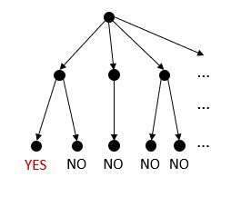
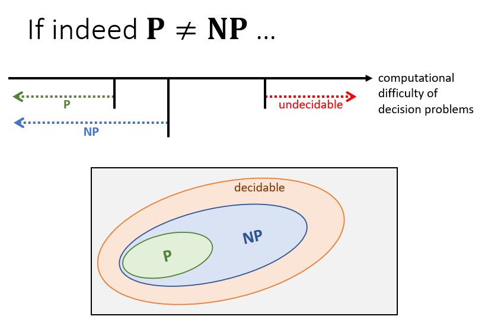

# 图灵机和决策问题
---
## 确定性图灵机
+ 一条无穷长的、被分割为多个单元的纸带
+ 读写头
+ 状态寄存器，用于存储当前图灵机的状态
+ 有限指令表
  + 给定当前状态和当前读入的符号后，能确定新状态

---
## 多项式时间
+ 为什么关注特别多项式时间？
  + 多项式时间往往意味着可能找到高效的解
  + 对合理的计算模型来说，在一个模型上多项式时间可解的问题，在另一个模型上多项式时间内也可解
  + 多项式在加法、乘法和**组合**运算下是封闭的。哪怕是将一个多项式时间算法的输出传送给另一个多项式时间算法作为输入，结果仍然是多项式时间内可解的
+ 编码
  + 在求解某个抽象判定问题时，实际上提供的输入是一个问题实例的二进制编码
+ 当提供给算法的是长度为$n=|i|$的问题实例$i$时，若算法可在$O(T(n))$时间内产生问题的解，则称算法在时间$O(T(n))$内解决了该问题
+ 如果$T(n)=n^k$，则称该具体问题是多项式时间可解的
---

## P
+ 考虑决策问题 $P$，令 $I$为问题 $P$的实例。$|I|$为$I$的规模
+ An algorithm $A$ for $P$ is *polynomial bounded*, if the runtime of $A$ is $|I|^{O(1)}$ for all $I$
+ P is the set of decision problems each of which has a polynomial bounded algorithm
+ P is the set of decision problems each of which can be decided by some TM within polynimial time
+ 也就是P是多项式时间内可解的具体判定问题的集合
+ Attension
  + 不在P中的问题一定是难以解决的
  + P中的问题具有闭包的性质
  + **在判定一个问题是否属于复杂类P时，默认使用二进制编码。**事实上除非是一进制编码，其余进制编码都将得到相同的结果。

### 编码与运行时间的关系
+ 在求解运行时间时，我们希望它与具体的编码形式是无关的，然而事实上为了把具体问题转换为抽象问题我们又不得不这么做
  + 例如以实数k为输入的算法，假设运行时间是线性于k的
    + 若用一串长度为k的1位串表示k，则输入规模$n=k$，运行时间为$O(n)$
    + 若用二进制表示，则$n=[\lg k]+1$，运行时间为$O(k)=(2^n)$，变成了指数时间。
+ 然而在实际运用中，如果不是采取空间代价高昂的编码形式（如一元编码），那么不同的编码方式不会影响到问题能否在多项式时间内求解
---
## 非确定性图灵机 NTM
+ 硬件和确定性图灵机相同
  + 无限长的纸带
  + 读写头
  + 状态寄存器
+ 有限的指令集
  + Given current tate and current read symbol, choose to execute an action among many actions  
    
+ 非确定性图灵机在一个确定的输入上返回yes当且仅当在所有的可能分支中，某一个执行终止于yes
  + 如果所有的执行都没有返回yes，则NTM返回no。
+ 如果对于问题的每个实例$I$，NTM都能在$T(|I|)$步内返回yes或no，则称NTM解决了该问题

## NP
+ **NP** is the set of problems each of which can be decided by some NTM within polynomial time
+ **NP** means "non-deterministic polynomial time"

## 非确定性算法 Non-deterministic Algorithm
+ A ***free, non-deterministic*** "guessing" phase
  + 以k着色问题为例，就是随机在地图块上进行着色
+ A deterministic ***veritication*** phase
  + 验证上述每一种着色方法是否满足要求
+ An output step
```python
NonDetAlg(x):
cer = GenRndCertFree()
flag = Verify(cer, x)
if (flag == 1)
    Output("yes")
```
+ Non-deterministic algorithm 𝒜 for 𝒫 is **polynomially bounded** if: for each **“yes” instance** 𝐼 of 𝒫, 𝒜(𝐼) returns “yes” in (|𝐼|)^𝑂(1)  time.
+ **NP的一个等价定义**：NP is the set of decision problems that have polynomially bounded non-deterministic algorithms.

## NP问题举例：SAT
+ 给定一个布尔表达式$\phi$，求解$\phi$是否可被满足
+ 例如𝜙=(𝑥_1∨𝑥_2 )∧(𝑥_3∨(𝑥_1 ))∧(𝑥_2∨(𝑥_1 )∨(𝑥_2 ))∧(𝑥_4 )
#### SAT$\in$NP证明
+ 若使用NP的第一个定义
  + 类似于决策树的思路，对每个变量分别赋值0或1，构建树形结构即可
  + 对每一个叶子节点，依次验证是否有$\phi=1$，即可得到NTM的输出
+ 若使用第二个定义
  + 使用和第一个方法相同的思路构建树
  + 对于每一个Verify步骤，是可以在多项式时间内完成的

---
## P $\subseteq$ NP
+ 任何确定性图灵机也是非确定性图灵机
+ 任何确定性算法也是非确定性算法
+ 因此P$\subseteq$NP

## P $\not =$ NP ?
+ 直觉上，大多数人认为P$\not =$NP
+ P 代表的是在多项式时间内可以被解决的问题的集合
+ NP 代表的是给定解后，在多项式时间内可以被验证的问题的集合



