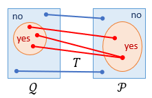
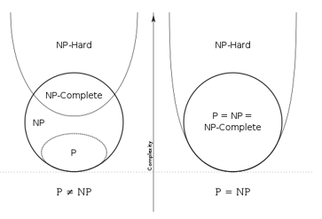
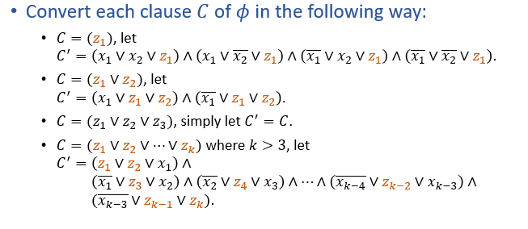
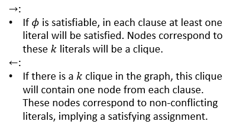
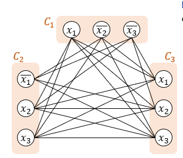

# NP完全问题 NPC
---
## NPC定义
+ 直觉上，NPC是NP问题中最难的一类问题
+ A decision problem $P$ in NPC if
  + The problem $P$ is NP
  + If we have an algorithm for $P$, then all problems in NP can be solved with little extra work

### 规约 Reduction
+ 如果我们已有问题P的高效算法，并且能将Q的instance转化为问题P的instance，那么我们就得到了解决问题Q的一个高效算法
+ 定义T为从Q到P的多项式时间规约(polynomial reduction)，如果T满足
  + 规约过程T可在多项式时间内完成
  + 输入x对于问题Q是“yes” instance**当且仅当**x对于P是“yes” instance
    
+ 如果Q能被多项式归约到P，则 Q$\leq_P$P，问题P至少和问题Q一样难
## * NP-hard定义
+ A decision problem $P$ is NP-hard if
  + for every problem $Q$ in NP, it is polynomially reducible to $P$
+ 也就是NP-hard问题中$P$不一定要属于NP
+ NP $\cap$ NP-hard = NPC
  

---
## 证明NPC
### SAT：the first NPC problem
+ 证明非常复杂，见clrs

### 证明方法
+ 在已知第一个NPC问题后，对于问题$P$，可通过证明
  + $P\subseteq$ NP
  + SAT $\leq_P$ $P$
  + 来证明$P$也是一个NPC问题。
  + 其中，规约只需要给出
    + 转换步骤
    + 真值之间的iff关系

### 3-SAT is NPC
+ given a Boolean formula $\phi$ in CNF in which each clause has exactly three distinct literals, is $\phi$ satisfiable?
#### proof
+ 显然，3-SAT 属于NP
+ 下面将SAT多项式归约到3-SAT
  

### Clique is NPC
+ **Clique**: Given $(G, k)$, does graph $G$ contain clique of size k?
+ clique：完全子图
#### proof
+ 显然Clique问题属于NP
  + 只需要选择出G中的任意k个节点，验证是否为clique即可
+ 下面将3-SAT归约到Clique
  + 转换步骤
    + 令k为3-SAT的一个实例$\phi$的子句个数
    + 对于$\phi$的每一个子句$C_i$，创建三个节点$v_{i1}, v_{i2}, v_{i3}$
    + 如果节点$v_{ij}$和节点$v_{i'j'}$满足：$i\not =j$，并且$v_{ij}$和$v_{i‘j’}$并不是彼此的反变量，则在图G中连接这两个节点
    + 下面是真值之间iff关系的证明
    
    
