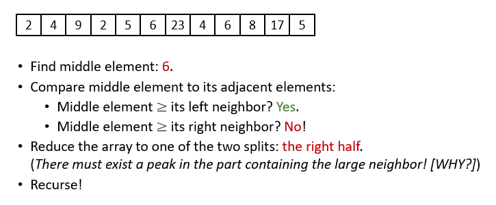
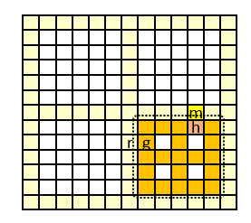
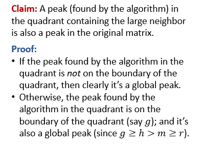

# Reduce and Conquer

## 二分搜索
+ 在有序列表中查询元素
+ 仅需要$O(\log n)$时间

## Peak Finding
+ 输入是一串数字序列，要求输出一个极大值
+ 算法：
  + 随机初始化选择一个元素(通常是中间的元素))
  + 如果该元素同时大于其左右两个元素，则该元素即为极大值。
  + 如果不能同时大于其左右两个元素，选择左右两元素中大的那个元素并对其递归。
  
```
PeakFinding(A):
left = 1, right = n;
while (left<right)
    middle = (left+right)//2
    if (middle>1 and A[middle-1] > A[middle])
        right = middle-1;
    else if (middle < n and A[middle+1]>A[middle])
        left = middle+1;
    else
        return A[middle];
```  
+ 时间开销为$O(\log n)$

## 二维情况下的二分搜索
+ 输入：一个n*n的二维数组
+ 输出：一个极大值（An element is a peak if it is no smaller than its adjacent elements）
+ 算法1：（分割成子矩阵，然后在子矩阵中查找极大元素。子矩阵的极大元素仍然是原矩阵的极大元素，因此做到了Reduce_and_Conquer）
  + 扫描中间一列，找到这一列中的**最大元素**
  + 如果该最大元素是peak，直接返回
  + 如果不是peak，说明其左边或右边的元素有至少一个更大。到更大的那一边的**半个矩阵**中重复1、2步骤。
  + $T(n, n^{\prime})\leq T(n/2, n^{\prime})+O(n^{\prime})$
  + $T(n, n^{\prime})\leq O(n\lg n)$
+ 算法2：（借鉴算法1中的分割思路，为了加快查找，可以在搜索时搜索十字区域内的最大元素，然后递归到某个象限中递归查找。这样问题的规模下降得更快。）
  + 首先扫描当前矩阵的中心十字形和所有边界元素，找出最大值m
  + 如果m是peak，返回
  + 如果m不是peak，找到m周围比m大的元素的那一侧，递归到那个象限中重复上面的步骤。
  + 
  + 
  + $T(n, n)\leq T(n/2, n/2)+\Theta(n)$
  + $T(n,n)=O(n)$

