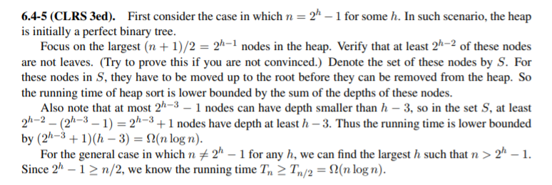

# Heap

## Binary Heap
+ 二叉堆是完全二叉树，每一个节点都代表一个物体。
+ 完全二叉树的每一个节点层都是二叉树，除了最后一层。最后一层不满时尽量填满左侧所有分支。
+ 堆性质：
  + 大底堆：对于堆当中的每一个节点，他的值都大于等于两个子节点的值
  + 小底堆：对于堆当中的每一个节点，他的值都小于等于两个子节点的值
+ 如果某一数据结构是堆，那么可以用数组来模拟。（由完全二叉树来保证）
  + u的父节点：$idx_u/2下取整$
  + u的左子节点、右子节点：$2idx_u,2idx_u+1$
+ 堆操作：
  + 一些私有方法：
  + Left(x):返回x的左子节点的下标值（可能越界）
  + Right(x):返回x的右子节点的下标值（可能越界）
  + HeapInsert:
    + 先把元素放到当前数组的末尾
    + 沿着新插入的元素一直到root的路径，比较相邻元素的大小。如果有违反堆性质的元素对，就把他们互相交换。
    + 复杂度为$O(\lg n)$
  + HeapGetMax: ez,return the root element$O(1)$
  + HeapExtractMax:
    + 返回根节点的内容，并去除
    + 从最后一层选一个数放到根位置
    + 然后从根节点开始，修复堆性质（比较两个子节点的内容和自己的内容，把大的放到父节点上）
  + 额外定义堆操作MaxHeapify:修复当前的堆性质。

## 优先队列 Priority Queue
+ 每次删除删除优先级最大或者是优先级最小的元素。
+ 操作
  + Add(item):HeapInsert(item)
  + Remove():HeapExtractMax()
  + GetMax()
  + UpdatePriority()
+ 优先队列的应用：仿真模拟，规划，在复杂算法中也有应用。

## HeapSort
+ 堆排序，首先建堆，然后每次都在堆中取出最大元素并修复堆的结构，实现对数组元素的排序。为了实现inplace排序，可将每次取出的最大元素放到数组末尾。
+ 建堆方法
  + 自底而上方法：一直将小的堆merge到更大的堆当中。merge过程实际上是将父节点加入进来之后修复堆的过程。
  + 时间复杂度分析：
    + 在高度为h处总共有$\frac h{2^{n+1}}$个节点
    + 每个节点处修复堆的时间复杂度为$O(h)$
    + 总共的时间复杂度为$\sum_{h=0}^{\lg n}O(h)*\frac n{2^{h+1}}=O(n)$
    + 实际上建堆过程只需要$O(n)$复杂度

## 证明：堆排序的时间复杂度为$\Theta(n\lg n)$
+ 上面已经证明堆排序的时间复杂度为$O(n\lg n)$
+ 下面证明堆排序的时间复杂度为$\Omega(n\lg n)$
  + 首先，设堆的深度为$h$
  + 深度**小于**$h-3$的节点至多有$\sum_{i=0}^{h-4}2^i=2^{h-3}-1$
  + 因此，除了这些节点，堆排序的下界可由删除节点时将深度大于等于$h-3$的节点提升并修复堆性质所需要的时间给出。（给出一个硬下界）  
    