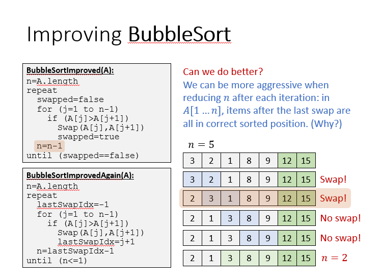
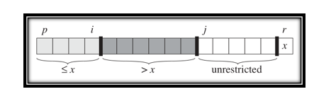
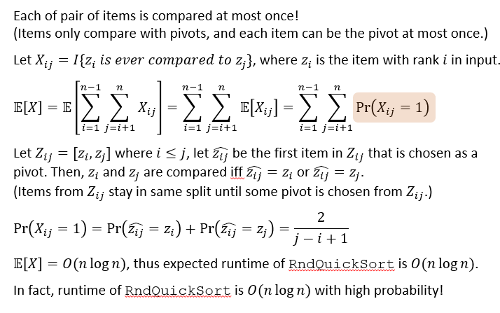

# 对排序算法的一般性分析
+ In-place：如果排序算法是原地的，表明排序只需要$O(1)$的额外空间
+ Stability：如果排序算法是稳定的，表明在原数组中相同的相同的任意两个元素的先后顺序在排序中不被改变。

## Sorting algorithms till now
+ Insertion Sort:
  + $O(n^2)$time, $O(1)$place
  + in-place, stable
+ Merge Sort
  + $O(n\lg n)$time, $O(n)$place(for typical way)
  + not in-place, but stable
+ Heap Sort
  + $O(n\lg n)$time, $O(1)$space
  + in-place, but not stable(相同元素的先后关系信息在建堆的时候丢失了)

# Bubble Sort
+ 基本思想：repeatedly step through the array, compare adjacent pairs and swaps them if they are in the wrong order. Thus, larger elements "bubble" to the “top”.
## 朴素实现
```c++
BubbleSort(A):
for (i=A.length downto 2)
  for (j=1 to i-1)
    if (A[j]>A[j+1])
      Swap(A[j], A[j+1])
```
+ $\Theta(n^2)$time, $O(1)$space, stable and in-place
## 改进
+ 基于以下事实：每次冒泡的迭代过程中，最后一次交换发生的坐标向后的元素一定都已被排列成正确的顺序。  



# Quick Sort
+ 在A中选择一个元素作为pivot
+ 利用pivot把原数组剩下的元素划分为两组B，C，使B中元素小于pivot，C中元素大于pivot
+ 递归
+ 返回\<B,x,C\>

## 选择pivot
+ 理想情况下pivot应该能把数组元素划分为大小大致相等的两组元素

## 划分
+ 用与数组等长的空间，用p_l和p_r分别从左到右和从右到左放数。
  + 开销
  $$T(n)=\Theta(n)$$
  $$S(n)=\Theta(n)$$
+ 改进：inplace partition
  + ```c++
    InplacePartition(A,p,r)
    x = A[r], i=p-1
    for (j=p to r-1)
        if (A[j]<=x)
            i++
            Swap(A[i], A[j])
    Swap(A[i+1], A[r])
    return i+1
    ```
  + 
  + 实际上每次都把较小的元素压到了数组的左边
  + 开销$T(n)=\Theta(|r-p|)$，也就是线性时间。
  + not stable

## 复杂度分析
+ 实际上pivot选择的好坏决定了递归树的高度
+ 最差情况下，$T(n)=max_{0\leq q\leq n-1}(T(q)+T(n-q-1)+cn$
+ 最好情况下，$T(n)\leq 2T(n/2)+\Theta(n)$
  + 只要我们选出的pivot能够将n分成固定常数比例的两部分，也就是$T(n)=T(dn)+T((1-d)n)+\Theta(n) where\ d=\Theta(1)$，就能保证运行时间为$\Theta(n\lg n)$
+ 平均状况下，运行时间为$O(n\lg n)$.这个平均状况和期望时间是不同的概念，因为在这里并没有使用随机算法。
---
# Randomized QuickSort
+ 对于任何一种确定性地选择pivot的算法，都存在一组输入，使得在该输入下每次的partition都是bad partition。因此引入随机化的partition来避免这种情况。
+ ```c++
  RndQuickSort(A, p, r):
  if (p<r)
    i = Random(p<r)
    Swap(A[r], A[i])
    q = InplacePartition(A, p, r)
    RndQuickSort(A, p, q)
    RndQuickSort(A, q+1, r)
  ```
## 最坏情况分析
+ 显然，无论概率多小，仍然存在每次都是最差划分的可能性。因此最坏情况下时间复杂度还是$O(n^2)$
## 期望运行时间
+ 断言：时间长短主要取决于Partition过程，而Partition过程时间开销取决于进行的元素的比较的次数
+ 下面对元素对发生比较的期望次数进行讨论
+ 