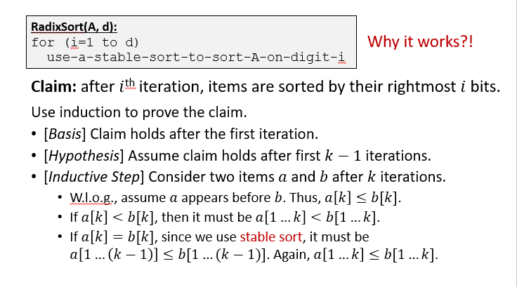
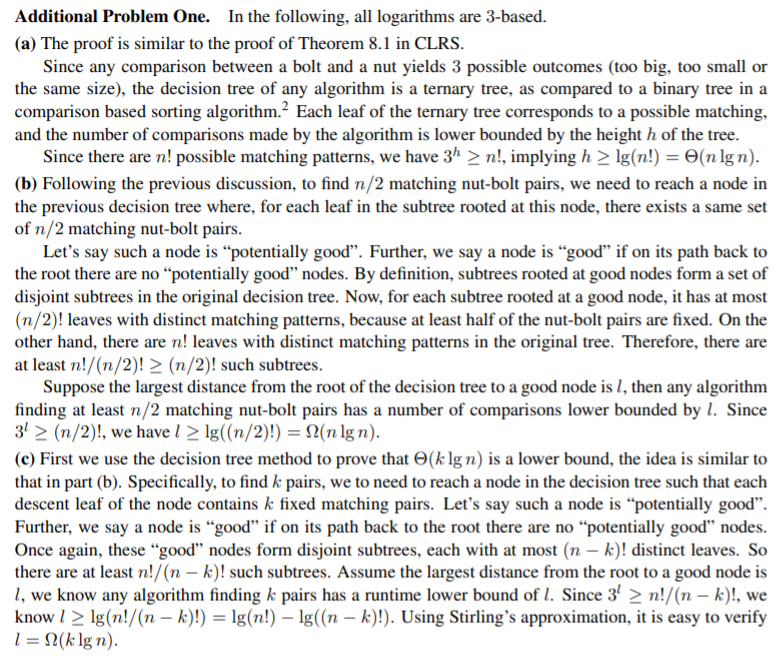
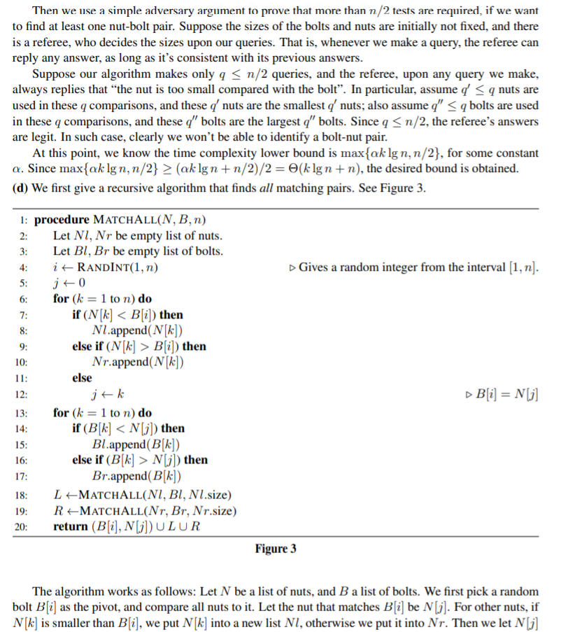
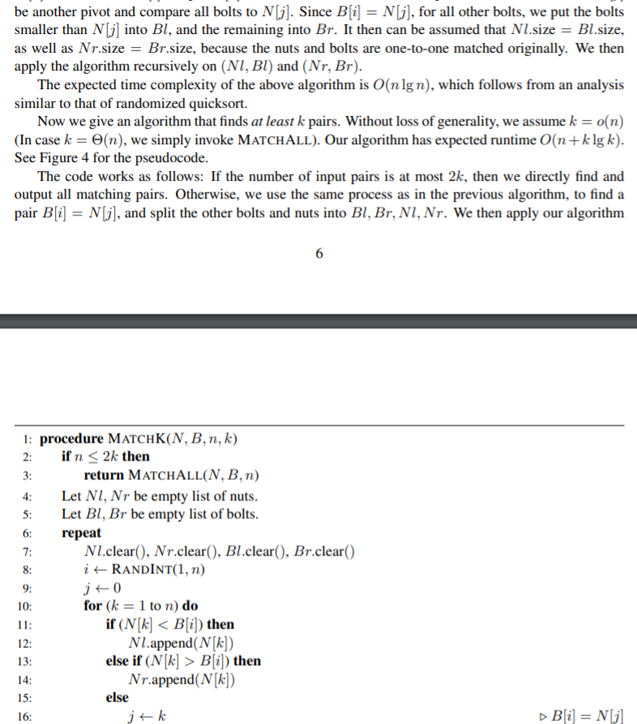
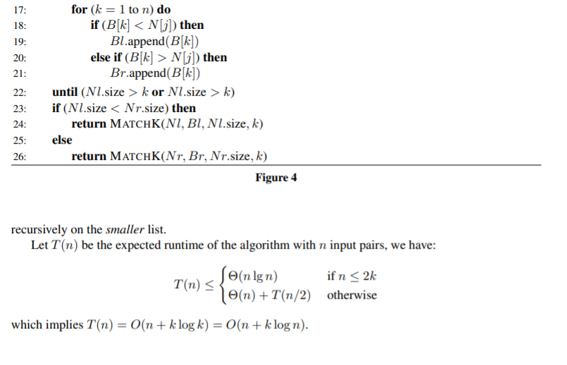

# 算法复杂性分析和不基于比较的排序算法
## 算法复杂性分析
+ 一个算法给出的是解决某个问题的上界
+ 解决问题的复杂性下界由该问题本身去定义
+ 证明算法复杂性的下界往往很难，因为需要证明对于任何算法，其复杂性都大于这个值

## 证明下界的算法
+ The Adversary Argument对手论证
  + 假想一个对手，能够对任何一种算法的query进行应答。然后证明，如果任何一种算法没有能问够一定数量的query，我们总能够构造出两种不同输出，这两种不同的输出在以上query中作出的应答总是相同的。
  + 进一步思考我认为，对手论证的关键点并不是怎样去设计应答策略，因为每一种算法的query可能都不尽相同。对手应当设计的是一些输入的情况，这些输入情况在可能的query中做出的应答完全相同。而对手只需要根据输入情况如实回答就行了。
+ 决策树算法。每一次query都相当于进行一次决策，而决策树的最小高度，即作出觉得所需要的最小步骤，就是最低复杂度

## 基于比较的排序算法
$任何基于比较的排序算法，其最坏情况下的复杂度均为\Omega (n\lg n)$  
下面使用决策树方法证明：  
+ 不失一般性，假设所有的输入元素都不相同
+ 假设算法仅使用小于等于号来进行比较
+ 显然，决策树的叶节点总数至少有$n!$（即所有元素的全排列）个
+ 因此，至少需要$\Omega(\lg n!)=\Omega(n\lg n)$

## 不基于比较的排序算法
### 桶排序
+ 并不是基于比较的排序，而是利用这些数本来的性质、值来操作
+ 如果原数组的规模为$n$，桶的数量为$d$，那么时间复杂度大致为$\Theta(n+d)$
#### 对桶排序的进一步讨论
+ 在这种情况下，$T(n)=\Theta(n)+\sum_{i=1}^{n}O(n_i^2)$，其中$n_i$为第$i$个桶内的元素数量。
+ 则$E(T(n))=\Theta(n)+\sum_{i=1}^{n}O(E(n_i^2))$
+ 定义指示器变量$X_{ij}$为原数组中第$j$个元素被插入到第$i$个桶内。
+ $E(n_i^2)=E((\sum_{j=1}^{n}X_{ij})^2)=E(\sum_{j=1}^nX_{ij}^2+\sum_{j=1}^n\sum_{k=1}^nX_{ij}X_{ik})=n\cdot \frac 1n+n(n-1)\frac 1{n^2}=2-\frac 1n$
+ 上式的推到中使用到了$k\not =j$和变量$X_{ij},X_{ik}$相互独立以及元素落入所有桶的概率相同等前提条件
+ 因此，$E(T(n))=\Theta(n)$
+ 事实上，即使每个元素落入桶内的概率并不是等可能的，我们也可以使用以上结果，只要**所有桶的大小的平方和与总的元素数量呈线性关系**。因为$cn*(2-\frac 1n)=O(n)$.
  
### 基数排序
+ 直观上排序确定位的数时可以从最高位开始进行递归的桶排序，但是基数排序是从最低位开始的
+ 从最低位开始，用稳定排序对数组的每一位数进行排序。
+ 

> **一道例题：**  
> We are given n bolts and n nuts of different sizes, where each bolt t exactly matches one nut. Our goal is to find the matching nut for each bolt. The nuts and bolts are too similar to compare directly; however, we can test whether any nut is too big, too small, or the same size as any bolt.  
> (a) Prove that in the worst case, Ω(n log n) nut-bolt tests are required to correctly match up the nuts
and bolts.  
> (b) Now suppose we would be happy to find most of the matching pairs. Prove that in the worst case, Ω(n log n) nut-bolt tests are required to find n/2 arbitrary matching nut-bolt pairs.  
> (c) Prove that in the worst case, Ω(n+k log n) nut-bolt tests are required to find k arbitrary matching
pairs.  
> (d) Describe a randomized algorithm that finds k matching nut-bolt pairs in O(n+k log n) expected time. You should also briefly argue your algorithm indeed has the desired expected runtime.

> > Solution:
> >
> >
> >
> >
> >**第2和第3问中通过计算子树的叶节点总数来计算符合某一条件的内节点数量的想法很有启发性。**
