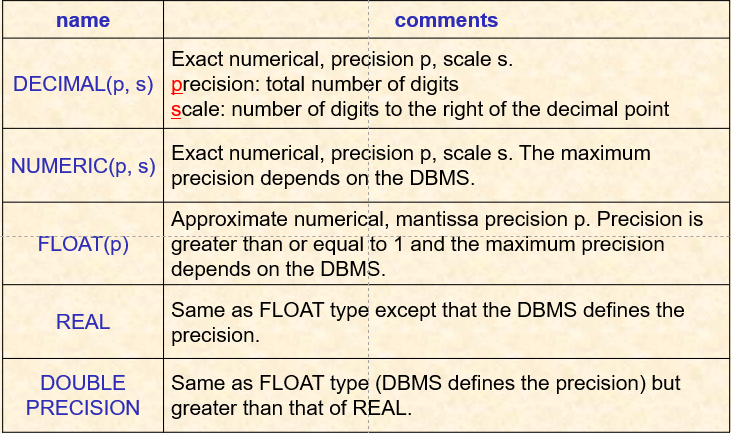
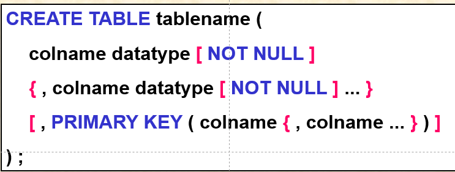
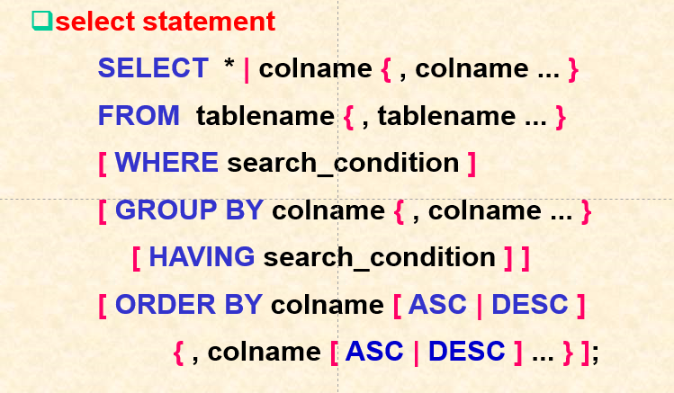
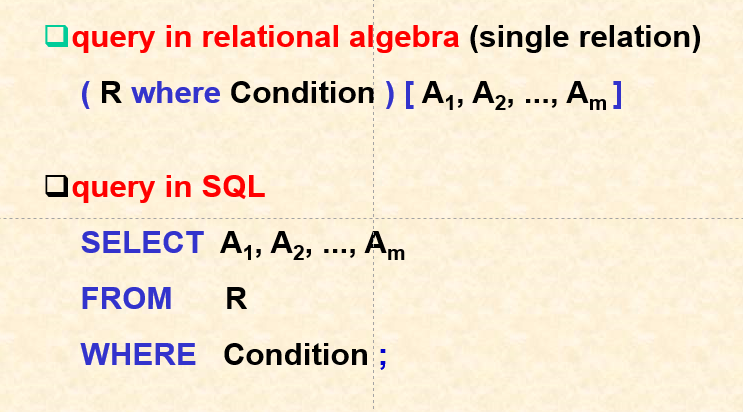
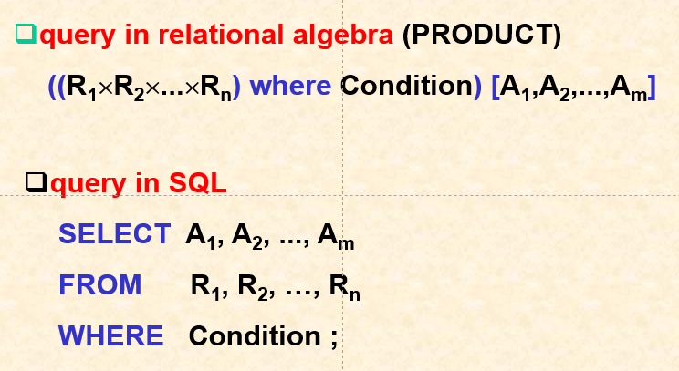
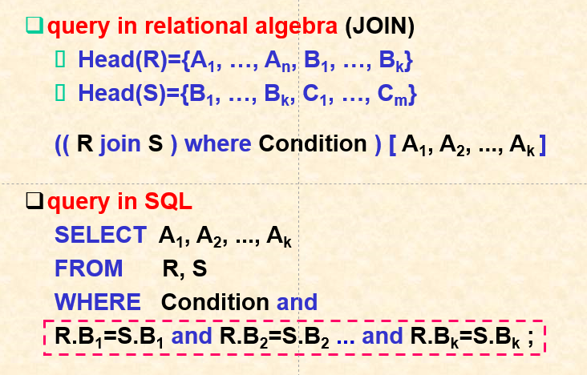

# SQL语句
## 数据类型
+ CHARACTER(n)/CHAR(n)定长字符串
+ CHARACTER VARYING(n)/CHAR VARYING(n)变长
+ INTEGER
+ SMALLINT
+ BIGINT  

## 格式
+ 创建表  
  
  + { }、[ ]内均为可选。也就是说，可以选择是否指定主关键字，可以使用NOT NULL指定每一个条目的这个属性能否为非空。 
  + > ex:
+ 选择语句  
  
  + 与关系代数的对应关系见后文

  
## 选择语句与关系代数的简单对应关系
+ 简单关系  
  
+ 笛卡尔乘积  
  
+ JOIN运算：查询条件必须显式地写在where语句中  
  
+ 

## 查询谓词
### IN、NOT IN
### The Qualified Conparison Predicate
### The EXISTS Predicate
### The Between Predicate
### The IS NULL Predicate
### The LIKE Predicate
