# SQL语句
---
## 数据类型
#### 数值类型
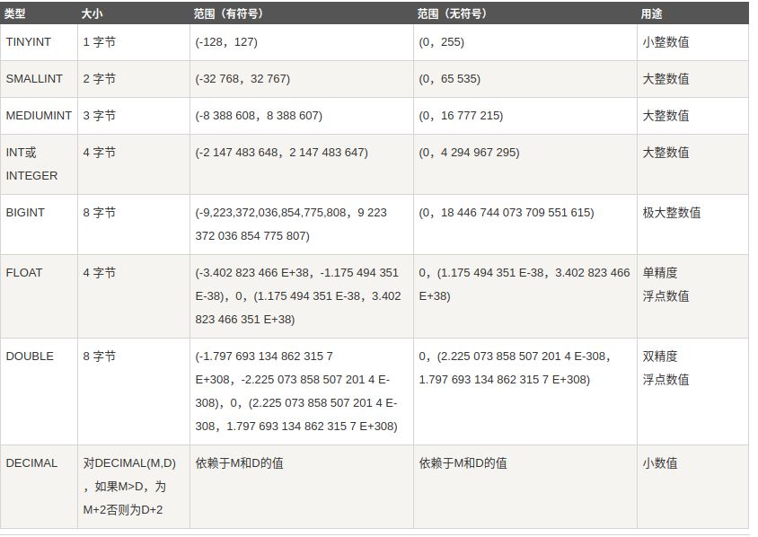
+ 其中DECIMAL、NUMERIC、FLOAT等可通过(precision, scale)的形式指定精度和数据规模
#### 日期和时间类型
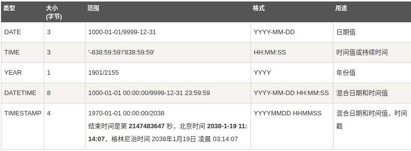
#### 字符串类型
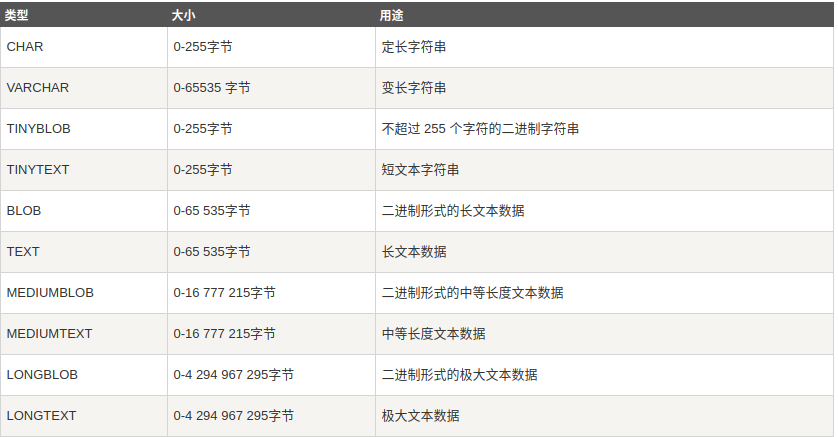


---
## 创建数据表
```sql
CREATE TABLE <table_name> (
    <col_name> <datatype> [<specifiers>], 
    <col_name> <datatype> [<specifiers>],
    ...
    [PRIMARY KEY(<col_name1>, <col_name2>,...)]
);
```
+ 在Mysql语句中，当需要创建、使用表名、列名时既可以加双引号也可以不加
+ specifiers是数据表中每个列的修饰符，可以有
  + NOT NULL:表示该字段的数据必须为非NULL
  + AUTO_INCREMENT:表示该字段为递增属性，数值会自动加1
+ 例子：
  + 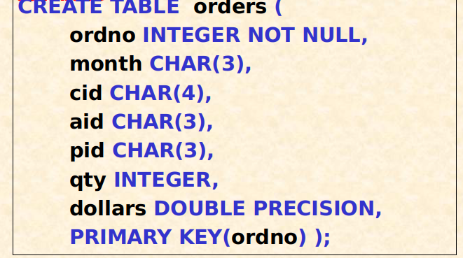


---
## 删除数据表
```sql
DROP TABLE <table_name>;
```


---
## 插入数据
```sql
INSERT INTO <table_name> (<col_name1>, <col_name2>,..., <col_namen>)
VALUES (...);
```
```sql
INSERT INTO <table_name>
  SELECT *
  FROM <table_name>
  WHERE <Condition>;          # 插入子查询的结果
```


---
## 更新数据
```sql
UPDATE <table_name>
SET ...
WHERE <Condition>;
```

---
## 删除数据
```sql
DELETE FROM <table_name>
WHERE Condition
```


---
## 查询数据
### Query
```sql
SELECT A1, A2, ..., Am
FROM R1, R2, ..., Rn
WHERE Condition
```
+ 对应于关系代数中的$((R_1\times R_2...\times R_n)where\;Condition)[A_1, A_2, ..., A_m]$

```sql
SELECT A1, A2, ..., Am
FROM R1, R2, ..., Rn
WHERE Condition and
R.B1=S.B1 and R.B2=S.B2 ... and R.Bk=S.Bk;
```
+ 对应于关系代数中的联结操作

#### SELECT语句
```sql
SELECT [DISTINCT] column_name_list [AS alias_name] | expressions | *     #SELECT子句，也是目标子句；AS子句，用于重命名
FROM table_name_list [AS alias_name]    #FROM子句
```
+ SELECT子句
  + 用于生成投影关系
  + 可用DISTINCT谓词进行结果的唯一性检查
+ FROM子句
  + 范围子句，定义本次查询可以访问的关系表
  + FROM和SELECT子句中的东西不能发生重名现象
+ AS子句
  + ```sql
    table_name | (subquery) [AS corr_name[(colname, ...)]]
    ```
  + 用于定义table_ref，不仅可以重命名表，也可以创建一个指向子查询的ref，同时可以重命名表内的属性名。
  + 一方面，当表名、属性名发生冲突时，使用AS子句解决冲突
  + 另一方面，适当地使用AS子句也可简化expressions和表名
  + AS子句也可省略AS，用空格连接原名和别名

### SubQuery
+ 子查询的结果可以通过聚合函数或操作符被应用到上层查询中
+ 子查询的形式可以是一个SELECT的结果，也可以是一个集合。
#### SQL中与子查询有关的谓词
+ IN
  + ```sql
    expr IN (subquery)
    ```

  + ```sql
    expr NOT IN (subquery)
    ```
  + 一个标量值是否属于一个向量值的比较
  + 可用于优化查询，例如下图  
  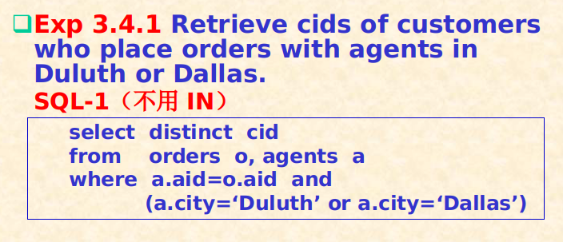
  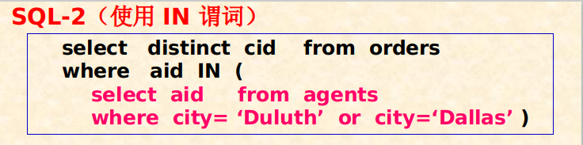
+ 量词
  + ```sql
    expr = | <> | < | <= | > | >= SOME (subquery)
    expr = | <> | < | <= | > | >= ANY (subquery)
    expr = | <> | < | <= | > | >= ALL (subquery)
    ```

  + 某些量词和运算符的组合等价于IN和NOT IN
    + IN == =SOME
    + NOT IN == <>ALL
  + 量词可以轻松实现最值的查询，而不再需要使用关系代数中的二次查询结构
    + 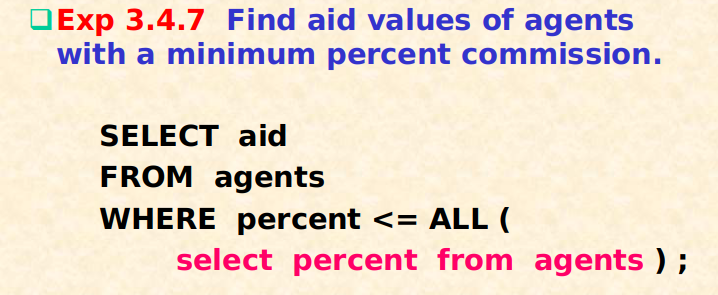
+ EXISTS
  + ```sql
    EXISTS(subquery)
    NOT EXISTS (subquery)
    ```
  + EXISTS子句为真的充要条件为子查询返回一个非空的集合
  + **一个事实：由于EXISTS没有前件，因此EXISTS子句中必含有外层变量，这样才能将子查询和母查询产生关联（否则子查询为固定的情况）。因此设计EXISTS的子查询必为相关子查询。**
  + NOT EXISTS可以被用来实现差集操作
    + 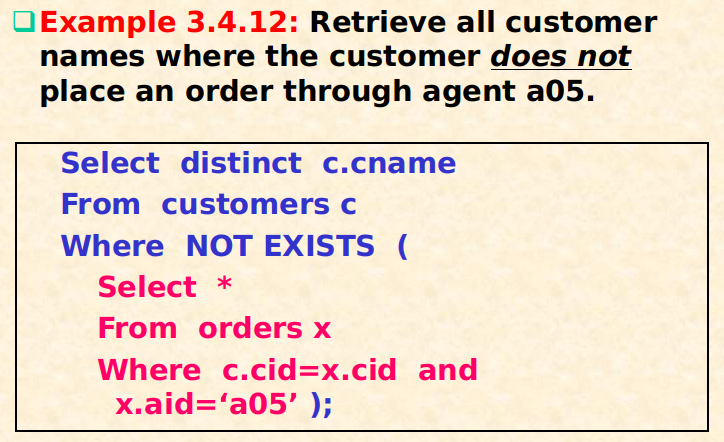
    + 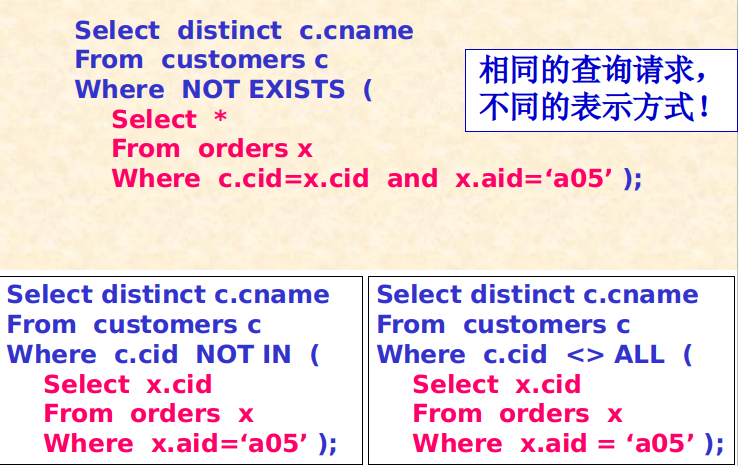
+ BETWEEN
  + 判断是否处于两个数值之间
+ IS [NOT] NULL
  + 判断是否为NULL值
+ LIKE
  + ```sql
    SELECT col_name
    FROM table_name
    WHERE col_name LIKE '<pattern>';
    ```
  + 类似正则表达式的匹配机制
  + 元字符
    + _: 匹配所有单个字符
    + %: 匹配任何长度为0或者更多的字符序列
    + ESCAPE: 指明上面的pattern中的转义字符
  + 几个例子
    + 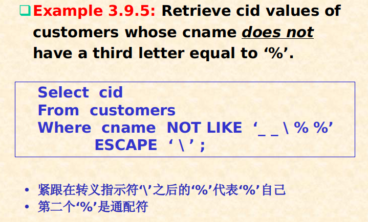

#### subquery之间的操作
+ UNION [ALL]
  + ```sql
    subquery UNION subquery
    subquery UNION ALL subquery
    ```
  + 二者区别在于取并集后是否保留重复的元组。UNION没有重复的元组，而UNION ALL有。
+ INTERSECT [ALL]
  + 可被IN、EXISTS替代
+ EXCEPT [ALL]
  + 可被NOT IN、NOT EXISTS替代
+ MINUS [ALL]
  + 可被NOT IN、NOT EXISTS替代
+ 上述子查询之间的操作要求结果关系的关系模式都是相容的(compatible)
+ ***同时，在使用INTERSECT和EXCEPT、MINUS运算时所得的结果列中必须含有关键字。思考：之前使用NOT IN操作的时候，我们将想要的结果（比如cname）作为目标列放在SELECT子句中，而使用主关键字属性（cid）在WHERE子句中和其他表进行联结，因此不会出现上述问题。***

#### 除法操作(FOR ALL Cond.)
考虑如下除法问题
> Find cids of customers who place orders with ALL agents based in New York. 
 
问题等价于
```
if row c in customers table is a customer of result set, then  
    for each row a in agents table which is based in New York  
        we can find a row o in orders table which: o.cid = c.cid  and  o.aid = a.aid
```
等价于
```
if row c in customers table is a customer of result set, then
    no row(a) in agents table which is based in New York s.t.
        no row(o) in orders table satisfies o.cid = c.cid  and  o.aid = a.aid
```
令
```sql
cond1:  NOT EXISTS ( SELECT * 
        FROM orders o
		WHERE o.cid=c.cid AND o.aid=a.aid );
cond2:  NOT EXISTS ( SELECT * 
        FROM agents a
		WHERE city = ‘New York’ AND cond1 );
```
cond1对应于上方等价问题的第三行条件，而cond2对应于第二行条件。最终，问题划归为
```sql
SELECT  c.cid 
FROM     customers  c
WHERE  cond2;
```
**除法操作均可以使用两层NOT EXISTS来实现。**  
**除法操作本质上是FOR ALL枚举的过程，因此可以使用否定的方法把FOR ALL转化为NOT EXISTS逻辑**

#### 独立子查询与相关子查询
+ 独立子查询指不需要使用外部查询的输入数据，相关子查询指需要外部数据
+ 作用域法则（Scoping Rule）：外部查询的变量可在子查询中使用，反之不可

#### 总结
|关系代数中的功能|sql谓词|
|:---:|:---:|
|自然联结|IN、=SOME、EXISTS|
|差集|NOT IN、<>ALL、NOT EXISTS|
|除法|NOT EXISTS|

### JOIN联结操作
+ 之前提到的联结操作均使用笛卡尔乘积+WHERE制定条件实现，事实上也可以使用JOIN-ON和JOIN-USING更加直观
+ 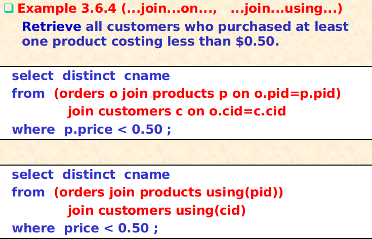

### 例子
+ 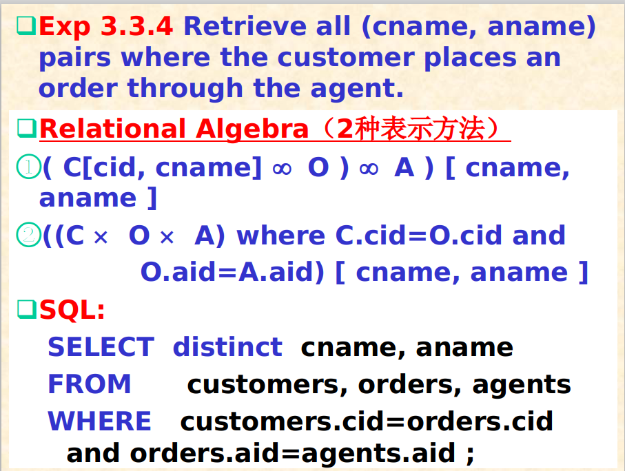
+ 
  + 注意AS子句和expression的使用
+ 
  + 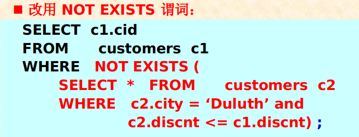
  + 也就是最值问题必须要使用子查询
  + 除此以外，差集问题也必须要使用子查询
+ 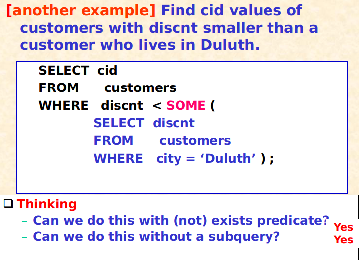
  + 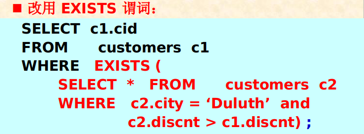
  + 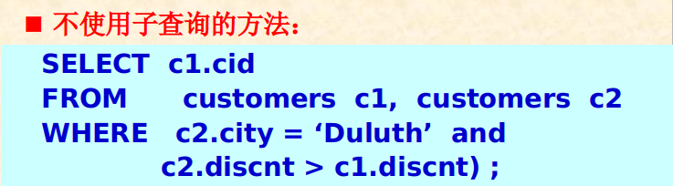
+ 


---
## 统计函数, GROUP BY子句和ORDER BY子句
#### 统计函数
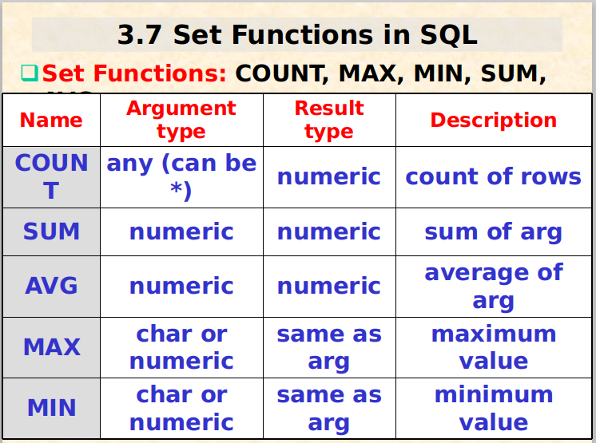
+ 在sql查询命令中，只允许在两个子句中使用统计函数
  + SELECT子句
  + HAVING子句
  + 因此以下统计函数的使用形式是不合法的  
    ```sql
    SELECT cid
    FROM customers
    WHERE discnt < max(discnt);
    ```
    正确使用形式为  
    ```sql
    SELECT cid
    FROM customers
    WHERE discnt < ALL(
      SELECT max(c2.discnt)
      FROM customers c2
    );
    ```

#### GROUP BY子句
```sql
SELECT <col_name>, ..., <statistic_quantity> | <col_name_n>
FROM <table_name>
GROUP BY <col_name>
HAVING <other_col_name> | <statistic_quantity> satisfy Condition
```
which actually equals to 
```sql
for each distinct value V of pid in orders:
    select pid, sum(qty)
    from orders
    where pid=V
end for
```
+ 带GROUP BY子句的分组统计查询执行过程
  + 先执行WHERE进行条件查询，得到满足WHERE条件的结果元组结合S
  + 根据各个元组在分组属性上的取值，将集合S划分为若干个子集：S1, S2, ..., Sk
  + 对每一个子集Si
    + 使用HAVING子句中的统计函数，对子集Si中的元组进行统计计算
    + 如果统计结果能使得HAVING成立，则按照SELECT子句中的要求进行统计计算，每个子集都将统计生成一条结果元组

#### ORDER BY子句
```sql
SELECT <col_name>
FROM <table_name>
WHERE Condition
ORDER BY <col_name> ASC | DESC;
```


