# 数据库设计
+ 分析需求实体
+ 列出所有数据库中需要存储的数据项
+ 设计如何存储这些数据。

## 一般朴素设计可能导致的问题
一般朴素设计就是指把所有的属性放在一张表中。问题在于如果属性的值之间的映射并不是一一映射的，那么表内就会有大量的冗余信息  
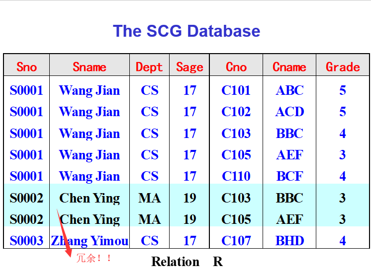
+ Problems
  + redundency数据冗余
  + abnormality of update修改异常
  + abnormality of delete删除异常
  + abnormality of insert插入异常  
  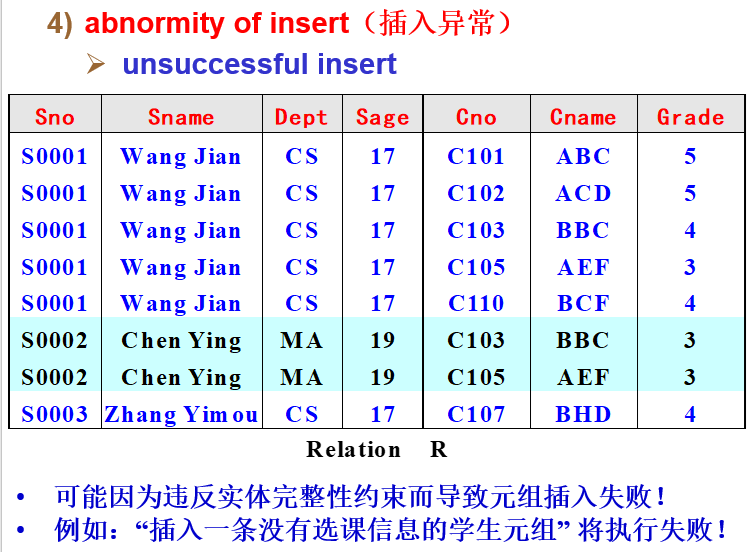

## 两条建模思路
1. 数据项 -> E-R model（概念数据模型） -> 数据表 -> logical design of a RDB
2. 数据项 -> 经过正则化，得到logical design of a relational database
---
## Intro to E-R Concept
### Entity（实体）
+ （Entity）实体指的是一系列相互可以区分、拥有相同属性的真实世界的物体集合
+ （Entity Instance）指的是实体的一个实例
### Attribute（属性）
+ 属性用于描述实体的某一个方面
+ 分类
  + 第一种分类方法：根据属性性质
    + identifier：可以用于区分不同实体的属性
    + descriptor：其余的属性。用于描述
  + 第二种分类方法：根据属性取值
    + single-valued attribute：单值属性
    + composite attribute：取值是一个元组
    + multi-valued attribute：取值可以是一个集合

### Relationship（联系）
+ 联系指明了一组实体之间的特定的相互关系，实际上是一组实体的笛卡尔乘积(E1,E2,E3,...,Em)。
+ **联系本质上也是一个表头，联系也有属性**
+ 联系的度：Relation所相关联的实体数量
  + binary relationship：二元联系
  + ring/recursive relationship：将一个实体与该实体自己联系起来的联系
  + N-ary relationship：联系多于两个实体的联系
+ 联系通常在图中使用菱形进行标注。同时为了提高可读性，尽量在链接实体的线段上加上文字进行解释说明。  
  
+ 联系属性的增加  
  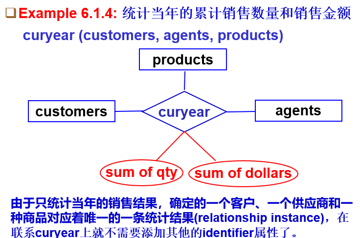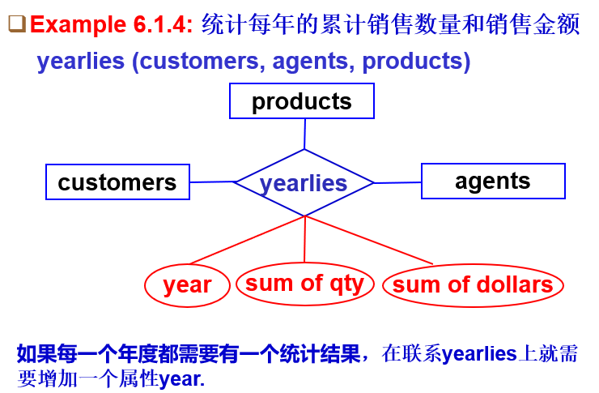

### 联系与实体参与度度量
#### card
+ max-card(E, R)：在联系R下E的像的最大个数
  + max-card(E, R)=1：E最多只有一个像
  + max-card(E, R)=N：E最多可以有多个像
+ min-card(E, R)：在联系R下E的像的最小个数
  + min-card(E, R)=1：E至少有一个向
  + min-card(E, R)=0：E可能没有像
+ Card(E, R)：Card(E, R)=(min-card(E, R), max-card(E, R))  
  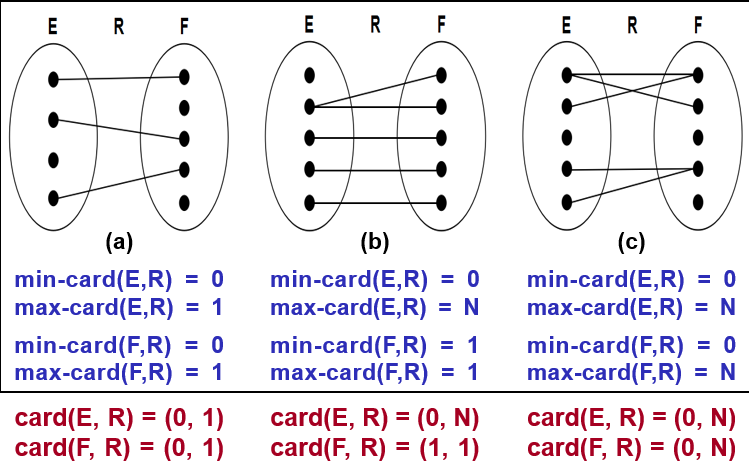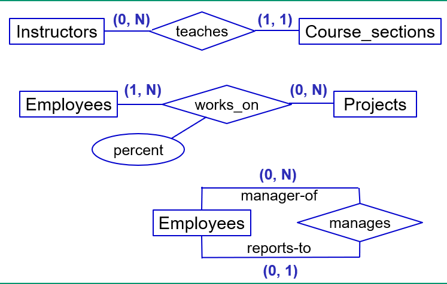
+ 若max-card(E, R) = 1，则E在R上为单值(single-valued)参与；若max-card(E, R) = N，则E在R上为多值(multi-valued)参与
+ 若min-card(E, R) = 1，则E在R上为强制(mandatory)参与；若min-card(E, R) = 0，则E在R上为可选(optional)参与

#### relation分类
+ 设联系R沟通实体E和R
+ One-to-One:max-card(E, R)=max-card(F, R)=1
+ Many-to-One:max-card(E, R)=1, max-card(F, R)=N
+ Many-to-Many:max-card(E, R)=max-card(F, R)=N

### E-R方法构建数据表时的映射规则
+ 规则一：实体被映射到一张表  
  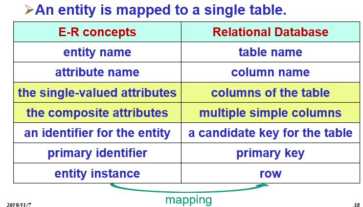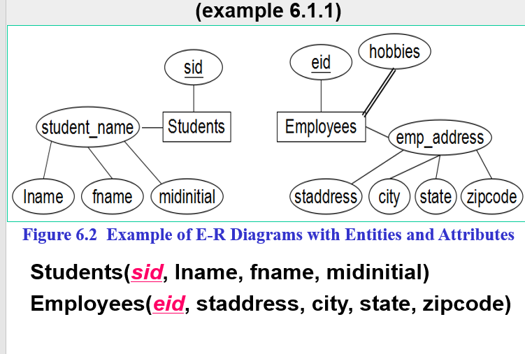
+ 规则二：每一个多值属性都要被映射到一个新表  
  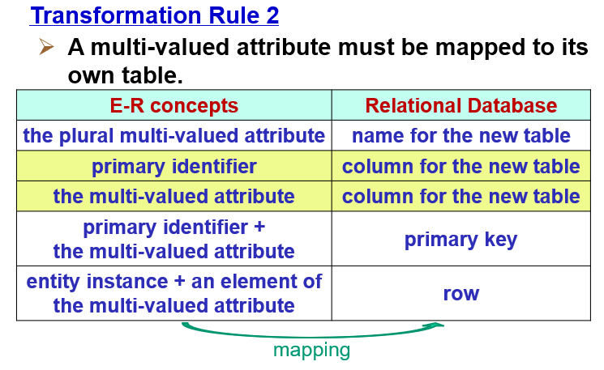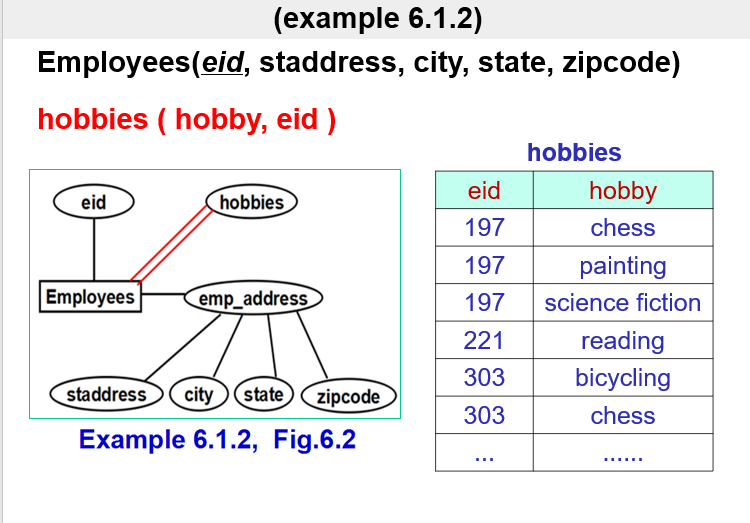
+ 规则三：若关系为Many-to-Many  
  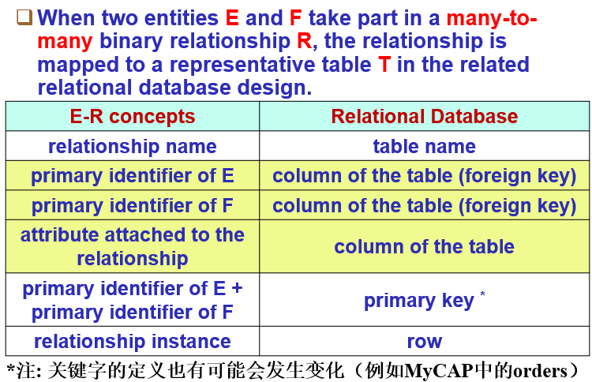
+ 规则四：若关系为Many-to-One  
  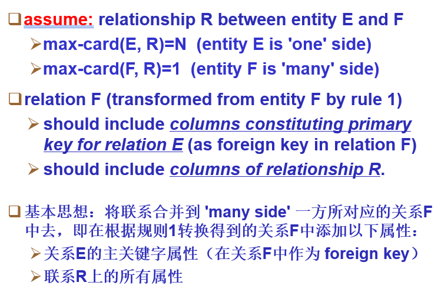
+ 规则五：若关系为One-to-One  
  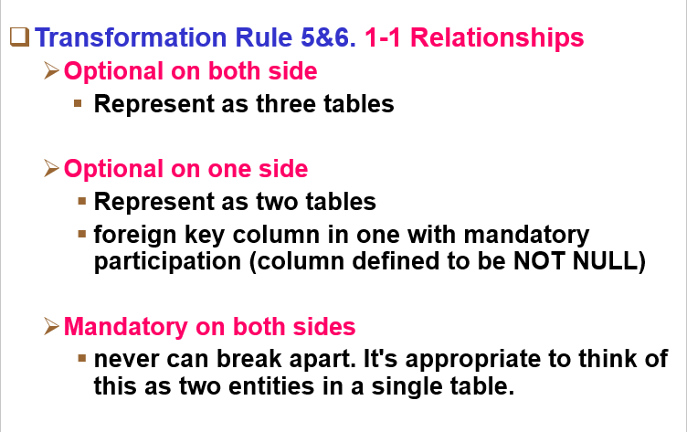
+ **对于规则三四五，通常情况下生成的新表的关键字都需要重新考虑。这一部分将在后续的规范化设计部分中设计，在此不作讨论。**
