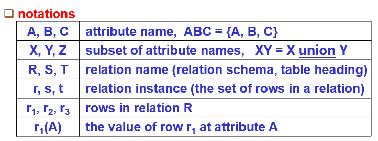
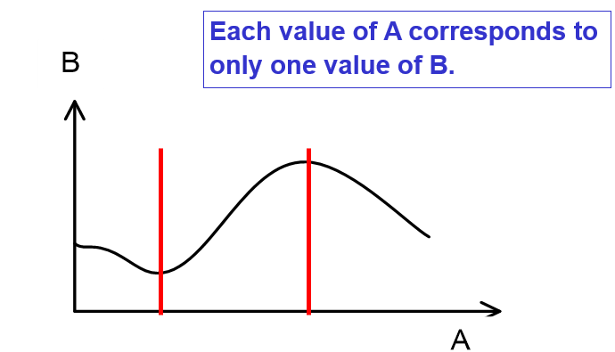
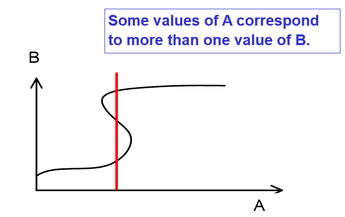
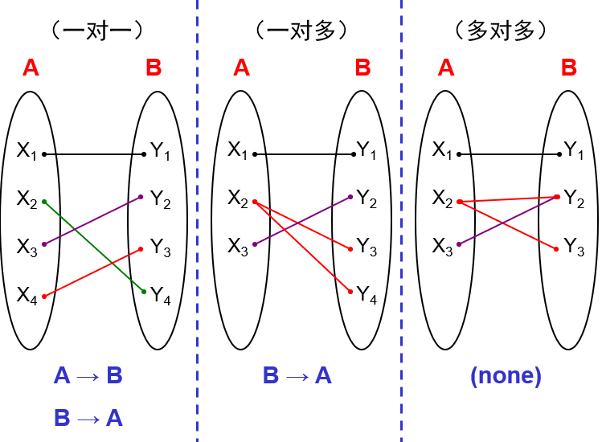
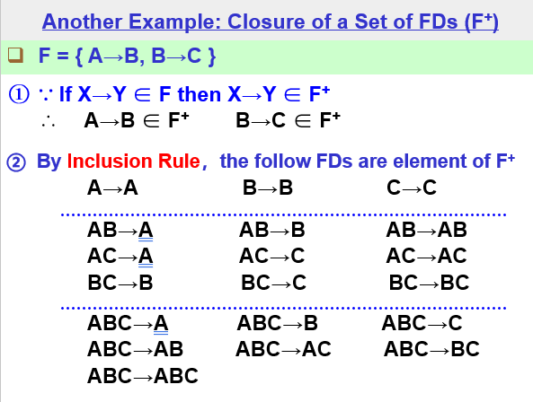
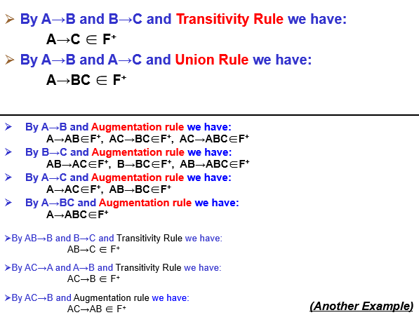
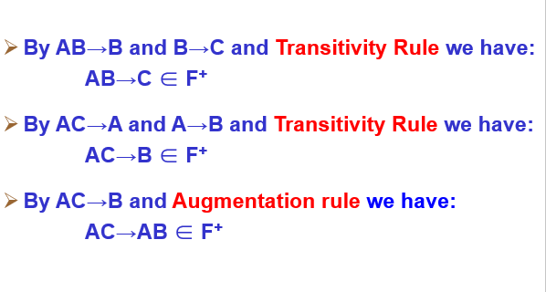
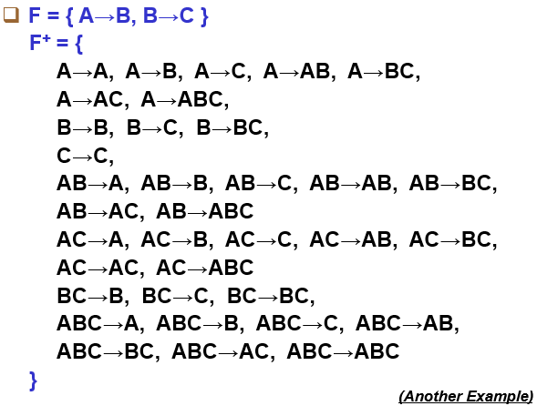
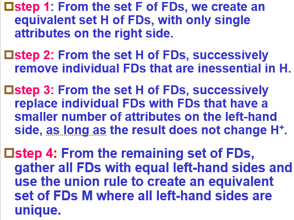

# 数据库设计
+ 分析需求实体
+ 列出所有数据库中需要存储的数据项
+ 设计如何存储这些数据。

## 一般朴素设计可能导致的问题
一般朴素设计就是指把所有的属性放在一张表中。问题在于如果属性的值之间的映射并不是一一映射的，那么表内就会有大量的冗余信息  

+ Problems
  + redundency数据冗余
  + abnormality of update修改异常
  + abnormality of delete删除异常
  + abnormality of insert插入异常  
  

## 两条建模思路
1. 数据项 -> E-R model（概念数据模型） -> 数据表 -> logical design of a RDB
2. 数据项 -> 经过正则化，得到logical design of a relational database
---
## Intro to E-R Concept
### Entity（实体）
+ （Entity）实体指的是一系列相互可以区分、拥有相同属性的真实世界的物体集合
+ （Entity Instance）指的是实体的一个实例
### Attribute（属性）
+ 属性用于描述实体的某一个方面
+ 分类
  + 第一种分类方法：根据属性性质
    + identifier：可以用于区分不同实体的属性
    + descriptor：其余的属性。用于描述
  + 第二种分类方法：根据属性取值
    + single-valued attribute：单值属性
    + composite attribute：取值是一个元组
    + multi-valued attribute：取值可以是一个集合

### Relationship（联系）
+ 联系指明了一组实体之间的特定的相互关系，实际上是一组实体的笛卡尔乘积(E1,E2,E3,...,Em)。
+ **联系本质上也是一个表头，联系也有属性**
+ 联系的度：Relation所相关联的实体数量
  + binary relationship：二元联系
  + ring/recursive relationship：将一个实体与该实体自己联系起来的联系
  + N-ary relationship：联系多于两个实体的联系
+ 联系通常在图中使用菱形进行标注。同时为了提高可读性，尽量在链接实体的线段上加上文字进行解释说明。  
  
+ 联系属性的增加  
  

### 联系与实体参与度度量
#### card
+ max-card(E, R)：在联系R下E的像的最大个数
  + max-card(E, R)=1：E最多只有一个像
  + max-card(E, R)=N：E最多可以有多个像
+ min-card(E, R)：在联系R下E的像的最小个数
  + min-card(E, R)=1：E至少有一个向
  + min-card(E, R)=0：E可能没有像
+ Card(E, R)：Card(E, R)=(min-card(E, R), max-card(E, R))  
  
+ 若max-card(E, R) = 1，则E在R上为单值(single-valued)参与；若max-card(E, R) = N，则E在R上为多值(multi-valued)参与
+ 若min-card(E, R) = 1，则E在R上为强制(mandatory)参与；若min-card(E, R) = 0，则E在R上为可选(optional)参与

#### relation分类
+ 设联系R沟通实体E和R
+ One-to-One:max-card(E, R)=max-card(F, R)=1
+ Many-to-One:max-card(E, R)=1, max-card(F, R)=N
+ Many-to-Many:max-card(E, R)=max-card(F, R)=N

### E-R方法构建数据表时的映射规则
+ 规则一：实体被映射到一张表  
  
+ 规则二：每一个多值属性都要被映射到一个新表  
  
+ 规则三：若关系为Many-to-Many  
  
+ 规则四：若关系为Many-to-One  
  
+ 规则五：若关系为One-to-One  
  
+ **对于规则三四五，通常情况下生成的新表的关键字都需要重新考虑。这一部分将在后续的规范化设计部分中设计，在此不作讨论。**

---
## Normalization(规范化理论)
+ 更多的时候我们对数据的建模采取以下策略
  + 获取数据
  + 初步进行E-R建模，得到关系表
  + 结果规范化，最终得到logical design of RDB
+ 规范化设计的目标
  + 在一个关系中，属性和属性之间需要满足一定约束。这样的约束条件被称作Normal Form
  + 通常由四个级别的NF：1NF, 2NF, 3NF, BCNF
  + 通常我们需要满足3NF的要求
+ 后文中的符号约定
  + 

### 函数依赖
#### 定义
+ A$\rightarrow$B $\Leftrightarrow$ For any rows r1 and r2 in any instance of relation T, if r1(A) = r2(A) then r1(B) = r2(B)
+ 表示B函数依赖于A或A函数决定B
+ A和B是两个属性集合且来自于同一个关系
+ 函数依赖实际上来自于对现实世界中数据约束的抽象,因此函数依赖关系属于语义范畴，需要在建立数据表之间就对函数依赖加以考虑
+ 一组图示，从函数对应的观点理解AB的依赖关系
  + 
  +   
    **注：在这种情况下B可能函数决定A！**
+ 从E-R模型中的对应性理解函数依赖
  

    
### Armstrong's Axioms(Armstrong公理)
+ 由已知的一些函数依赖，可以推导出另外一些函数依赖。这就需要定义一些推导规则。
+ **【Rule1 自反规则】：If Y$\subset$X，then  X$\rightarrow$Y**
+ **【Rule2 传递规则】：If X$\rightarrow$Y and Y$\rightarrow$Z, then X$\rightarrow$Z**
+ **【Rule3 增广规则】：If X$\rightarrow$Y, then XZ$\rightarrow$YZ**
+ **【Rule4 合并规则】：If X$\rightarrow$Y and X$\rightarrow$Z, then X$\rightarrow$YZ**
+ **【Rule5 分解规则】：If X$\rightarrow$YZ,then X$\rightarrow$Y and X$\rightarrow$Z**
+ **【Rule6 伪传递规则】：If X$\rightarrow$Y, and WY$\rightarrow$Z, then XW$\rightarrow$Z**
+ **【Rule7 聚积规则】：If X$\rightarrow$YZ and Z$\rightarrow$W, then X$\rightarrow$TZW**
+ **note:XY表示属性X和属性Y的union**

### 平凡函数依赖，完全函数依赖和部分函数依赖
+ 平凡函数依赖：如果Y$\subset$X，那么依赖X$\rightarrow$Y为平凡函数依赖
+ 部分函数依赖：函数依赖FD:X$\rightarrow$Y是部分函数依赖，如果存在另一个W，使得W$\subset$X ans W$\rightarrow$Y（可理解为去除X中的水分）
+ 非部分函数依赖即为完全函数依赖。

### 函数依赖集F的闭包
+ $F^+=${根据F中已有的函数依赖，利用Armstrong公理系统能够推到得到的所有函数依赖}
+ 具体计算过程如下
  + F中的每一个函数依赖都是其闭包F+的成员
  + 利用自反规则推导得到的所有平凡函数依赖，也都是闭包F+的成员
  + 如果函数依赖f1,f2,...,fk(k≥1)是闭包F+的成员，且利用Armstrong公理系统能够从f1,f2,...,fk推导得到函数依赖f，则函数依赖f也是闭包F+的成员
  + 重复步骤上述步骤，直至F+中不再有新的函数依赖加入
+ 例子：  
  
  
  
  

### 函数依赖集F的覆盖
+ 如果函数依赖集F**覆盖**函数依赖集G，意味着G$\subseteq$F$^+$，也就是G中的函数依赖可被F中的函数依赖推导出来

### 最小覆盖
+ 如果M是给定的函数依赖集F的最小覆盖，则
  + M没有冗余的函数依赖：我们无法找到M的真子集H使得H也覆盖F
  + M中的每一个函数依赖关系都是完全函数依赖
+ 计算方法  
  

