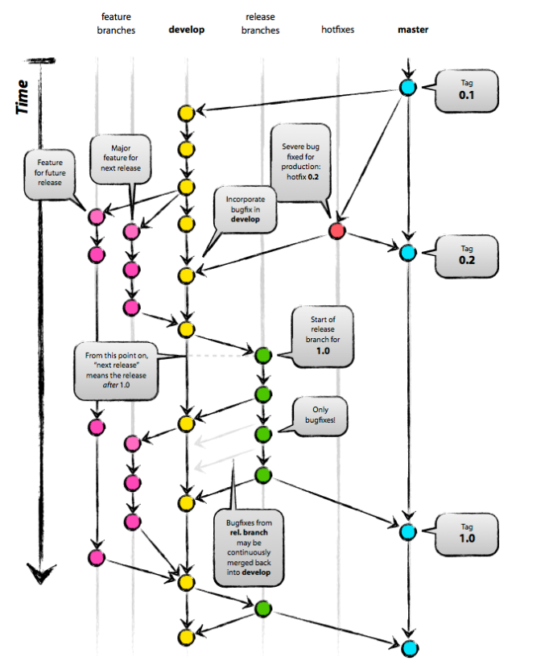

# Git使用
## 分支管理


### 中心库与分布式管理
+ 中心库通常为远程仓库，origin
+ 团队其他成员的代码pull自中心库

### 关键分支
+ master和develop称为关键分支
+ 其中master用于发布稳定的版本，develop用于集成新的feature

### 功能分支
+ 从develop中checkout，最终merge到develop
+ 通常为正在研发的新功能
+ 存放于开发者的本地仓库中

```bash
git checkout -b myfeature develop

git checkout develop
git merge --no-ff myfeature
git branch -d myfeature
git push origin develop
```

### Release分支
+ 从developcheckout，最终合并到develop和master分支上
+ 命名习惯为“release-*”
+ 为新产品的发布做准备。当develop上的功能成熟足够作为新的release版本时，应创建release分支，在此期间进行一些小的bug修复，准备发布元数据（版本号，开发时间等）。release分支创建后，develop新添加的feature都只能被作为下一个版本的feature。
+ 这个分支可能会存在一段时间，直到发布之前的所有调整和修改都已完成，merge到develop和master分支上。

```bash
git checkout -b release-1.2 develop
./bump-version.sh 1.2
git commit -a -m "Bumped version number to 1.2"

git checkout master
git merge --no-ff release-1.2
git tag -a v1.2
git checkout develop
git merge --no-ff release-1.2
git branch -d release-1.2
```

### 热修复分支
+ 从master分支checkout，最终合并到develop和master分支上
+ 一般是发布版本出现问题后进行修复所占用的分支

```bash
// 假设当前版本为 v1.2
git checkout -b hotfix-1.2.1 master
./bump-version.sh 1.2.1
git commit -a -m "Bumped version to 1.2.1"

git commit -m "Fixed ..."
git checkout master
git merge --no-ff hotfix-1.2.1
git tag -a v1.2.1
git branch -d hotdix-1.2.1
```
