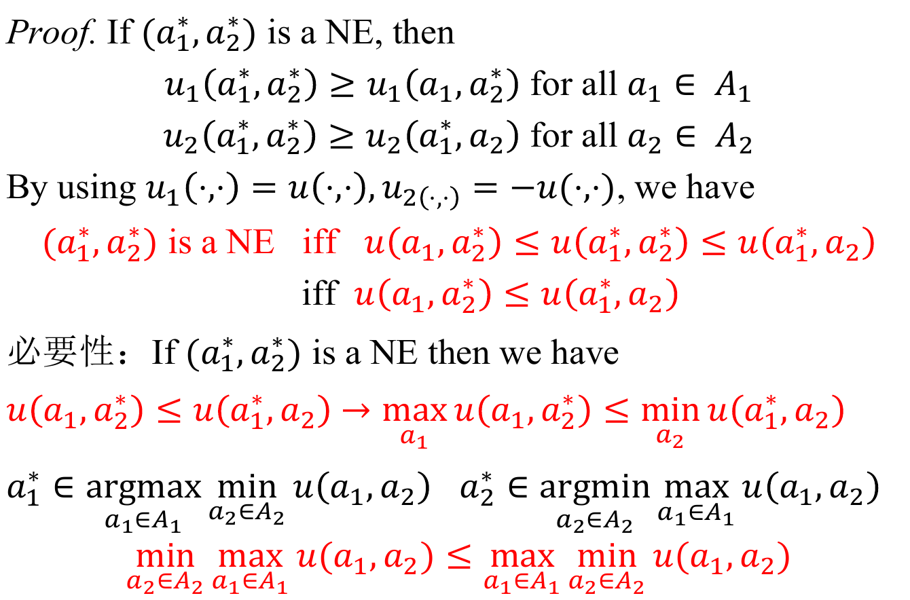
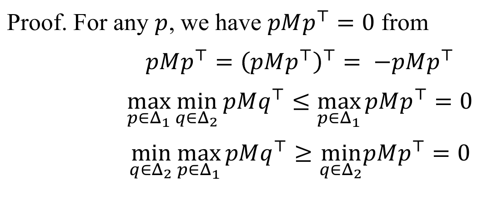

# Zero Sum Game
+ **Definition**: *two-player zero-sum game*
  + $G = \{\{1,2\}, \{A_1, A_2\}, \{u_1, u_2\}\}$
  + $u_1(a_1, a_2)+u_2(a_1, a_2)=0$ for $a_1\in A_1$ and $a_2\in A_2$ 
+ 因为$u_1, u_2$之间存在关系，因此往往使用player1的收益简写整张收益表

## Maxmin Principle
+ 对于玩家1，他的策略为
  $$\argmax_{a_1\in A_1}\min_{a_2\in A_2}u(a_1, a_2)$$
+ 对于玩家2，他的目标为
  $$\max_{a_2\in A_2}\min_{a_1\in A_1}u_2(a_1, a_2)=-\min_{a_2\in A_2}\max_{a_1\in A_1}u(a_1, a_2)$$
  因此他的策略为
  $$\argmin_{a_2\in A_2}\max_{a_1\in A_1}u(a_1, a_2)$$
+ **Lemma:** *For two-player zero-sum finite game $G$, we have $min-max\geq max-min$.*
  > proof: for any $F(x, y)$, we have $F(x,y)\geq min_{y}F(x,y)$, thus for any given $y$, $\max_{x}F(x,y)\geq \max_{x}\min_yF(x,y)$（因为左边的对$x$上界必须大于右边对$x$上界）. Thus $\min_y\max_xF(x,y)\geq \max_x\min_yF(x,y)$.

## Pure Strategy NE
+ **Lemma:** In zero-sum game, if player 1 select $a^*_1\in \argmax_{a_1\in A_1}\min_{a_2\in A_2}u(a_1, a_2)$, and let player 2 select $a_2^*\in\argmin_{a_2\in A_2}\max_{a_1\in A_1}u(a_1, a_2)$, then $(a_1^*, a_2^*)$ is a Nash Equilibrum iff
  $$\max_{a_1\in A_1}\min_{a_2\in A_2}u(a_1, a_2)=\min_{a_2\in A_2}\max_{a_1\in A_1}u(a_1, a_2)$$
  > 
  > 

## Mixed Strategy NE
+ Mixed strategy
  + $p=(p_1, p_@, ..., p_m)\in \Delta_1$ is a mixed strategy over $A_1$
  + $1=(q_1, q_2, ..., q_n)\in \Delta_2$ is a mixed strategy over $A_2$
  + Expected payoff for player 1 on $(p, q)$:
    $$U(p, q)=\sum_{i}\sum_{j}p_iq_ju(a_i, b_j)=pMq^\top$$
+ 相应地，Max-min定理在混合策略下的表示为
  $$\max_{p\in \Delta_1}\min_{q\in \Delta_2}U(p, q)\leq \min_{q\in \Delta_2}\max_{p\in \Delta_1}U(p, q)$$
+ **Theorem:** For two-player zero-sum finite game $G=\{\{1,2\}, \{A_1, A_2\}, u\}$, let player 1 select 
  $$p^{*} \in \underset{p \in \Delta_{1}}{\operatorname{argmax}} \min _{q \in \Delta_{2}} U(p, q)$$
  and let player 2 select
  $$q^{*} \in \underset{q \in \Delta_{2}}{\operatorname{argmin}} \max _{p \in \Delta_{1}} U(p, q)$$
  The mixed strategy outcome $(p^*, q^*)$ is a MNE iff
  $$\max _{p \in \Delta_{1}} \min _{q \in \Delta_{2}} U(p, q)=\min _{q \in \Delta_{2}} \max _{p \in \Delta_{1}} U(p, q)$$

+ **John von Neumann's Minimax Theorem:** For two-player zero-sum finite game $G=G=\{\{1,2\}, \{A_1, A_2\}, u\}$, we have
  $$\max _{p \in \Delta_{1}} \min _{q \in \Delta_{2}} pMq^\top=\min _{q \in \Delta_{2}} \max _{p \in \Delta_{1}} pMq^\top$$
  + 这意味着，双人有限零和博弈一定存在至少一个MNE

## 求解MNE: 双人零和博弈
+ **Theorem:** The optimization problem of $\max_{p\in \Delta_1}\min_{q\in \Delta_2}pMq^\top$ is quivalent to
  $$
  \begin{aligned}
      &\max\quad v\\
      &\text{s.t.}\quad pM\geq v \boldsymbol{1}\\
      &\quad\quad  \ p_1+p_2+...+p_m=1\\
      &\quad\quad  \ p_i\geq 0
  \end{aligned}
  $$
+ **Theorem:** The optimization problem of $\min_{q\in \Delta_2}\max_{p\in \Delta_1}pMq^\top$ is quivalent to
  $$
  \begin{aligned}
      &\min\quad v\\
      &\text{s.t.}\quad Mq^\top\leq v \boldsymbol{1}\\
      &\quad\quad  \ q_1+q_2+...+q_m=1\\
      &\quad\quad  \ q_i\geq 0
  \end{aligned}
  $$

## Symmetric Game
+ **Definition:** 在双人零和博弈的基础上，进一步有$M=-M^\top$，即策略互换，收益也互换。
+ **Theorem:** For a symmetric game, we have 
  $$\max_{p\in \Delta_1}\min_{q\in \Delta_2}pMq^\top=\min_{q\in\Delta_2}\max_{p\in \Delta_1}pMq^\top=0$$
  > 